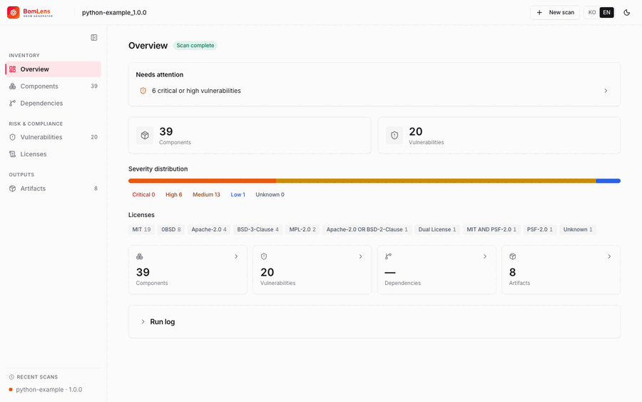
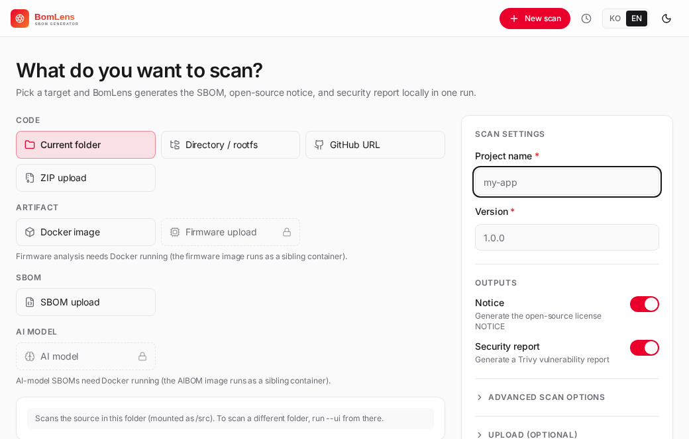
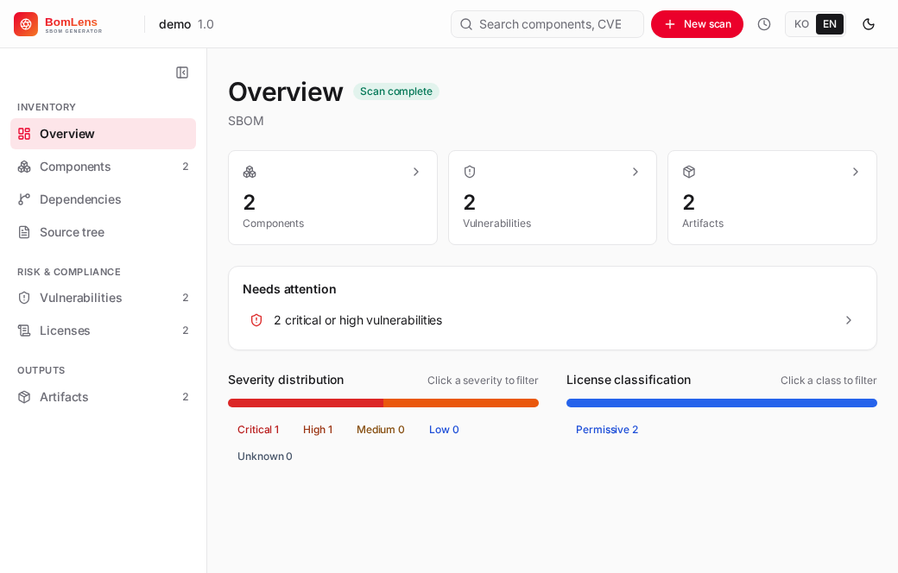
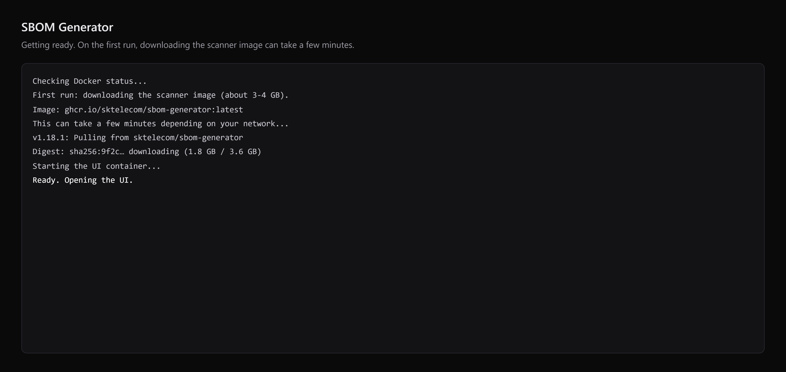

<p align="center">
  
</p>

> **BomLens** is a local-first SBOM generator and open-source risk assessor. It produces a CycloneDX SBOM, an open-source notice, and a security/license risk report for a single project in seconds — from source code, containers, binaries, firmware, or an SBOM you received. CLI or browser UI, no SaaS.

[](https://github.com/sktelecom/sbom-tools/releases)
[](https://github.com/sktelecom/sbom-tools/pkgs/container/bomlens)
[](LICENSE)
[](https://www.bestpractices.dev/projects/13059)
[](https://securityscorecards.dev/viewer/?uri=github.com/sktelecom/sbom-tools)

<p align="center">
  
</p>

**Where to start:**

- **Using the tool** — generate an SBOM, an open-source notice, or a security report, or assess a binary or an SBOM you received. Start with [Getting started](docs/getting-started.en.md) ([한국어](docs/getting-started.md)). On Windows and prefer no command line? [Download BomLens for Windows (.exe)](https://github.com/sktelecom/sbom-tools/releases/latest/download/SBOM-Generator-Setup.exe) and double-click — the [no-CLI quick start](docs/quickstart-no-cli.md) (Korean) walks through it.
- **Contributing to the tool itself** — building the image, the pipeline internals, or adding a package manager? See [CONTRIBUTING](CONTRIBUTING.en.md) and the [architecture](docs/architecture.en.md).

A Docker engine is required either way; the free [Rancher Desktop](https://rancherdesktop.io/) works well on Windows.

One Docker image, two jobs:

- **Generate** — scan your source code (or a container image / binary) and produce a CycloneDX SBOM, an open-source notice, and a security report.
- **Assess open-source risk** — analyze what you *receive*, including a supplier's finished SBOM or a firmware binary, and produce an open-source risk report (licenses + known vulnerabilities, with Critical-7d / High-30d remediation deadlines).

Every scan also emits the risk report by default. Run it from the CLI or a browser UI. Originally built by SK Telecom for supply-chain security, now open source.

Languages: Java, Python, Node.js, Ruby, PHP, Rust, Go, .NET, C/C++ (Conan/vcpkg). Inputs: source folder, GitHub URL, ZIP archive, Docker image, binary/RootFS, existing SBOM, firmware.



## Quick Start

Prerequisite: a Docker engine, 20.10+. Free options that work on Windows: **Rancher Desktop** (GUI; supports the `.bat` double-click flow) or **WSL2 + docker-ce** (run the tool from inside WSL — fully free, no Windows named-pipe needed). Docker Desktop also works but requires a paid license for larger organizations. The Web UI needs nothing else; the Windows CLI wrapper additionally needs Git for Windows (Git Bash).

```bash
git clone https://github.com/sktelecom/sbom-tools.git && cd sbom-tools
docker pull ghcr.io/sktelecom/bomlens:latest   # aliases: sbom-generator and sbom-scanner serve the same image
```

No git installed? Download the repo as a ZIP from the GitHub page (the green Code button, then Download ZIP) and unzip it.

### Web UI — easiest (no CLI needed)

Launch, scan, and download — all in the browser. Live logs stream as it runs.



```bash
cd ~/sbom-output     # any folder — this is where results are saved
/path/to/sbom-tools/scripts/scan-sbom.sh --ui     # opens http://localhost:8080
#   Windows: double-click scripts\sbom-ui.bat
```

Enter the project name and version, pick a scan target (current folder, GitHub URL, ZIP, SBOM, firmware upload, or Docker image), click Run scan, then view or download the results.

#### Windows, no CLI — from a source ZIP you received

A common case: a dev team handed you a source archive and you need its SBOM. The [no-CLI quick start](docs/quickstart-no-cli.md) walks through this step by step in Korean for non-developers; the short version is below.

1. Install and start a Docker engine. **Rancher Desktop** is a free, drop-in choice for this double-click flow; Docker Desktop also works (with licensing caveats for organizations).
2. Get this repo: on the GitHub page use the green Code button, then Download ZIP, and unzip it.
3. Pick a folder for the results under your home directory, such as `C:\Users\you\sbom-output`. It must sit inside a path your Docker engine is allowed to share (file sharing); `C:\Users` is shared by default in both Rancher Desktop and Docker Desktop.
4. Double-click `scripts\sbom-ui.bat`. A browser opens at http://localhost:8080.
5. Enter a project name and version, choose ZIP upload as the scan target, upload the source ZIP you received, run the scan, then download the SBOM, the notice, and the risk report.

The [getting-started guide](docs/getting-started.md) covers this in more detail and shows the CLI path.

Prefer a real app over a `.bat`? A desktop app wraps this same flow with no console window — it checks Docker, pulls the image, and opens the UI on double-click. Download `SBOM-Generator-*.exe` (or `.dmg`) from the [latest release](https://github.com/sktelecom/sbom-tools/releases/latest). It is unsigned for now, so if Windows SmartScreen warns, click **More info** and then **Run anyway**. Build details are in [`electron/`](electron/README.md).



### CLI

```bash
# All deliverables for the current project
./scripts/scan-sbom.sh --project MyApp --version 1.0.0 --all --generate-only

# Other inputs: GitHub URL · source archive · Docker image · firmware
./scripts/scan-sbom.sh --git https://github.com/org/repo --project MyApp --version 1.0.0 --all --generate-only
./scripts/scan-sbom.sh --target ./src.zip      --project MyApp --version 1.0.0 --all --generate-only
./scripts/scan-sbom.sh --target nginx:latest   --project MyApp --version 1.0.0 --all --generate-only
./scripts/scan-sbom.sh --target dev.bin --firmware --project MyApp --version 1.0.0 --all --generate-only
```

On Windows, run the same commands through `scripts\scan-sbom.bat`, which forwards them to the script via Git Bash (Git for Windows required).

Outputs (`{Project}_{Version}_…`): `bom.json` (SBOM), `NOTICE.{txt,html}`, `risk-report.{md,html}` (default), and `security.{json,md,html}` (Trivy). Each input form is covered in the [scenarios guide](docs/scenarios-guide.md).

## Documentation

Read the docs as a navigable site at **[sktelecom.github.io/sbom-tools](https://sktelecom.github.io/sbom-tools/)** (search, sidebar, English/Korean). The same content lives under [docs/](docs/) in this repo.

The web UI itself is bilingual (English and Korean, English by default). The core docs are available in English; the most detailed and complete guides — including the non-developer quick start — are in Korean.

### English

| Doc | What |
|-----|------|
| [Getting started](docs/getting-started.en.md) | Install and your first SBOM (web UI + CLI) |
| [Usage guide](docs/usage-guide.en.md) | Every option, analysis modes, CI/CD |
| [Input scenarios](docs/scenarios-guide.en.md) | GitHub URL, ZIP, local C/C++, existing SBOM, firmware |

Building or extending the tool? Start with the [architecture](docs/architecture.en.md); design notes live under [docs/internal/](docs/internal/) (Korean).

### 한국어

| 문서 | 설명 |
|------|------|
| [비개발자 빠른 시작](docs/quickstart-no-cli.md) | 명령줄 없이 데스크톱 앱과 웹 UI로 SBOM과 고지문 만들기 |
| [시작하기](docs/getting-started.md) | 설치와 첫 SBOM (웹 UI 포함) |
| [시나리오 가이드](docs/scenarios-guide.md) | 입력 형태별(GitHub, ZIP, 로컬, SBOM, 펌웨어) 처리 |
| [고지문·보안 보고서](docs/notice-and-security.md) | 산출물 생성·해석과 웹 UI 사용법 |
| [사용 가이드](docs/usage-guide.md) | 전체 옵션, 분석 모드, CI/CD |
| [예제 가이드](docs/examples-guide.md) | 언어별 예제 프로젝트 실습 |

> 내부 구조([아키텍처](docs/architecture.md))와 설계 배경, 메인테이너용 조사 문서는 [docs/internal/](docs/internal/)에 있습니다. Docker 이미지의 가치(cdxgen 대비 측정)는 [방향성 조사 보고서](docs/internal/direction-study.md), Windows 데스크톱 앱 도입 검토는 [데스크톱 앱 검토 보고서](docs/internal/desktop-app-study.md)를 참고하세요. 전체 문서 목록은 [docs/](docs/)에 있습니다.

## Contributing & License

Issues and PRs welcome — see [CONTRIBUTING.md](CONTRIBUTING.en.md) ([한국어](CONTRIBUTING.md)) and [GitHub Issues](https://github.com/sktelecom/sbom-tools/issues).

Apache License 2.0 · © 2026 SK Telecom Co., Ltd. Bundled third-party tools keep their own licenses — see [NOTICE](NOTICE) and [THIRD_PARTY_LICENSES.md](THIRD_PARTY_LICENSES.md).
