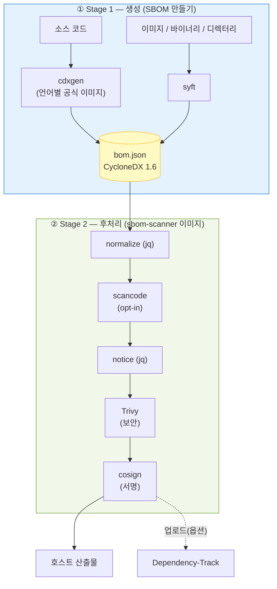
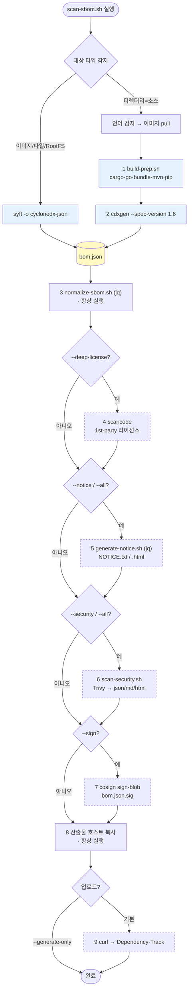
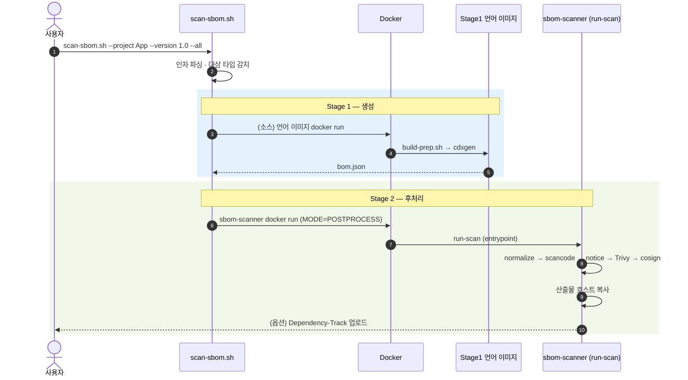
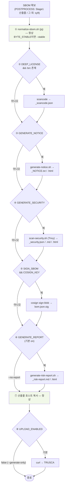
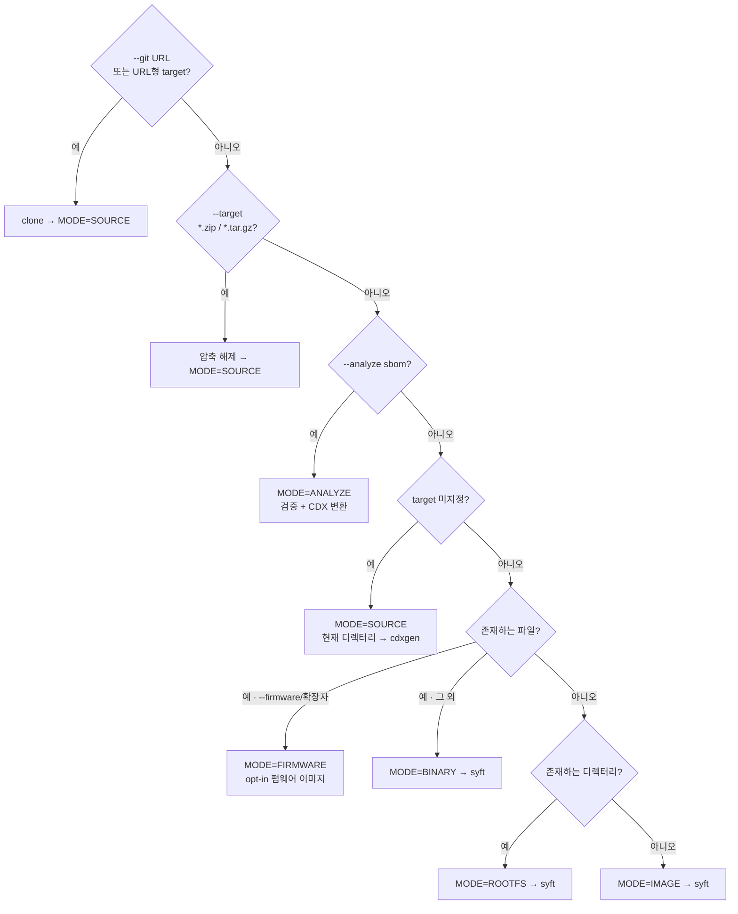
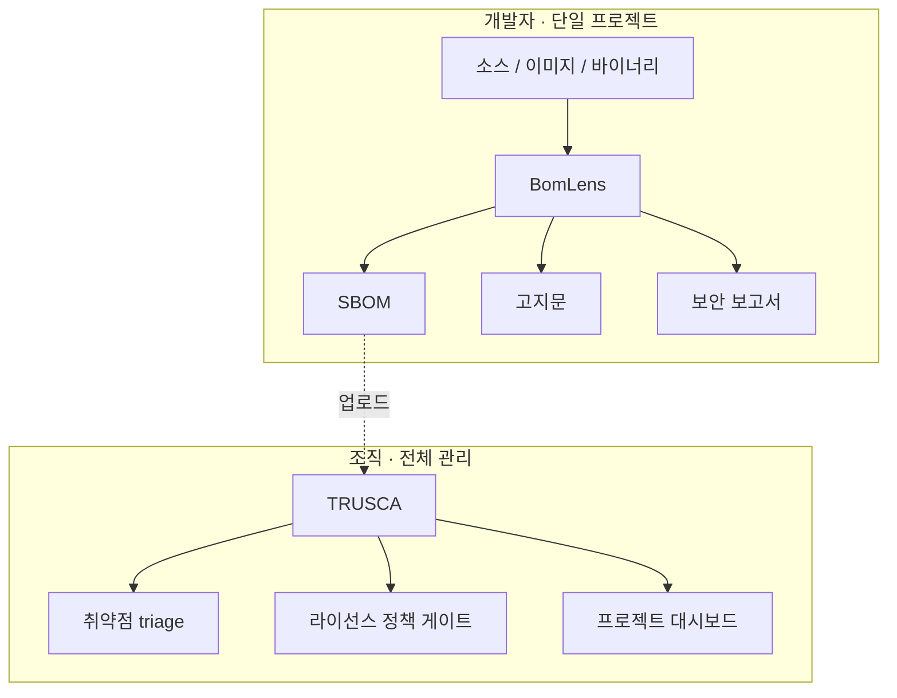

# 아키텍처

BomLens의 전체 시스템 구조와, 스캔 파이프라인에서 각 도구가 어느 단계에서 어떤 순서로 호출되는지 설명합니다.

> 이 문서는 현재 구현된 2단계(2-stage) 아키텍처를 기준으로 작성되었습니다. 소스 코드의 Stage 1 라우팅(언어 감지 후 cdxgen 공식 언어 이미지 실행)은 `scripts/scan-sbom.sh`에 구현되어 동작합니다.

## 한눈에 보기

BomLens는 두 종류의 Docker 이미지가 협력하는 2단계 파이프라인입니다.

- **Stage 1 — 생성**: 소스 코드는 cdxgen 언어별 공식 이미지가, 컨테이너 이미지·바이너리·디렉터리는 syft가 SBOM(CycloneDX 1.6)을 만듭니다.
- **Stage 2 — 후처리**: 경량 `sbom-scanner` 이미지가 SBOM을 받아 정규화, (정밀 라이선스), 고지문, 보안 보고서, 서명, 업로드를 차례로 수행합니다.

오케스트레이션의 단일 진입점은 `scripts/scan-sbom.sh`(Windows는 `scan-sbom.bat`)이며, 사용자는 이 스크립트 하나만 호출합니다.

---

## 왜 2단계인가

기존에는 모든 언어 런타임 + 분석 도구를 하나의 거대한 이미지에 담았습니다. 재설계된 파이프라인은 책임을 둘로 나눕니다(근거는 메인테이너용 [방향성 조사 보고서](https://github.com/sktelecom/sbom-tools/blob/main/docs/internal/direction-study.md) §1, §5).

| | Stage 1 이미지 | Stage 2 이미지 (`sbom-scanner`) |
|---|---|---|
| **역할** | 소스 → SBOM **생성** | SBOM **후처리**(정규화·고지문·보안·서명·업로드) + syft 스캔 |
| **구성** | cdxgen 공식 **언어별** 이미지 (java·python·node·…) | 언어 toolchain **없음** — `debian:12-slim` 경량 |
| **획득** | 프로젝트 언어 감지 후 **on-demand pull** | 한 번 pull해서 재사용 |
| **이점** | 언어별 최신 toolchain을 cdxgen이 직접 관리 | 이미지가 작고, 도구 버전 고정으로 재현성 확보 |

> 주류 5개 언어(java, python, node, dotnet, php)는 cdxgen 공식 이미지로 검출이 동일하고, go와 ruby, rust에서 toolchain 보강(`build-prep.sh`)이 결정적으로 우수합니다. 측정 데이터는 [README "Why a Docker image?"](https://github.com/sktelecom/sbom-tools#why-a-docker-image-vs-plain-cdxgen)와 [방향성 조사 보고서](https://github.com/sktelecom/sbom-tools/blob/main/docs/internal/direction-study.md) §1을 참조하세요.

---

## 도구 인벤토리

파이프라인에서 호출되는 도구와 **버전 고정**(공급망 위생) 현황입니다.

| 도구 | 버전 | 단계 | 역할 | 활성 조건 |
|------|------|------|------|-----------|
| **cdxgen** | 언어 이미지 동봉 | Stage 1 | 소스 코드 SBOM 생성 (`--spec-version 1.6`) | `MODE=SOURCE` |
| **build-prep.sh** | — | Stage 1 | cdxgen 직전 의존성 보강(cargo·go·bundle·mvn·pip) | `MODE=SOURCE` |
| **syft** | `v1.18.1` | Stage 1 | 이미지·바이너리·RootFS 스캔 | `MODE=IMAGE/BINARY/ROOTFS` |
| **jq** (`normalize-sbom.sh`) | — | Stage 2 | SBOM 정규화·정렬 | 항상 |
| **ScanCode Toolkit** | `32.3.0` | Stage 2 | 1st-party 소스 정밀 라이선스 탐지 | `--deep-license` (opt-in 빌드) |
| **SCANOSS** | `1.25.2` | Stage 2 | 패키지 매니저 없는 C/C++ 소스의 vendored 오픈소스 식별 | `--identify-vendored` (opt-in 빌드) |
| **jq** (`generate-notice.sh`) | — | Stage 2 | 오픈소스 고지문(NOTICE) 생성 | `--notice` / `--all` |
| **Trivy** | `v0.70.0` | Stage 2 | 취약점(CVE) 보안 보고서 | `--security` / `--all` |
| **Cosign** | `v2.4.1` | Stage 2 | SBOM detached 서명 | `--sign` |
| **curl** | — | Stage 2 | Dependency-Track 업로드 | 기본(=`--generate-only` 아님) |

> 버전은 `docker/Dockerfile`의 `ARG`로 고정됩니다. 이미지 경량화를 위해 일부 도구는 **opt-in** 빌드 인자입니다: ScanCode(`--build-arg SBOM_DEEP_LICENSE=true`)와 SCANOSS 클라이언트(`--build-arg SBOM_SCANOSS=true`, 발행 이미지엔 포함). 펌웨어 언팩·식별(unblob, cve-bin-tool)은 별도 opt-in `bomlens-firmware` 이미지에 들어갑니다.

---

## 전체 파이프라인 흐름

도구 호출 **순서**를 한 장으로 본 그림입니다. 점선 박스는 플래그로 켜지는 선택적 단계입니다.

사용자 호출부터 후처리까지의 시퀀스:

---

## Stage 1 — SBOM 생성

대상 타입에 따라 생성 도구가 갈립니다.

### 소스 코드 (`MODE=SOURCE`) — cdxgen 언어 이미지

`scan-sbom.sh`가 `detect_lang()`으로 프로젝트 언어를 감지하고, `img_for_lang()`으로 해당 cdxgen **공식 언어 이미지**를 골라 pull한 뒤, 그 이미지 안에서 `build-prep.sh`를 실행합니다(`scripts/scan-sbom.sh:138-208`). 후처리 경량 이미지에는 언어 toolchain이 없으므로, 생성은 전적으로 언어 이미지가 담당합니다.

언어별 cdxgen 이미지 매핑은 다음과 같습니다 (`scan-sbom.sh:158-177`, 태그는 `CDXGEN_TAG`로 고정).

| 감지 언어 | 이미지 |
|-----------|--------|
| rust | `cdxgen-debian-rust` |
| go | `cdxgen-debian-golang124` |
| ruby | `cdxgen-debian-ruby34` |
| java | `cdxgen-temurin-java21` |
| python | `cdxgen-python312` |
| node | `cdxgen-node20` |
| php | `cdxgen-debian-php84` |
| dotnet | `cdxgen-debian-dotnet9` |
| android | 자체 빌드 `bomlens-android-sdk<API>` (compileSdk 자동 추출) |
| mixed / unknown | cdxgen all-in-one (`CDXGEN_ALLINONE`) |

이미지 안에서의 두 단계:

1. **`build-prep.sh`** (`docker/lib/build-prep.sh`) — cdxgen **직전** 의존성 보강. cdxgen이 자동 해석하지 못하는 생태계(특히 Rust·Go)의 lockfile을 만들어 전이 의존성까지 노출시킵니다. POSIX `sh`, best-effort(스캔을 절대 실패시키지 않음).

   | 생태계 | 동작 | 비고 |
   |--------|------|------|
   | Rust | `cargo generate-lockfile` | cdxgen이 cargo를 자동 실행하지 않음 — **필수** |
   | Go | `go mod download` (`-mod=mod`) | 모듈 그래프 확보 |
   | Ruby | `bundle lock` / `install` | lockfile 없을 때만 |
   | Maven | `mvn dependency:resolve` | 경량 안전망 |
   | Python | `pip install -r requirements.txt` | lockfile 없는 경우 전이 의존성 노출 |

2. **cdxgen 실행** — `build-prep.sh`가 이미지별로 다른 cdxgen 바이너리 경로를 자동 탐지해 `cdxgen -r --spec-version 1.6 -o bom.json` 을 실행합니다(`build-prep.sh:60-73`). 생성된 SBOM은 이어서 Stage 2(`MODE=POSTPROCESS`) 후처리 이미지로 넘어갑니다.

### 이미지 / 바이너리 / 디렉터리 — syft

`sbom-scanner` 이미지에 포함된 **syft**가 직접 SBOM을 생성합니다. (`docker/entrypoint.sh`)

| MODE | 입력 | syft 호출 |
|------|------|-----------|
| `IMAGE` | Docker 이미지 | `syft <image> -o cyclonedx-json` (docker.sock 마운트 필요) |
| `BINARY` | 단일 파일 | `syft file:<path> -o cyclonedx-json` (실패 시 최소 SBOM 폴백) |
| `ROOTFS` | 디렉터리 | `syft dir:<path> -o cyclonedx-json` |

---

## Stage 2 — 후처리 파이프라인

`sbom-scanner` 이미지의 진입점 `run-scan`(`docker/entrypoint.sh`)이 SBOM을 받아 **고정된 순서**로 단계를 실행합니다. 각 단계는 환경변수(=CLI 플래그)로 켜지며, 산출물은 `ARTIFACTS` 목록에 누적됩니다.

단계별 상세:

| # | 단계 | 스크립트 / 도구 | 조건 | 산출물 |
|---|------|-----------------|------|--------|
| ① | **정규화** | `normalize-sbom.sh` (jq) | 항상 (`--byte-stable`이면 결정론적 모드) | `bom.json` 갱신 |
| ② | **정밀 라이선스** | `scancode` | `--deep-license` + `/src` 존재 | `_scancode.json` |
| ③ | **고지문** | `generate-notice.sh` (jq) | `--notice` / `--all` | `_NOTICE.txt`, `_NOTICE.html` |
| ④ | **보안 보고서** | `scan-security.sh` (Trivy) | `--security` / `--all` | `_security.{json,md,html}` |
| ⑤ | **서명** | `cosign sign-blob` | `--sign` + `COSIGN_KEY` | `bom.json.sig` |
| ⑥ | **위험분석보고서** | `generate-risk-report.sh` | 기본 (`--no-report`로 생략) | `_risk-report.{md,html}` (+ ANALYZE면 `_conformance.*`) |
| ⑦ | **호스트 복사** | `cp` | 항상 | `HOST_OUTPUT_DIR`로 복사 |
| ⑧ | **업로드** | `curl` | 기본 (`--generate-only`이면 생략) | Dependency-Track 서버 또는 TRUSCA 네이티브 ingest로 업로드 (`UPLOAD_TARGET`로 선택) |

> **순서가 고정인 이유**: 정규화는 이후 모든 단계의 입력을 안정화하므로 가장 먼저, 서명은 최종 `bom.json`을 대상으로 해야 하므로 가장 나중에 실행됩니다. 각 단계는 실패해도 `|| true`/경고로 처리되어 전체 스캔을 중단시키지 않습니다(서명·업로드 제외).

---

## 입력 타입별 분기

`scan-sbom.sh`는 `--git`/`--analyze`/`--firmware`와 `--target` 값을 보고 모드를 자동 결정합니다.

위에서부터 순차로 판정합니다(먼저 맞는 분기 채택).

> `--ui`는 위 분기와 별개로 `MODE=UI`(웹 서버 `server.py`)를 띄우고, 후속 스캔을 폼/업로드로 실행합니다.

| 모드 | 트리거 | 생성 도구 | 비고 |
|------|--------|-----------|------|
| `SOURCE` | target 미지정 · `--git <url>` · `--target *.zip/*.tar.gz` | cdxgen | 언어 감지 → 언어별 이미지. git는 clone, 아카이브는 자동 해제 후 소스로 처리. (웹 UI의 SOURCE는 컨테이너 내 `syft dir:`) |
| `ANALYZE` | `--analyze <sbom>` (별칭 `--sbom`) | — | 공급사 SBOM(CycloneDX/SPDX) 검증 → CDX 변환 → 재집계. `_conformance.*` 생성 |
| `FIRMWARE` | `--target <file> --firmware` 또는 펌웨어 확장자 | unblob + syft + cve-bin-tool | **opt-in 이미지** `bomlens-firmware`. 상세 [펌웨어 분석 가이드](../guides/firmware.ko.md) |
| `BINARY` | `--target <파일>` | syft | `file:` 스킴 |
| `ROOTFS` | `--target <디렉터리>` | syft | `dir:` 스킴 |
| `IMAGE` | `--target <이미지명>` | syft | docker.sock 마운트 |
| `UI` | `--ui` | — | 브라우저 UI, 6종 스캔 대상을 폼/업로드로 실행 |

---

## 플래그 ↔ 단계 매핑

CLI 플래그가 어떤 환경변수로 변환되어 어느 단계를 켜는지 정리합니다 (`scan-sbom.sh`가 변환해 `entrypoint.sh`로 전달).

| 플래그 | 환경변수 | 켜지는 단계 |
|--------|----------|-------------|
| (기본) | `GENERATE_REPORT=true` (+ notice·security) | normalize + **위험분석보고서** + 업로드 |
| `--no-report` | `GENERATE_REPORT=false` | 위험분석보고서·고지문·보안 강제 활성화 안 함 |
| `--notice` | `GENERATE_NOTICE=true` | ③ 고지문 |
| `--security` | `GENERATE_SECURITY=true` | ④ 보안 보고서 |
| `--all` | 위 둘 다 | ③ + ④ |
| `--git <url>` / `--branch` | (호스트에서 clone) | SOURCE 입력 수집 |
| `--analyze <sbom>` | `MODE=ANALYZE` | 공급사 SBOM 검증·변환·보고서 |
| `--firmware` | `MODE=FIRMWARE` (펌웨어 이미지) | 언팩 → syft + cve-bin-tool |
| `--deep-license` | `DEEP_LICENSE=true` | ② scancode |
| `--byte-stable` | `BYTE_STABLE=true` | ① 결정론적 정규화 (CLI 전용) |
| `--sign` | `SIGN_SBOM=true` (+ `COSIGN_KEY`/`COSIGN_PASSWORD`) | ⑤ 서명 |
| `--generate-only` | `UPLOAD_ENABLED=false` | ⑦ 업로드 생략 |
| `--ui` | `MODE=UI` | 웹 UI |

> **위험분석보고서**(`_risk-report.{md,html}`)는 모든 모드에서 **기본 생성**됩니다(라이선스+취약점 집계). 이를 위해 고지문·보안 스캔이 자동으로 함께 켜지며, `--no-report`로 끌 수 있습니다.

각 기능의 사용법은 [고지문·보안 보고서 가이드](../guides/reports.ko.md)를 참조하세요.

---

## 산출물

`{P}`=프로젝트 이름, `{V}`=버전 (특수문자는 `_`로 정규화).

| 파일 | 생성 조건 |
|------|-----------|
| `{Project}_{Version}_bom.json` | 항상 (CycloneDX 1.6) |
| `{Project}_{Version}_NOTICE.txt` / `.html` | `--notice` / `--all` / 위험분석보고서 기본 생성 시 |
| `{Project}_{Version}_security.json` / `.md` / `.html` | `--security` / `--all` / 위험분석보고서 기본 생성 시 |
| `{Project}_{Version}_risk-report.md` / `.html` | 기본 (전 모드) — `--no-report`로 생략 |
| `{Project}_{Version}_conformance.json` / `.md` / `.html` | `--analyze` (공급사 SBOM 검증) |
| `{Project}_{Version}_scancode.json` | `--deep-license` |
| `{Project}_{Version}_bom.json.sig` | `--sign` |

---

## 확장 포인트

### 새 언어 지원 추가
1. 해당 언어의 cdxgen 공식 이미지가 있는지 확인 — 있으면 라우팅 테이블에 추가.
2. cdxgen이 전이 의존성을 자동 해석하지 못하면 `docker/lib/build-prep.sh`에 보강 로직 추가.
3. `examples/{언어}/`에 예제 프로젝트, `tests/cases/test-{언어}.sh`에 테스트 케이스 추가.

자세한 절차: [패키지 매니저 추가 가이드](../contribute/package-managers.ko.md).

### 새 후처리 단계 추가
`docker/lib/`에 헬퍼 스크립트를 추가하고, `entrypoint.sh`의 공통 파이프라인 구간(정규화 이후)에서 환경변수 가드와 함께 호출한 뒤 산출물을 `ARTIFACTS`에 추가합니다. 서명 단계보다 **앞**에 배치해야 산출물이 서명 대상에 포함됩니다.

---

## 설계 원칙

- **격리성** — 모든 분석은 Docker 컨테이너에서 수행, 호스트 환경 무오염.
- **책임 분리** — 생성(Stage 1)과 후처리(Stage 2)를 분리해 후처리 이미지를 경량화.
- **재현성** — 도구 버전을 `ARG`로 고정, `--byte-stable`로 바이트 동일 출력.
- **표준 준수** — CycloneDX 1.6 스펙 준수.
- **견고성** — 후처리 단계는 best-effort로 전체 스캔을 쉽게 중단시키지 않음.
- **단일 인터페이스** — 모든 언어·모드를 `scan-sbom.sh` 하나로 호출.

---

## 역할 분담 (TRUSCA)

BomLens는 **생성(generation)** 전문 도구입니다. 전사(全社) 프로젝트 관리·취약점 triage·라이선스 정책 게이트 같은 **거버넌스**는 자매 프로젝트 [TRUSCA](https://github.com/trustedoss/trusca)(구 TrustedOSS Portal)에 위임합니다. 두 도구 모두 cdxgen/Trivy를 공유하므로 산출물(CycloneDX)이 그대로 호환됩니다.

---

> **관련 문서**: [시작하기](../start/first-scan.ko.md) | [사용 가이드](../reference/cli.ko.md) | [Docker 이미지 직접 사용](../reference/docker-image.ko.md) | [패키지 매니저 추가](../contribute/package-managers.ko.md)
