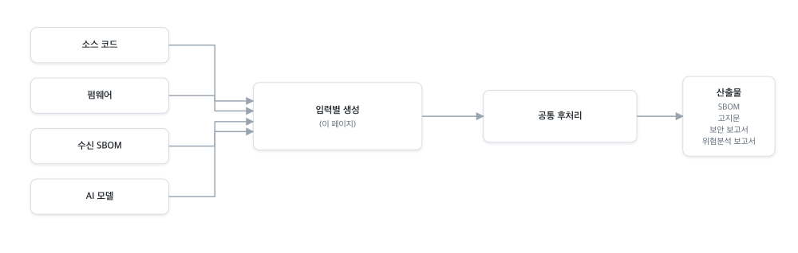
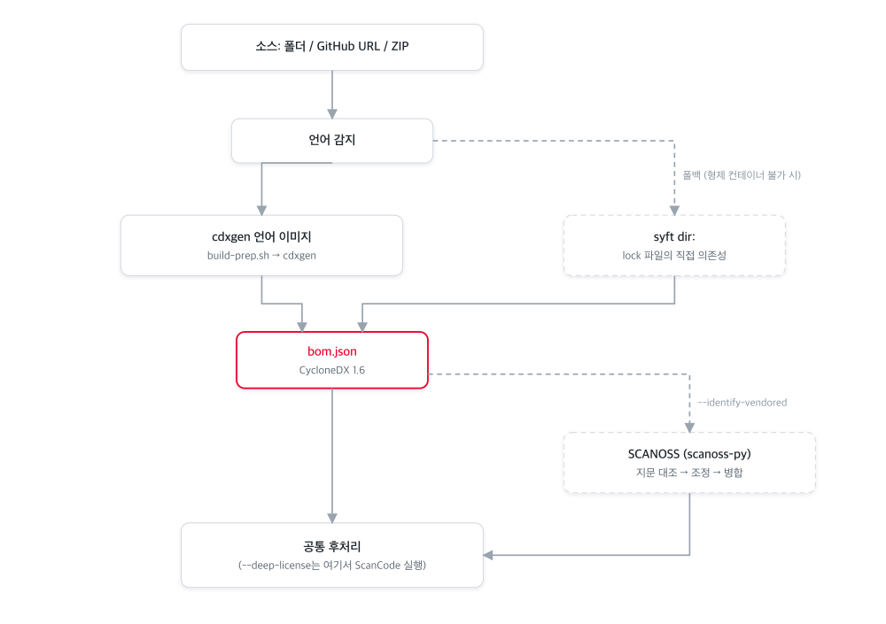
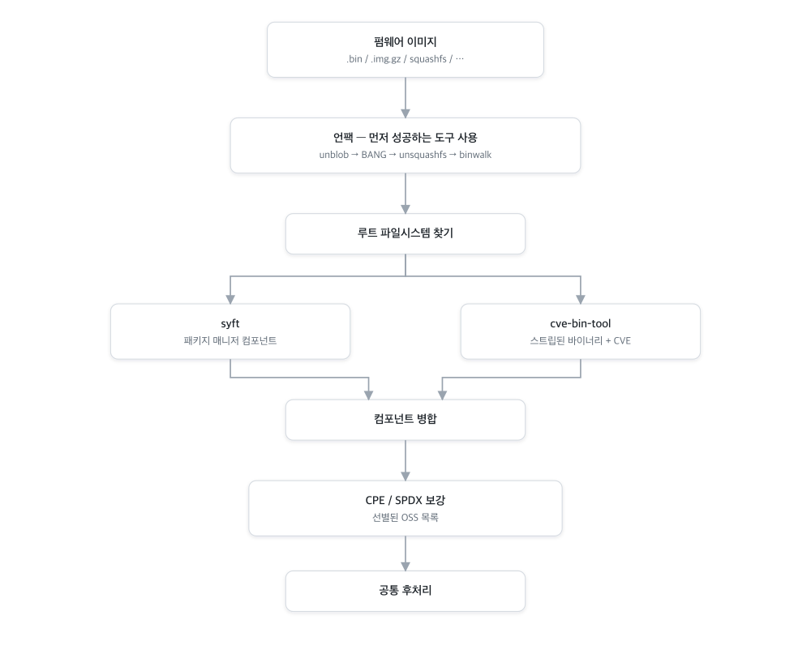
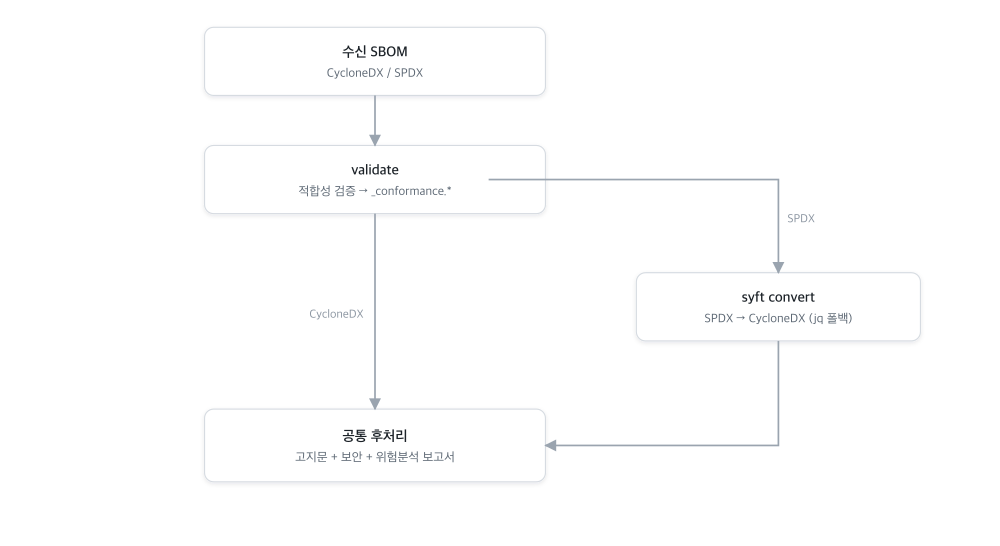
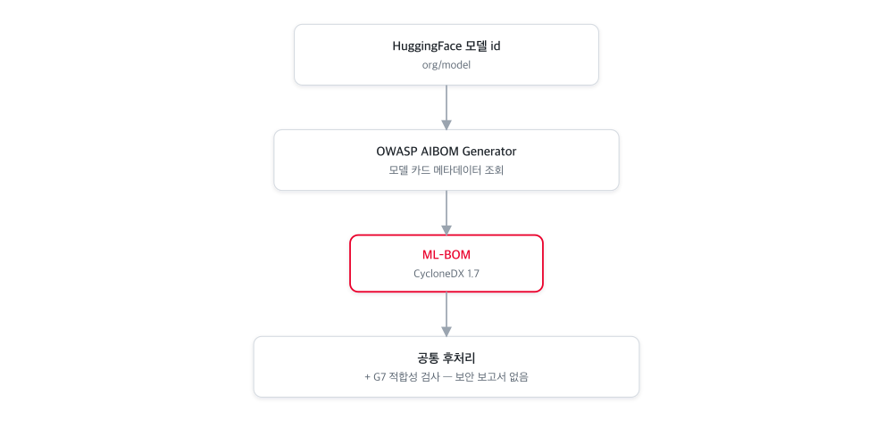
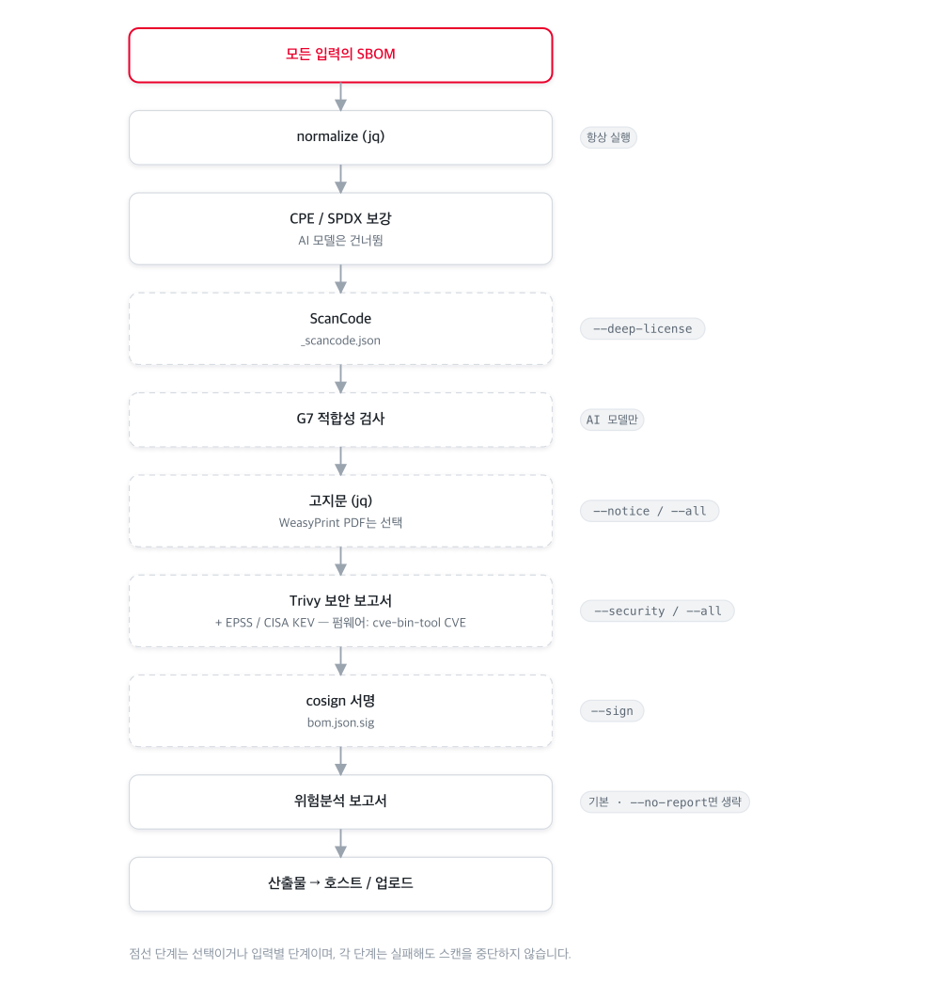

# 입력 형태별 파이프라인

BomLens는 여러 입력을 받습니다. 소스코드, 펌웨어, 받은 SBOM, AI 모델입니다. 각 입력은 CycloneDX SBOM을 만드는 **생성** 단계를 따로 거친 뒤, 모두 하나의 공통 **후처리** 파이프라인(고지문, 보안, 위험 보고서)으로 합류합니다. 이 문서는 입력별 도구 흐름을 따라갑니다. 2단계 개요는 [아키텍처](architecture.ko.md)를 참고하세요.

아래 외부 도구는 모두 오픈소스입니다. [사용 오픈소스 도구](#사용-오픈소스-도구) 표에 각 도구의 역할, 라이선스, 프로젝트 링크를 정리했습니다.

---

## 소스코드

소스 폴더, GitHub URL, ZIP 아카이브입니다. 언어 감지로 알맞은 공식 [cdxgen](https://github.com/CycloneDX/cdxgen) 언어 이미지를 골라, 의존성을 준비(`build-prep.sh`)한 뒤 SBOM을 생성합니다. 형제 컨테이너를 실행할 수 없을 때(예: 웹 UI의 소스 스캔)는 디렉터리를 [syft](https://github.com/anchore/syft)로 스캔하는 방식으로 폴백하며, 이때는 락 파일에서 직접 의존성을 잡습니다.

소스 스캔에만 적용되는 옵션이 두 가지 있고, 둘 다 기본은 꺼짐입니다.

- **내장 OSS 식별**(`--identify-vendored`, [SCANOSS](https://github.com/scanoss/scanoss.py)) — 패키지 매니저 없이 복사해 넣은 C/C++ 등의 코드를 위한 옵션입니다. SCANOSS 클라이언트가 파일 지문을 만들어 호스팅 OSSKB 서비스에 조회하고, 패키지 매니저 스캔이 이미 찾은 것과 대조해 중복을 제거한 뒤 나머지를 SBOM에 병합합니다.
- **정밀 라이선스 탐지**(`--deep-license`, [ScanCode Toolkit](https://github.com/aboutcode-org/scancode-toolkit)) — 1st-party 소스의 라이선스 헤더를 탐지합니다. 후처리 단계에서 돌며 별도 `_scancode.json`을 남깁니다.

> 컨테이너 이미지, 단일 바이너리, 디렉터리(루트 파일시스템)는 cdxgen을 건너뛰고 syft가 바로 스캔한 뒤 같은 후처리를 따릅니다.

---

## 펌웨어

네트워크 장비 펌웨어 이미지(`.bin`, `.img.gz`, squashfs 등)이며, opt-in `bomlens-firmware` 이미지가 담당합니다. 펌웨어는 운영체제와 라이브러리 수십 개를 한 파일에 밀봉하므로, 먼저 압축을 풀고 두 가지로 구성요소를 식별합니다. 패키지 매니저 메타데이터는 syft로, strip된 정적 바이너리는 [cve-bin-tool](https://github.com/intel/cve-bin-tool)로 식별하며 cve-bin-tool은 CVE도 함께 매칭합니다. 두 결과를 병합한 뒤, 잘 알려진 OSS(busybox, dropbear, dnsmasq 등)의 CPE/SPDX를 채우는 보강 단계를 거치고, 그 결과를 Trivy와 고지문 생성이 이어받아 활용합니다.

언팩은 먼저 성공한 도구를 쓰는 순서로 시도합니다. [unblob](https://github.com/onekey-sec/unblob)(기본), [BANG](https://github.com/armijnhemel/binaryanalysis-ng), 표준 squashfs용 `unsquashfs`, 그다음 `binwalk`입니다.

> 펌웨어 도구는 GPL 계열이라 `bomlens-firmware` 이미지에만 들어가고, 기본 이미지는 permissive 라이선스만 유지합니다. [펌웨어 가이드](../guides/firmware.ko.md)와 그 한계를 참고하세요.

---

## 받은 SBOM

협력사 등 외부에서 받은 SBOM(CycloneDX 또는 SPDX)이며, 소스 코드가 필요 없습니다. BomLens는 먼저 품질 기준에 맞는지 검사해 적합성 보고서를 쓰고, 이후 파이프라인이 분석할 수 있도록 입력을 CycloneDX로 정규화합니다. SPDX는 `syft convert`로 변환하며, syft를 쓸 수 없으면 `jq` 폴백이 SPDX JSON을 처리합니다. 이 모드에서는 고지문, 보안, 위험 보고서가 항상 생성됩니다.

> 적합성 검사는 변환 전 원본을 기준으로 하므로, SPDX는 SPDX로 검사합니다. 자세한 내용은 [공급사 SBOM 가이드](../guides/supplier-sbom.ko.md)에 있습니다.

---

## AI 모델

HuggingFace 모델 id(`org/model`)이며, opt-in `bomlens-aibom` 이미지가 담당합니다. [OWASP AIBOM Generator](https://github.com/GenAI-Security-Project/aibom-generator)가 네트워크로 모델 카드 메타데이터를 가져와, 모델과 데이터셋 중심의 CycloneDX 1.7 ML-BOM을 만듭니다. 이후 후처리에서 G7 최소 요소 적합성 검사를 더합니다. AI 모델에는 패키지 CVE가 없으므로 보안 보고서는 건너뜁니다.

> 모델 카드의 공개 항목(가중치, 아키텍처, 학습 데이터, 학습 과정)과 G7 결과는 웹 UI의 모델·데이터셋과 G7 섹션에 나타납니다. [웹 UI 레퍼런스](../reference/ui.ko.md)를 참고하세요. 단계별 안내는 [AI 모델 가이드](../guides/ai-model.ko.md)에 있습니다.

---

## 공통 후처리

어떤 입력이든 SBOM은 같은 순서의 단계를 거칩니다. 정규화는 이후 모든 단계의 입력을 안정시키므로 가장 먼저 돌고, 서명은 최종 SBOM을 대상으로 해야 하므로 마지막에 돕니다. 점선 단계는 선택이거나 입력별입니다. 각 단계는 실패하더라도 전체 스캔을 중단하지 않고 경고와 함께 건너뜁니다(서명과 업로드는 예외).

위험 보고서는 모든 모드에서 기본으로 생성됩니다(라이선스와 취약점을 종합). `--no-report`로 끕니다. 플래그별 단계 매핑은 [아키텍처](architecture.ko.md)를 참고하세요.

---

## 사용 오픈소스 도구

분석 도구는 모두 오픈소스입니다. 기본 이미지는 permissive 라이선스만 담고, GPL 도구는 opt-in `bomlens-firmware` 이미지에, AI 생성기는 `bomlens-aibom`에 격리합니다.

| 도구 | 역할 | 입력 | 라이선스 | 이미지 | 프로젝트 |
|------|------|------|----------|--------|----------|
| cdxgen | 소스에서 SBOM 생성 | 소스 | Apache-2.0 | 언어 이미지 | [CycloneDX/cdxgen](https://github.com/CycloneDX/cdxgen) |
| syft | 이미지·바이너리·디렉터리·펌웨어 rootfs의 SBOM | 소스(폴백)·이미지·바이너리·rootfs·펌웨어 | Apache-2.0 | base / firmware | [anchore/syft](https://github.com/anchore/syft) |
| SCANOSS (scanoss.py) | 파일 지문으로 내장 OSS 식별 | 소스(`--identify-vendored`) | MIT | base | [scanoss/scanoss.py](https://github.com/scanoss/scanoss.py) |
| ScanCode Toolkit | 1st-party 정밀 라이선스 탐지 | 소스(`--deep-license`) | Apache-2.0 | base(opt-in) | [aboutcode-org/scancode-toolkit](https://github.com/aboutcode-org/scancode-toolkit) |
| unblob | 펌웨어 언팩(기본) | 펌웨어 | MIT | firmware | [onekey-sec/unblob](https://github.com/onekey-sec/unblob) |
| BANG | 펌웨어 언팩(폴백) | 펌웨어 | GPL-3.0 | firmware(선택) | [armijnhemel/binaryanalysis-ng](https://github.com/armijnhemel/binaryanalysis-ng) |
| cve-bin-tool | strip된 바이너리 식별 + CVE 매칭 | 펌웨어 | GPL-3.0 | firmware | [intel/cve-bin-tool](https://github.com/intel/cve-bin-tool) |
| OWASP AIBOM Generator | HuggingFace 모델 카드로 ML-BOM 생성 | AI 모델 | Apache-2.0 | aibom | [GenAI-Security-Project/aibom-generator](https://github.com/GenAI-Security-Project/aibom-generator) |
| Trivy | 취약점(CVE) 보안 보고서 | 공통 | Apache-2.0 | base | [aquasecurity/trivy](https://github.com/aquasecurity/trivy) |
| cosign | SBOM detached 서명 | 공통(`--sign`) | Apache-2.0 | base | [sigstore/cosign](https://github.com/sigstore/cosign) |
| WeasyPrint | 고지문 PDF 렌더링(선택) | 공통(`SBOM_PDF` 빌드) | BSD-3-Clause | base(opt-in) | [Kozea/WeasyPrint](https://github.com/Kozea/WeasyPrint) |
| jq | SBOM 정규화·고지문·보고서 조립 | 공통 | MIT | base | [jqlang/jq](https://github.com/jqlang/jq) |

> 전체 라이선스 인벤토리와 펌웨어 이미지의 GPL 소스 제공은 [THIRD_PARTY_LICENSES.md](https://github.com/sktelecom/bomlens/blob/main/THIRD_PARTY_LICENSES.md)를 참고하세요.

---

> **관련 문서**: [아키텍처](architecture.ko.md) | [펌웨어 가이드](../guides/firmware.ko.md) | [공급사 SBOM 가이드](../guides/supplier-sbom.ko.md) | [내장 OSS 식별](../guides/identify-vendored.ko.md)
