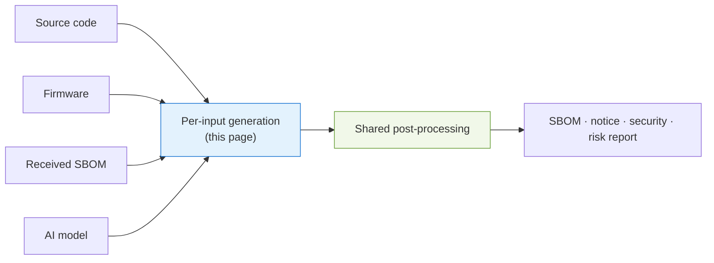
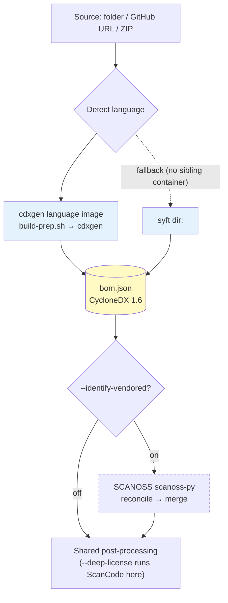
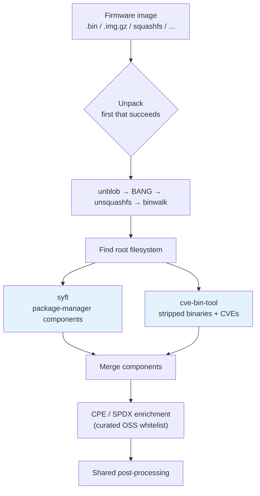
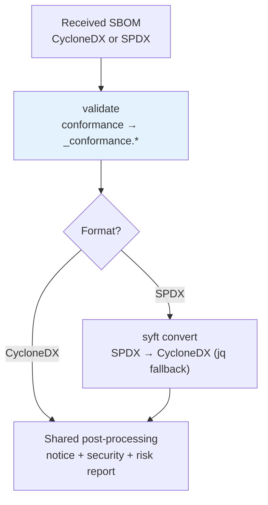
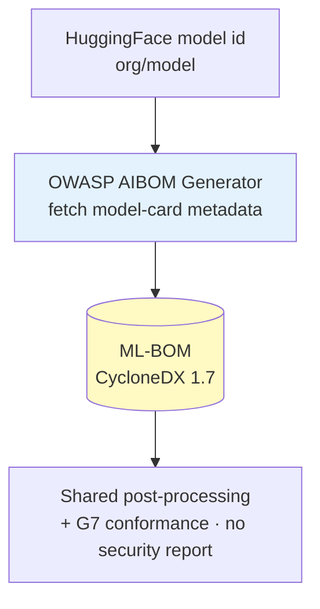
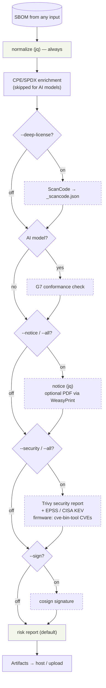

# Pipeline by input type

BomLens accepts several kinds of input — source code, firmware, an SBOM you received, and an AI model. Each has its own **generation** step that builds a CycloneDX SBOM, and then they all converge on one shared **post-processing** pipeline (notice, security, risk report). This page walks the tool flow for each input. For the high-level two-stage view, see [Architecture](architecture.md).

Every external tool below is open source; the table in [Open-source tools used](#open-source-tools-used) lists each one's role, license, and project link.

---

## Source code

A source folder, a GitHub URL, or a ZIP archive. Language detection picks the matching official [cdxgen](https://github.com/CycloneDX/cdxgen) language image, which prepares dependencies (`build-prep.sh`) and generates the SBOM. When BomLens cannot run a sibling container (for example the web UI's source scan), it falls back to [syft](https://github.com/anchore/syft) over the directory, which captures direct dependencies from lock files.

Two options apply to source scans only, and both are off by default.

- **Identify vendored OSS** (`--identify-vendored`, [SCANOSS](https://github.com/scanoss/scanoss.py)) — for C/C++ and other code copied in without a package manager. The SCANOSS client fingerprints files and queries the hosted OSSKB service, then BomLens reconciles the matches against what the package-manager scan already found and merges the rest into the SBOM.
- **Deep license detection** (`--deep-license`, [ScanCode Toolkit](https://github.com/aboutcode-org/scancode-toolkit)) — scans first-party source for license headers. It runs during post-processing and writes a separate `_scancode.json`.

> Container images, single binaries, and directories (root filesystems) skip cdxgen and are scanned directly by syft, then follow the same post-processing.

---

## Firmware

A network-device firmware image (`.bin`, `.img.gz`, squashfs, and more), handled by the opt-in `bomlens-firmware` image. Firmware packs an OS and dozens of libraries into one sealed file, so BomLens first unpacks it, then identifies components two ways: package-manager metadata with syft, and stripped static binaries with [cve-bin-tool](https://github.com/intel/cve-bin-tool) (which also matches CVEs). The two results merge, and a CPE/SPDX enrichment step fills identifiers for a curated list of well-known OSS (busybox, dropbear, dnsmasq, …) so Trivy and the notice can use them.

Unpacking tries tools in order, using the first that succeeds: [unblob](https://github.com/onekey-sec/unblob) (primary), [BANG](https://github.com/armijnhemel/binaryanalysis-ng), `unsquashfs` for standard squashfs, then `binwalk`.

> The firmware tools are GPL-family, so they live only in the `bomlens-firmware` image; the base image stays permissive-only. See the [firmware guide](../guides/firmware.md) and its limits.

---

## Received SBOM

An SBOM (CycloneDX or SPDX) received from a supplier or another team — no source code needed. BomLens first checks it against the quality criteria and writes a conformance report, then normalizes the input to CycloneDX so the rest of the pipeline can analyze it. SPDX is converted with `syft convert` (a `jq` fallback handles SPDX JSON if syft is unavailable). Notice, security, and the risk report are always produced in this mode.

> Validation is based on the original input before conversion, so SPDX is checked as SPDX. Details are in the [supplier SBOM guide](../guides/supplier-sbom.md).

---

## AI model

A HuggingFace model id (`org/model`), handled by the opt-in `bomlens-aibom` image. The [OWASP AIBOM Generator](https://github.com/GenAI-Security-Project/aibom-generator) fetches the model-card metadata over the network and builds a CycloneDX 1.7 ML-BOM centered on the model and its datasets. Post-processing then adds a G7 minimum-element conformance check. Because an AI model has no package CVEs, the security report is skipped.

> The model card's disclosure (weights, architecture, training data, training process) and the G7 result appear in the web UI's Models & datasets and G7 sections — see the [web UI reference](../reference/ui.md). For a step-by-step walkthrough, see the [AI model guide](../guides/ai-model.md).

---

## Shared post-processing

Whatever the input, the SBOM flows through the same ordered steps. Normalization runs first to stabilize the input for every later step; signing runs last so it covers the final SBOM. Dashed steps are optional or input-specific. Each step is best-effort — a failure is skipped with a warning rather than aborting the scan (signing and upload excepted).

The risk report is generated by default in every mode (it aggregates licenses and vulnerabilities); skip it with `--no-report`. For the step-by-step flag mapping, see [Architecture](architecture.md#flag-to-step-mapping).

---

## Open-source tools used

Every analysis tool is open source. The base image is permissive-only; GPL tools are isolated in the opt-in `bomlens-firmware` image, and the AI generator in `bomlens-aibom`.

| Tool | Role | Input | License | Image | Project |
|------|------|-------|---------|-------|---------|
| cdxgen | Generate the SBOM from source | source | Apache-2.0 | language images | [CycloneDX/cdxgen](https://github.com/CycloneDX/cdxgen) |
| syft | SBOM for images, binaries, directories, firmware rootfs | source (fallback), image, binary, rootfs, firmware | Apache-2.0 | base / firmware | [anchore/syft](https://github.com/anchore/syft) |
| SCANOSS (scanoss.py) | Identify vendored OSS via file fingerprints | source (`--identify-vendored`) | MIT | base | [scanoss/scanoss.py](https://github.com/scanoss/scanoss.py) |
| ScanCode Toolkit | Deep first-party license detection | source (`--deep-license`) | Apache-2.0 | base (opt-in) | [aboutcode-org/scancode-toolkit](https://github.com/aboutcode-org/scancode-toolkit) |
| unblob | Firmware unpacking (primary) | firmware | MIT | firmware | [onekey-sec/unblob](https://github.com/onekey-sec/unblob) |
| BANG | Firmware unpacking (fallback) | firmware | GPL-3.0 | firmware (opt) | [armijnhemel/binaryanalysis-ng](https://github.com/armijnhemel/binaryanalysis-ng) |
| cve-bin-tool | Stripped-binary identification + CVE matching | firmware | GPL-3.0 | firmware | [intel/cve-bin-tool](https://github.com/intel/cve-bin-tool) |
| OWASP AIBOM Generator | ML-BOM from a HuggingFace model card | AI model | Apache-2.0 | aibom | [GenAI-Security-Project/aibom-generator](https://github.com/GenAI-Security-Project/aibom-generator) |
| Trivy | Vulnerability (CVE) security report | all | Apache-2.0 | base | [aquasecurity/trivy](https://github.com/aquasecurity/trivy) |
| cosign | Detached SBOM signature | all (`--sign`) | Apache-2.0 | base | [sigstore/cosign](https://github.com/sigstore/cosign) |
| WeasyPrint | Optional PDF rendering of the notice | all (`SBOM_PDF` build) | BSD-3-Clause | base (opt-in) | [Kozea/WeasyPrint](https://github.com/Kozea/WeasyPrint) |
| jq | SBOM normalization, notice, report assembly | all | MIT | base | [jqlang/jq](https://github.com/jqlang/jq) |

> For the full license inventory and the GPL source-offer for the firmware image, see [THIRD_PARTY_LICENSES.md](https://github.com/sktelecom/bomlens/blob/main/THIRD_PARTY_LICENSES.md).

---

> **Related**: [Architecture](architecture.md) | [Firmware guide](../guides/firmware.md) | [Supplier SBOM guide](../guides/supplier-sbom.md) | [Identify bundled OSS](../guides/identify-vendored.md)
