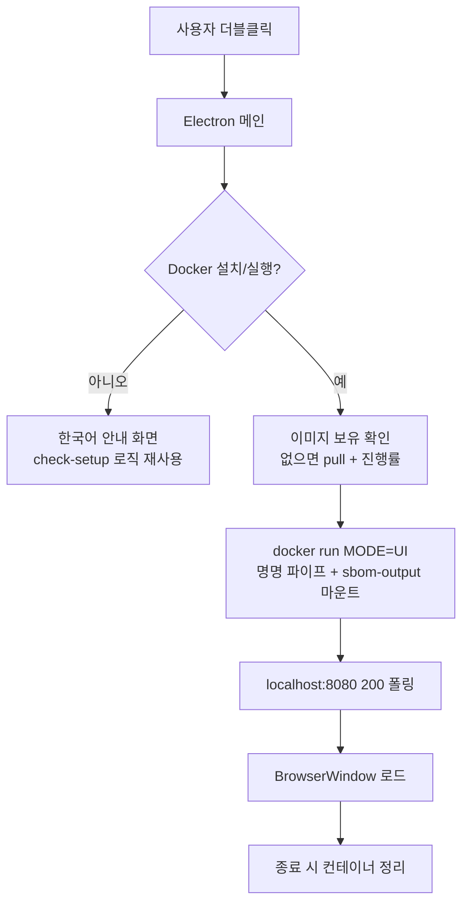

# Windows 데스크톱 앱(실행 파일) 도입 검토 보고서

> 작성일 2026-06-02. 대상 독자는 sbom-tools 메인테이너. 성격은 의사결정용 검토.

## 0. 요약 (Executive Summary)

비개발자 라이선스 담당자는 콘솔 없이 더블클릭으로 도구를 쓰고 싶어 한다. 같은 사내(SK텔레콤과
카카오) 오픈소스인 [onot](https://github.com/sktelecom/onot)은 이런 사용자층을 위해 더블클릭
한 번으로 실행되는 Windows 설치 파일을 제공한다. 우리도 같은 방식으로 개선할 수 있는지 검토했다.

결론은 두 가지다.

- 우리 도구의 전체 기능을 onot처럼 Docker 없는 단일 실행 파일로 묶는 것은 **비현실적**이다.
  도구의 가치 자체가 Docker 이미지에 cdxgen과 syft, trivy, 그리고 언어별 toolchain을 번들하는
  데 있기 때문이다.
- 대신 **기존 웹 UI를 Electron 데스크톱 앱으로 감싸 더블클릭 경험만 끌어올리는 방향**은 충분히
  현실적이고 권장할 만하다. 백엔드와 프론트가 이미 Docker 이미지 안에 있으므로, Electron은
  onot이 파이썬 사이드카를 띄우는 자리에 컨테이너를 띄우기만 하면 된다. 이는 지금
  `scripts/sbom-ui.bat`이 하는 일을 콘솔 없는 앱으로 승격하는 것과 같다.

| 항목 | 판단 |
|------|------|
| 전체 기능 네이티브 단일 .exe | 비현실적 (언어 toolchain과 이미지 크기) |
| Docker 없는 경량 고지문 전용 .exe | 가능하나 onot과 정면 중복 |
| Electron 래퍼 (Docker 유지) | **권장** |
| 이번 산출물 | 이 검토 보고서. 구현은 승인 후 별도 라운드 |

## 1. 배경과 목적

[시작하기](getting-started.md)와 [라이선스 담당자용 빠른 시작](notice-quickstart.md)에서 보듯,
현재 비개발자 흐름은 Docker 엔진을 설치하고 `scripts/sbom-ui.bat`을 더블클릭해 브라우저 UI를
여는 것이다. 동작은 하지만 검은 콘솔 창이 뜨고, 앱 아이콘이나 인스톨러가 없으며, Docker 설치
안내가 실행 시점에야 텍스트로 나온다.

onot은 같은 문제를 데스크톱 앱으로 풀었다. 이 선례를 우리 아키텍처에 적용할 수 있는지, 적용한다면
어떤 형태가 맞는지 판단하는 것이 이 검토의 목적이다.

## 2. onot 방식 요약

onot은 SBOM(CycloneDX, SPDX, Excel)을 입력받아 고지문(HTML, Text, Markdown, PDF)을 렌더링하는
순수 파이썬 도구다. 외부 도구 의존이 없어 다음 구조로 자기완결 실행 파일이 된다.

| 구성 | 역할 | 참조 |
|------|------|------|
| PyInstaller 사이드카 | 파이썬 + 의존성 + 라이선스 전문을 53MB 바이너리로 동결 | `onot/electron/build-sidecar.sh` |
| Electron 메인 | 사이드카를 spawn하고 `/healthz` 폴링 후 React UI 로드 | `onot/electron/main.mjs`, `onot/electron/lib/sidecar.mjs` |
| electron-builder | win은 `nsis`, mac은 `dmg`, linux는 `AppImage`로 패키징 | `onot/electron/electron-builder.yml` |
| CI build-desktop | `windows-latest`와 `macos-latest`에서 빌드해 아티팩트 업로드 | `onot/.github/workflows/ci.yml` |

핵심은 네트워크도 Docker도 필요 없는 에어갭 동작이다. 이것이 가능한 이유는 onot이 다루는 작업
(SBOM 파싱과 고지문 렌더링)이 순수 파이썬으로 끝나기 때문이다.

## 3. 제약 분석: 왜 우리는 단일 네이티브 .exe가 안 되는가

우리 도구의 가치는 onot과 정반대 지점에 있다. `docker/Dockerfile`과 `scripts/scan-sbom.sh`에서
확인되는 의존 구조 때문에 전체 기능을 네이티브로 묶는 것은 비현실적이다.

- 언어별 toolchain 의존. `scan-sbom.sh`의 2-stage 아키텍처는 소스를 감지해 cdxgen 언어별 이미지를
  on-demand로 띄운다. 네이티브로 옮기려면 JDK, Python, Go, Rust, Ruby, Node, PHP, .NET을 모두
  호스트에 깔아야 하고, 묶으면 수 GB가 된다.
- Linux 중심 도구. syft와 trivy, cosign은 Go 바이너리이고 unblob과 scancode는 파이썬이지만,
  파이프라인 전체가 리눅스 컨테이너 환경을 가정한다.
- 컨테이너 입력 모드. 이미지와 바이너리 스캔은 Docker 소켓을 통해 동작한다.

요약하면 onot은 "묶을 수 있는 작업"이라 묶었고, 우리는 "묶기 어려운 작업"이라 Docker에 담은
것이다. 이 차이는 설계 실수가 아니라 도구의 본질에서 온다.

## 4. 권장 방향: Electron 래퍼 (Docker 유지)

onot과 우리의 결정적 차이를 역이용한다. onot의 Electron은 파이썬 사이드카 바이너리를 띄우지만,
우리의 백엔드와 프론트는 **이미 Docker 이미지 안에 있다**. `docker/web/server.py`(파이썬 표준
라이브러리만 사용)가 `UI_PORT`(기본 8080)에서 React SPA(`docker/web/frontend/`)를 서빙하고,
`docker/entrypoint.sh`는 `MODE=UI`일 때 이 서버를 실행한다. 따라서 Electron은 사이드카 대신
UI 컨테이너를 띄우면 된다.

동작 설계의 각 단계는 이미 검증된 기존 자산을 재사용한다.

- Docker 점검. 메인 프로세스가 `docker version`과 `docker info`를 확인하고, 없으면 한국어 안내
  화면을 띄운다. `scripts/check-setup.sh`와 `check-setup.bat`의 점검 로직과 메시지를 그대로 옮긴다.
- 이미지 프리풀. 첫 실행이면 스캐너 이미지를 미리 받고 진행률을 창에 표시한다. `sbom-ui.bat`의
  프리풀 로직과 동일하다.
- 컨테이너 기동. `docker run`으로 `MODE=UI` 컨테이너를 띄운다. 마운트는 `sbom-ui.bat`과 같게
  명명 파이프와 `%USERPROFILE%\sbom-output` 출력 폴더를 쓴다.
- 헬스체크와 로드. `http://localhost:8080`이 200을 반환할 때까지 폴링한 뒤 `BrowserWindow`에
  로드한다. onot의 `lib/sidecar.mjs` 헬스체크 패턴과 같은 구조다.
- 수명주기. 앱을 닫으면 컨테이너를 정리한다. 먼저 graceful stop을 시도하고 안 되면 강제 종료한다.

컨테이너 안의 React SPA와 `server.py`를 그대로 쓰므로 프론트를 따로 번들할 필요가 없다. Electron에는
"Docker가 없습니다" 안내용 정적 페이지 하나만 동봉한다.

## 5. 패키징과 CI 설계

onot의 build-desktop 잡을 본보기로 삼는다. electron-builder로 win은 `nsis`, mac은 `dmg`,
linux는 `AppImage` 타깃을 만들고, `windows-latest`와 `macos-latest` 러너에서 빌드해 GitHub
릴리스에 첨부한다. 우리는 사이드카 빌드 단계가 없으므로 onot보다 파이프라인이 단순하다.
파이썬과 PyInstaller 단계가 빠지고 Electron 패키징만 남는다.

1차 산출물은 미서명으로 둔다. 정식 배포 시 코드 서명과 공증을 추가하는 문제는 아래 미결 질문에서
다룬다.

## 6. 대안 비교

| 대안 | 현실성 | 기각/채택 사유 |
|------|--------|----------------|
| 전체 기능 네이티브 단일 .exe | 낮음 | 언어 toolchain과 이미지 크기로 비현실적 |
| Docker 없는 경량 고지문 전용 .exe | 높음 | 기술적으로 가능하나 onot과 기능이 정면 중복 |
| onot 연동(핸드오프) | 높음 | 독자 패키징을 택해 이번에는 비채택, 경계만 명시 |
| Electron 래퍼(Docker 유지) | 높음 | **채택**. 전체 기능 유지하며 더블클릭 경험 확보 |

## 7. 트레이드오프 (현재 `sbom-ui.bat` 대비)

| 관점 | sbom-ui.bat (현재) | Electron 앱 (제안) |
|------|--------------------|--------------------|
| 실행 | 더블클릭 시 콘솔 창 노출 | 콘솔 없는 네이티브 창 |
| Docker 점검 | 실행 시점 텍스트 안내 | 시작 시 점검 후 안내 화면 |
| 배포 형태 | 저장소 ZIP 안의 .bat | 아이콘 있는 인스톨러(.exe/.dmg) |
| 다운로드 크기 | 수 KB(스크립트) | 약 150~200MB(Electron 런타임) |
| 빌드 파이프라인 | 없음 | electron-builder + CI 잡 추가 |
| Docker 필요 | 필요 | 여전히 필요 |
| 수명주기 관리 | 창 닫으면 컨테이너 종료 | graceful stop과 강제 종료 단계 |

이득은 콘솔 없는 진짜 더블클릭, 시작 시 Docker 자동 점검, 앱 아이콘과 인스톨러, 컨테이너 수명주기
관리다. 비용은 약 150~200MB 다운로드와 별도 빌드 파이프라인이며, Docker 의존은 그대로 남는다.

## 8. onot과의 관계와 경계

onot은 우리 출력 형식인 CycloneDX를 입력으로 받으므로, 두 도구는 자연스럽게 이어진다. 다만 이번
검토는 독자 패키징을 택했다. 역할 경계는 이렇게 정리한다. 우리는 소스를 스캔해 SBOM을 만들고
고지문과 보안 보고서까지 내는 전체 스캐닝 UI를 데스크톱 앱으로 감싼다. onot은 이미 만들어진 SBOM을
받아 고지문을 여러 형식으로 정교하게 렌더링한다. 우리 `docker/lib/generate-notice.sh`의 고지문과
기능이 일부 겹치는 것은 사실이며, 이 중복은 인지하고 진행한다. 향후 고지문 렌더링을 onot에 위임할지는
별도 논의로 남긴다.

## 9. 단계별 로드맵

1. 스파이크. Electron이 Windows에서 Docker를 구동하고 UI를 띄우는지 확인하고, 인스톨러 크기를
   실측한다. Docker 미설치와 미실행 상황의 안내 화면도 함께 본다.
2. MVP. win NSIS 1종으로 더블클릭부터 고지문 다운로드까지 완주되는 최소 앱을 만든다. 기존
   `tests/windows-e2e-checklist.md`를 앱 흐름에 맞게 확장해 검증한다.
3. 멀티플랫폼과 서명. mac dmg와 linux AppImage를 더하고 코드 서명과 공증을 붙인다.
4. 릴리스 통합. release 워크플로우에 데스크톱 아티팩트를 첨부하고 문서를 갱신한다.

## 10. 미결 질문

- 코드 서명 인증서의 주체와 비용 부담을 누가 지는가.
- 배포 채널은 GitHub Releases인가 사내 배포인가.
- 자동 업데이트(electron-updater)를 넣을 것인가.
- 데스크톱 앱 도입 후 `scripts/sbom-ui.bat`을 유지할 것인가 대체할 것인가.
- 최소 지원 Windows 버전과 아키텍처(x64, arm64)는 어디까지인가.
