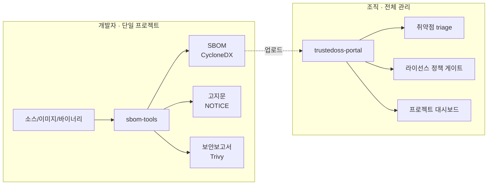

# sbom-tools 방향성 조사 보고서

> 작성일: 2026-05-30 · 대상 독자: sbom-tools 메인테이너 · 성격: 의사결정 + 실행 로드맵

## 0. 요약 (Executive Summary)

`sbom-tools`의 향후 방향을 5개 질문으로 조사했다. 결론은 **"sbom-tools를 단독 프로젝트용 경량 종합 스캐너로 강화"**하는 것이다 — 한 프로젝트의 **SBOM + 오픈소스 고지문 + 보안 취약점 보고서**를 로컬에서 한 번에 생성한다. 전사(全社) 프로젝트 관리·협업·취약점 triage·라이선스 정책 게이트는 자매 프로젝트 [`trustedoss-portal`](https://github.com/sktelecom/trustedoss-portal)에 위임한다.

| # | 질문 | 결론 |
|---|------|------|
| 1 | Docker 이미지의 의미 / 빌드 유무 차이 | **lockfile이 있으면 빌드 유무와 무관하게 동일 검출. lockfile 없는 python(+178%)·rust(+3500%)에서만 빌드환경이 transitive를 크게 늘림(실측).** `compare-cdxgen-vs-docker.sh`로 재현. |
| 2 | 이미지 커버리지는 충분한가 | **불충분 — Go·.NET 미설치, yarn/pnpm/poetry 누락, 도구 버전 미고정.** 커버리지 보강 + Android 추가 + 버전 고정. 장기적으로 언어별 이미지 분리 + on-demand pull. |
| 3 | SBOM + 고지문 + 보안보고서 | **`scan-sbom.sh` 플래그(`--notice`/`--security`/`--all`)로 통합.** 고지문 Text+HTML, 보안보고서 Trivy 기반 JSON+MD+HTML. scancode는 `--deep-license` 옵트인. |
| 4 | CLI 미숙 사용자용 UI | **localhost 웹 래퍼를 Docker 이미지에 내장.** `scan-sbom.sh --ui` → 브라우저. Windows는 `.bat` 더블클릭. Docker Desktop은 감지·안내. |
| 5 | 추가 고려 | CycloneDX 1.6, byte-stable 출력, cosign 서명, 빌드환경 자동감지, repo 위생, 테스트 계층화. |

### 역할 분담



sbom-tools는 **생성(generation)** 전문, trustedoss-portal은 **관리(governance)** 전문이다. 둘 다 cdxgen/Trivy를 공유하므로 산출물(CycloneDX)이 그대로 호환된다.

---

## 1. Docker 이미지의 의미 — cdxgen 단독 vs Docker 스캔

### 현황 진단
`docker/entrypoint.sh`(141–220줄)는 cdxgen을 실행하기 **전에** 언어별 의존성을 설치한다:

```sh
[ -f pom.xml ]      && mvn dependency:resolve ...      # Maven
[ -f build.gradle ] && gradle dependencies ...         # Gradle
[ -f Gemfile ]      && bundle install ...              # Ruby
[ -f composer.json ]&& composer install ...            # PHP
[ -f Cargo.toml ]   && cargo generate-lockfile ...     # Rust
[ -f requirements.txt ] && pip install ...             # Python
```

의존성 설치는 **lockfile이 없는 프로젝트에서 결정적**이다. cdxgen은 lockfile이 있으면 빌드 없이도 transitive까지 정확히 파싱하지만, lockfile이 없으면 매니페스트의 **직접 의존성만** 잡는다 — 이때 빌드(설치)가 lockfile을 생성해 전이 의존성을 끌어온다.

### 실측 데이터 (sbom-tools 자체, `compare-cdxgen-vs-docker.sh`)

같은 sbom-tools 이미지로 **빌드 유무만 달리해**(baseline `SKIP_BUILD=true` = 매니페스트/lockfile만, variant = 빌드 포함) 번들 예제를 측정한 결과:

| 프로젝트 | 빌드 없이 | 빌드 포함 | 차이 |
|----------|-------:|-------:|-----:|
| python (`requirements.txt`, lock 없음) | 14 | 39 | **+178%** |
| rust (`Cargo.toml`, `Cargo.lock` 없음) | 5 | 180 | **+3500%** |
| dotnet · go · java-gradle · java-maven · nodejs · php · ruby (lockfile 존재) | (동일) | (동일) | — |

→ **lockfile이 있는 7개 생태계는 빌드 유무와 무관하게 동일**(maven 91, npm 493 등). **lockfile이 없는 python·rust에서만 빌드환경이 transitive 검출을 크게 늘린다.**

> 주의: 초기 보고서는 `bd-scan`의 "+6271%"를 인용했으나, 그것은 **빌드도구 자체가 없어 Black Duck detector가 실패하는** 다른 맥락이다. sbom-tools는 cdxgen이 lockfile 파싱을 잘 수행하므로 그 수치는 적용되지 않는다. (초기 cdxgen-공식-이미지 baseline이 0을 반환한 것은 이미지 실행 문제였고, 빌드환경 부재가 아니었음 — 측정 교정 완료.)

### 권고 + 다음 단계
- Docker 이미지의 실제 가치는 ① **lockfile 없는 프로젝트의 정확도**(python·rust) ② 호스트 도구 설치 불필요(일관성) ③ SBOM+고지문+보안보고서 통합 ④ syft 이미지/바이너리 스캔 — "무조건 수 배 검출"이 아니다.
- 실증은 `tests/compare-cdxgen-vs-docker.sh`(같은 이미지 `SKIP_BUILD` 대조)로 재현. 결과 요약을 README **"Why Docker?"**에 게재.
- 권장: lockfile 없는 프로젝트 스캔 시 빌드 포함을 기본으로, lockfile 있으면 빌드 생략(`SKIP_BUILD`)으로 빠르게 — 향후 자동 판단 가능.

---

## 2. Docker 이미지 커버리지

### 현황 진단 (`docker/Dockerfile` 직접 확인)

`node:20-slim` 단일 이미지. README 지원 주장과 실제 설치 사이에 **명백한 갭**이 있다:

| 언어 | 패키지매니저 | README 주장 | Dockerfile 실제(개선 전) | 비고 |
|------|-------------|:-----------:|:-----------------------:|------|
| Java | Maven, Gradle | ✅ | ✅ (JDK17 단일) | 멀티버전 없음 |
| Python | pip, Poetry | ✅ | ⚠️ pip만 | **poetry/pipenv 누락** |
| Node.js | npm, Yarn, pnpm | ✅ | ⚠️ npm만 | **yarn/pnpm 누락** |
| Ruby | Bundler | ✅ | ✅ | |
| PHP | Composer | ✅ | ✅ | |
| Rust | Cargo | ✅ | ✅ | |
| **Go** | Go modules | ✅ | ❌ **미설치** | README 거짓 주장 |
| **.NET** | NuGet | ✅ | ❌ **미설치** | README 거짓 주장 |
| Android | Gradle+SDK | — | ❌ | 신규 요구 |
| 이미지/바이너리 | — (syft) | ✅ | ✅ | |

추가 문제: **도구 버전 미고정** — `cdxgen@latest`, syft는 `install.sh ... main`. 재현성이 깨지고 공급망 공격(커밋 `1d2ed74`의 Trivy 사건과 동질)에 노출된다.

### 권고 + 다음 단계
1. **Go·.NET 런타임 설치 추가** → README 주장과 일치시키고 fixtures의 `go`·`dotnet` 스캔 가능. (구현 완료)
2. **yarn/pnpm, poetry/pipenv 추가**. (구현 완료)
3. **Android 지원 추가** — Gradle + Android command-line tools/SDK. (구현 완료, `SBOM_ANDROID_SDK` 옵트인 빌드 인자)
4. **도구 버전 고정** — cdxgen·syft·Trivy·scancode를 명시적 버전(ARG)으로 핀 고정. (구현 완료)
5. **(로드맵) 언어별 이미지 분리 + on-demand pull** — `scan-sbom.sh`가 프로젝트 타입을 감지(bd-scan `detect_build_env()` 패턴)해 필요한 언어 이미지만 pull. 거대 단일 이미지의 pull 비용을 줄인다. 레지스트리 매트릭스 빌드가 필요하므로 별도 마일스톤으로 진행. → §5 Phase 5.

---

## 3. SBOM + 오픈소스 고지문 + 보안 보고서

### 설계 원칙
단독 프로젝트의 **결과물 3종 생성**은 sbom-tools 범위에 정확히 부합한다. 단, trustedoss-portal의 관리 기능(triage 워크플로우·정책 게이트·DB)은 가져오지 않는다.

### 고지문(NOTICE) — Text + HTML
- 라이선스 소스(기본): 이미 생성된 CycloneDX의 `components[].licenses` 필드. 추가 도구·온라인 조회 불필요(경량).
- `--deep-license` 옵트인: scancode-toolkit로 1st-party 소스코드의 라이선스 헤더까지 탐지(무겁고 느려 기본 비활성).
- 구현: `docker/lib/generate-notice.sh` — SBOM JSON → 라이선스별 그룹핑 → `NOTICE.txt` / `NOTICE.html`. HTML은 모든 필드를 escape(XSS 방어). trustedoss-portal `services/obligation_service.py`의 렌더 구조 차용.

### 보안 보고서 — Trivy 기반 JSON + Markdown + HTML
- 엔진: **Trivy(버전 고정)** — `trivy sbom --format json --input <bom.json>`. NVD+OSV+GHSA DB.
- 구현: `docker/lib/scan-security.sh` — Trivy JSON → severity 정규화·집계 → `_security.json` / `_security.md` / `_security.html`. trustedoss-portal `integrations/trivy.py`·`services/report_service.py` 패턴 차용.
- 공급망 안전: Trivy를 **CLI 바이너리로 버전 고정** 설치(문제됐던 `trivy-action@master`와 다름). `.github/workflows/docker-publish.yml`의 비활성화 스텝도 핀 고정으로 재활성화.

### 호출 방식 — `scan-sbom.sh` 플래그 확장
```bash
scan-sbom.sh --project App --version 1.0 --generate-only           # SBOM만 (기존 호환)
scan-sbom.sh --project App --version 1.0 --notice --generate-only  # + 고지문
scan-sbom.sh --project App --version 1.0 --security --generate-only# + 보안보고서
scan-sbom.sh --project App --version 1.0 --all --generate-only     # 3종 모두
scan-sbom.sh ... --all --deep-license                              # + scancode 정밀 라이선스
```
산출물: `{project}_{version}_bom.json`, `{project}_{version}_NOTICE.{txt,html}`, `{project}_{version}_security.{json,md,html}`.

---

## 4. CLI 미숙 사용자용 경량 UI

### 방식 — localhost 웹 래퍼 + Docker 이미지 내장
데스크톱 앱(Tauri/Wails)은 OS별 크로스 빌드·코드 서명(Windows SmartScreen, macOS notarization) 부담이 크다. 반면 **localhost 웹 UI를 기존 Docker 이미지에 내장**하면 추가 런타임이 0이고 크로스플랫폼이다.

- 구현: `docker/web/server.py`(Python 표준 라이브러리 `http.server`만 사용, 추가 의존성 없음) + `docker/web/index.html`.
- 실행: `scan-sbom.sh --ui` → `docker run -p 8080:8080` → 브라우저 자동 오픈.
- 기능 범위(실행 + 결과 뷰어): 폼 입력(프로젝트·버전·타겟·옵션 체크박스) → 스캔 실행(로그 스트리밍) → SBOM·고지문·보안보고서를 화면에서 보고 다운로드.
- Windows: `scripts/sbom-ui.bat` 더블클릭 → Docker 확인 → 컨테이너 기동 → 기본 브라우저 오픈.

### Docker 의존성 (진짜 병목)
UI가 쉬워도 **Docker Desktop 설치가 진입 장벽**이다. 따라서 런처가 Docker 설치·구동 여부를 **감지하고, 없으면 공식 설치 링크와 가이드를 안내**한다(자동 설치는 권한·라이선스 문제로 제외).

---

## 5. 추가 고려사항 + 단계별 실행 로드맵

### 추가 과제
- **CycloneDX 1.4 → 1.6 업그레이드**: cdxgen `--spec-version 1.6`, syft `cyclonedx-json@1.6`. 최신 스키마(라이선스 표현·lifecycle). (Phase 3에서 적용)
- **결정론적·byte-stable 출력**: `metadata.timestamp` 고정/제거 + `components`를 purl로 정렬 → 동일 입력 동일 바이트. CI diff·재현성. (`docker/lib/normalize-sbom.sh`)
- **SBOM 서명/검증(cosign)**: `--sign` 옵트인 시 `cosign sign-blob`로 detached 서명. (Phase 5)
- **빌드환경 자동감지 고도화**: bd-scan `detect_build_env()` + prune 정책(node_modules·build·dist 제외). 언어별 이미지 분리(Phase 5)의 토대.
- **repo 위생**: 루트 `sbom-tools-20260312.zip`·`.DS_Store`는 git 미추적이나 작업트리에 존재 — 정리 권고. `.gitignore`는 이미 커버.
- **테스트 계층화**: bd-scan 3단계(Level 1 격리 / Level 2 Docker / Level 3 실스캔). 항목1·2 검증을 CI 자동화.

### 실행 로드맵

각 Phase의 **구체 구현 방법**:

#### Phase 1 — 커버리지 보강 + 버전 고정 (기반)
- `docker/Dockerfile`:
  - Go(`golang` apt 또는 tarball, `ARG GO_VERSION`), .NET SDK(`dotnet-sdk-8.0`, `ARG DOTNET_VERSION`) 설치.
  - corepack로 yarn/pnpm 활성화, `pipx`/`pip`로 poetry·pipenv 설치.
  - cdxgen·syft·Trivy·scancode를 `ARG ...VERSION`으로 핀 고정.
  - Android: `ARG SBOM_ANDROID_SDK=false` — true일 때만 cmdline-tools + SDK 설치(이미지 비대화 방지).
- 검증: `docker build` 성공 + `shellcheck`.

#### Phase 2 — 실증 비교 (질문 1 데이터)
- `tests/compare-cdxgen-vs-docker.sh`: fixtures 루프 → A(cdxgen 단독)·B(Docker) 스캔 → 컴포넌트·취약점·시간 측정 → CSV.
- README "Why Docker?" 표 추가.

#### Phase 3 — 고지문 + 보안보고서 (질문 3)
- `docker/lib/generate-notice.sh`, `docker/lib/scan-security.sh`, `docker/lib/normalize-sbom.sh` 신규.
- `docker/entrypoint.sh`: Go/.NET/poetry 빌드 분기 추가, SBOM 생성 후 `GENERATE_NOTICE`/`GENERATE_SECURITY`/`DEEP_LICENSE` 환경변수에 따라 헬퍼 호출, CycloneDX 1.6 출력, normalize 적용.
- `scripts/scan-sbom.sh`·`scan-sbom.bat`: `--notice`/`--security`/`--all`/`--deep-license` 플래그 + 환경변수 전달.

#### Phase 4 — 웹 UI (질문 4)
- `docker/web/server.py` + `index.html`, `entrypoint.sh`에 `UI` 모드, `scan-sbom.sh --ui`, `scripts/sbom-ui.bat`.

#### Phase 5 — 고도화 (로드맵)
- 언어별 이미지 분리 + on-demand pull(레지스트리 매트릭스 빌드), cosign 서명, 빌드환경 자동감지 함수화.

---

## 부록: 참고 프로젝트 매핑

| sbom-tools 기능 | 차용 출처 |
|----------------|----------|
| 실증 비교 방법론 | `bd-scan/tests/level3/e2e_compare_legacy_vs_current.sh` |
| 빌드환경/컴포넌트 감지 | `bd-scan/local-scan/scan.sh` (`detect_build_env`, `detect_components`) |
| 고지문 렌더 | `trustedoss-portal/apps/backend/services/obligation_service.py` |
| Trivy 통합 | `trustedoss-portal/apps/backend/integrations/trivy.py` |
| 취약점 보고서 | `trustedoss-portal/apps/backend/services/report_service.py` |
| byte-stable SBOM | `trustedoss-portal` SBOM export (BUG-006) |
