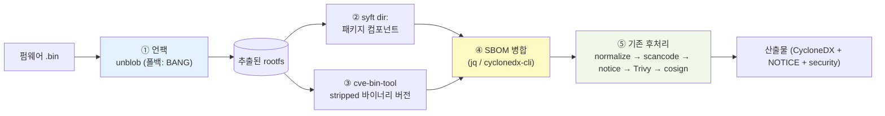

# 펌웨어 분석 (Firmware Analysis)

> **관련 문서**: [아키텍처](architecture.md) · [방향성 조사 보고서](direction-study.md) · [고지문·보안·UI 가이드](notice-security-ui-guide.md) · [번들 도구 라이선스](../THIRD_PARTY_LICENSES.md)
>
> 성격: 설계·의사결정 문서 (메인테이너용). 일부 단계는 **구현 예정**이며 본문에 명시했습니다.

## 요약 (Executive Summary)

공급사가 제공한 **네트워크 장비 펌웨어 바이너리**(`.bin`/`.img`/squashfs 등)의 SBOM·보안취약점·라이선스 점검 시나리오를 다룹니다.

- **현재**: 펌웨어 파일을 그대로 넣으면 **거의 검출하지 못합니다**(빈 SBOM). 이미지에 언팩 도구조차 없습니다.
- **방향**: **언팩(unblob, 폴백 BANG) → syft(패키지) + cve-bin-tool(stripped 바이너리) → SBOM 병합 → 기존 후처리(라이선스·CVE·서명) 재사용**. 별도 opt-in 이미지 `sbom-scanner-firmware`로 제공.
- **기대치**: 오픈소스 스택으로 검출률 약 **60~85%**. 상용 도구(Insignary Clarity 등)의 **함수 수준 바이너리 핑거프린팅**은 알고리즘은 재현 가능하나 멀티아키·멀티버전 시그니처 코퍼스 부재로 동등 정확도는 미달 — 고비용 고도화 트랙(Phase 3)으로 분류합니다.

핵심 원칙: **"가방 열기(언팩)"는 전용 도구, "내용물 식별·라이선스·CVE"는 우리가 이미 가진 도구**로 역할을 분리합니다.

---

## 목차
- [1. 현재 능력과 한계](#1-현재-능력과-한계)
- [2. 오픈소스 스택과 워크플로우](#2-오픈소스-스택과-워크플로우)
- [3. 바이너리 OSS 식별 도구 카탈로그](#3-바이너리-oss-식별-도구-카탈로그)
- [4. BANG 검토 결론](#4-bang-검토-결론)
- [5. 구현 설계 — FIRMWARE 모드](#5-구현-설계--firmware-모드)
- [6. 단계별 로드맵 (Phase)](#6-단계별-로드맵-phase)
- [7. 정직한 한계](#7-정직한-한계)
- [8. 라이선스 주의](#8-라이선스-주의)

---

## 1. 현재 능력과 한계

펌웨어는 운영체제·라이브러리 수십 개가 **통째로 압축·밀봉된 이삿짐 가방**과 같습니다. 현재 파이프라인은 이 가방을 **열지 못합니다**.

| 입력 | 현재 동작 | 결과 |
|------|-----------|------|
| 펌웨어 `.bin` (압축/squashfs) | `BINARY` 모드 → `syft file:` → 거의 항상 실패 → 빈 SBOM 폴백 (`docker/entrypoint.sh:67-83`) | ❌ 컴포넌트 0개 |
| 압축 해제된 rootfs 디렉터리 | `ROOTFS` 모드 → `syft dir:` | ⚠️ 패키지 DB(opkg/dpkg/apk/rpm)만 검출, stripped 정적 바이너리는 놓침 |

추가로 `docker/Dockerfile`에는 펌웨어 언팩 도구(binwalk/unblob/unsquashfs 등)가 **설치되어 있지 않습니다**. 즉 사용자가 외부에서 직접 언팩한 rootfs를 `ROOTFS` 모드로 넘기지 않는 한, 펌웨어는 사실상 점검 불가입니다.

**검출/미검출 요약**

| 항목 | 검출 | 미검출 |
|------|------|--------|
| 패키지 매니저로 설치된 컴포넌트(opkg/dpkg/apk/rpm) | ✅ (언팩 후) | — |
| stripped 정적 링크 바이너리(busybox, openssl, dropbear 등) | — | ❌ syft만으로는 놓침 |
| 펌웨어 직접 입력(언팩 전) | — | ❌ 빈 SBOM |

---

## 2. 오픈소스 스택과 워크플로우



| 단계 | 도구 | 라이선스 | 역할 |
|------|------|----------|------|
| ① 언팩 | **unblob** (폴백 **BANG**) | MIT (BANG: GPL-3.0) | 펌웨어 압축·파일시스템 해제 → rootfs 추출 |
| ② 패키지 식별 | **syft** | Apache-2.0 | rootfs의 패키지 매니저 DB 기반 컴포넌트 |
| ③ 바이너리 식별 | **cve-bin-tool** | GPL-3.0 | stripped 정적 바이너리의 버전 문자열 + CVE (CycloneDX 입출력) |
| ④ 병합 | jq / cyclonedx-cli | MIT/Apache-2.0 | ②③ SBOM을 하나로 합쳐 후처리 입력 단일화 |
| ⑤ 후처리 | scancode / Trivy / cosign | Apache-2.0 | **기존 파이프라인 그대로 재사용** (라이선스·CVE·서명) |

**식별의 두 방식** (비유: 라벨 읽기 vs 지문 대조)
- **라벨 읽기** = `syft` — 부품에 붙은 패키지 라벨(opkg 등)을 읽음. 쉽고 정확하나 라벨 없으면 못 읽음.
- **버전 글자 지문** = `cve-bin-tool` — 바이너리 안에 적힌 버전 문자열을 뒤짐. 글자가 strip되면 실패.
- **모양(함수) 지문** = 상용 도구의 핵심. 오픈소스로는 정확도 한계 → §3·§6 Phase 3 참조.

---

## 3. 바이너리 OSS 식별 도구 카탈로그

함수 수준 핑거프린팅 **알고리즘은 오픈소스로 재현 가능**하며, 공개 시그니처 DB를 가진 도구도 일부 실재합니다. 다만 진짜 해자는 **라벨링된 멀티아키·멀티버전 시그니처 코퍼스**(상용 Insignary는 ≈ 40,000개 OSS 프로젝트)이고, 정확도 격차는 큽니다 — 상용 컴포넌트 95%+/버전 90%+ 대비 오픈소스 최고가 컴포넌트 70~80%/버전 50~60%, stripped MIPS에선 더 악화.

### A. 사전구축 DB 보유 → 즉시 식별 가능
| 도구 | 방식 | 사전구축 DB | 라이선스 | 성숙도 |
|------|------|-------------|----------|--------|
| **SCANOSS** | winnowing (파일/스니펫) | ✅ 100M+ OSSKB 공개 | GPL-2.0 / MIT | **프로덕션급**, CycloneDX 네이티브 |
| **LibDB** | 함수 임베딩 + 신경망 | ✅ Fedora 25k 버전 DB + 모델 | 학술 | 프로토타입 |
| **LibAM** | 함수 영역(area) 매칭 | ✅ 사전추출 특성 + Docker | 학술 | 프로토타입, 부분 임포트 강함 |
| **BinaryAI** | 트랜스포머 binary↔source | ✅ 모델 공개 | 학술 | ICSE 2024, 정밀도 ~86% |

### B. 펌웨어 통합 프레임워크
| 도구 | 라이선스 | 비고 |
|------|----------|------|
| **EMBA** | GPL-3.0 | 펌웨어 분석 끝판왕, CycloneDX+VEX, Dependency-Track 연계 |
| **FACT** | GPL-3.0 | Fraunhofer, 모듈식 펌웨어 분석 |
| **BANG** | GPL-3.0 | Armijn Hemel, 언팩 강력 (§4) |

### C. 유사도 엔진 (모델만 제공, OSS 라벨 DB는 직접 구축 필요)
| 도구 | 라이선스 | 한계 |
|------|----------|------|
| **Ghidra BSim / FID** | Apache-2.0 | ARM·MIPS 지원하나 공개 시그니처 DB 부족 |
| **jTrans · SAFE · Trex · PalmTree · Kam1n0** | MIT 등 | "유사도"만 풀고 OSS 라벨 매핑은 별도 |
| **Diaphora** | AGPL-3.0 | binary diffing |
| **Karta** | MIT | **IDA Pro(상용) 필수** |

**판정**: "함수 수준 핑거프린팅 + 즉시 쓸 DB"를 둘 다 갖춘 건 LibDB/LibAM/BinaryAI(학술 프로토타입, 견고성·유지보수 약함)뿐입니다. 프로덕션 안정성 + 거대 공개 KB는 파일/스니펫 레벨인 **SCANOSS**가 독보적입니다. → 함수 핑거프린팅은 "불가능"이 아니라 **"학술 도구 통합 또는 자체 DB 구축이 필요한 Phase 3 선택지"** 입니다.

---

## 4. BANG 검토 결론

Armijn Hemel(GPL 위반 적발로 유명한 라이선스 컴플라이언스 전문가)의 **BANG(Binary Analysis Next Generation)**, GPL-3.0, 활발히 유지보수.

| 영역 | 평가 |
|------|------|
| **언팩** | ⭐⭐⭐⭐⭐ 221+ 포맷, 재귀, squashfs/ubifs/exotic 펌웨어 — binwalk/unblob 우위 |
| 컴포넌트 식별 | 해시·문자열 기반. **대조용 knowledge base는 자체 구축 필요**(공개 DB 없음, 고비용) |
| 라이선스 식별 | ⚠️ 미완성 (옛 BAT의 코드클론 탐지가 BANG엔 미포함) |
| CVE 식별 | ⚠️ 프로토타입 ("DO NOT USE" 표기) |
| SBOM(CycloneDX) 출력 | ❌ 없음 |

**결론**: "라이선스 거장이 만든 도구"라는 기대와 달리, 라이선스/CVE 식별 기능은 미완성입니다. **BANG은 "언팩 폴백"으로만 채택**합니다. 라이선스/CVE/SBOM은 우리가 이미 가진 scancode/Trivy/syft가 더 성숙하므로 그 영역에 BANG을 쓰지 않습니다.

---

## 5. 구현 설계 — FIRMWARE 모드

> **구현 완료(Phase 1+2).** 기존 IMAGE/BINARY/ROOTFS 모드와 동일하게 **후처리 이미지 패밀리의 한 모드**로 추가하되, 무거운 언팩·바이너리 분석 도구는 별도 opt-in 이미지 `sbom-scanner-firmware`에만 설치합니다. 폴백 언팩은 BANG(설치 시) → binwalk 순입니다.

### 5.1 `scripts/scan-sbom.sh`
- `FIRMWARE_IMAGE="${SBOM_FIRMWARE_IMAGE:-ghcr.io/sktelecom/sbom-scanner-firmware:latest}"` 변수 추가.
- `is_firmware()` 헬퍼: 확장자(`.bin .img .squashfs .ubi .ubifs .trx .chk .fw .rom` 등) + (호스트에 `file`이 있으면) magic 검사.
- 타깃 감지(`scan-sbom.sh:128-133`)에 FIRMWARE 분기, `--firmware` 강제 플래그 추가.
- `case "$MODE"`(`scan-sbom.sh:219-223`)에 `FIRMWARE)` 디스패치 → `RUN_IMAGE="$FIRMWARE_IMAGE"`. `pp_env()`는 그대로 재사용.

### 5.2 `docker/entrypoint.sh`
- BINARY case 뒤에 `FIRMWARE)` case 추가 → `bash "$LIBDIR/scan-firmware.sh" "$TARGET_FILE" "$OUTPUT_FILE" "$PROJECT_VERSION"`.
- `LIBDIR` 정의를 case 블록 위로 이동.
- 그 아래 **공통 파이프라인(normalize → scancode → notice → Trivy → cosign → upload)은 무수정 재사용**.

### 5.3 `docker/lib/scan-firmware.sh` (신규)
```
scan-firmware.sh <firmware_file> <output_sbom.json> <version>
```
1. `WORK=$(mktemp -d)` (trap으로 cleanup), 언팩: **unblob 우선**, 실패/미설치 시 **BANG 폴백**.
2. rootfs 후보 디렉터리 탐색(없으면 추출 루트 전체).
3. `syft dir:$ROOTFS -o cyclonedx-json` → 패키지 SBOM.
4. (Phase 2) `cve-bin-tool ... --sbom-output ... cyclonedx` → 바이너리 SBOM.
5. 병합(cyclonedx-cli 또는 jq, purl 기준 dedupe) → `$OUTPUT_FILE`.
6. `metadata.component`를 펌웨어 파일명/버전/`file` 출력으로 채움.

기존 `docker/lib/*.sh` 스타일(인자 위치, `[prefix]` 로깅, jq, best-effort)을 따릅니다.

### 5.4 `docker/Dockerfile`
- `ARG SBOM_FIRMWARE=false` + `CVE_BIN_TOOL_VERSION`/`UNBLOB_VERSION` 핀.
- scancode opt-in 블록(`Dockerfile:60-67`) 패턴 그대로, `COPY` 이전에 firmware opt-in RUN 블록 추가(unblob + cve-bin-tool, 폴백 BANG).
- 배포는 별도 태그 `sbom-scanner-firmware:latest`로 분리 → **경량 기본 이미지 보호**.

### 5.5 테스트
- `tests/test-scan.sh`/`tests/test-e2e.sh`에 소형 squashfs fixture로 FIRMWARE e2e 케이스 추가.
- 기본 이미지 회귀(firmware 도구 미설치) 확인.

---

## 6. 단계별 로드맵 (Phase)

| Phase | 범위 | 검출 | 미검출 |
|-------|------|------|--------|
| **1 (MVP)** | 언팩(unblob+BANG 폴백) + syft dir | opkg/dpkg/apk/rpm 패키지 | stripped 바이너리 |
| **2 (목표 범위)** | + cve-bin-tool + SBOM 병합 | busybox/openssl/zlib/dropbear 등 stripped 정적 바이너리의 버전·CVE | 버전 strip된 바이너리, 사명 변경 라이브러리 |
| **3 (선택·고도화)** | 정확도 향상 트랙 | — | — |

**Phase 3 우선순위** (현실적):
1. **SCANOSS** winnowing 통합 — 공개 OSSKB, CycloneDX 병합, 통합 난이도 낮음.
2. **EMBA** 결과 수집기 연계 — 펌웨어 전용, CycloneDX+VEX.
3. 함수 핑거프린팅이 필요하면 **LibDB/BinaryAI**(학술 공개 모델/DB) 실험 또는 **Ghidra BSim 커스텀 DB** 자체 구축(3~6개월 고비용).
4. 그 외: 중첩 추출, 커널/모듈, rootfs deep-license(scancode), UI 업로드 경로(`docker/web/server.py`).

> 이번 구현 목표는 **Phase 1+2** 입니다.

---

## 7. 정직한 한계

- 오픈소스 스택 검출률은 약 **60~85%**, 펌웨어 종류·strip 정도·언팩 성공 여부에 크게 좌우됩니다.
- **함수 수준 바이너리 핑거프린팅 부재** — 상용(Insignary Clarity/Cybellum/Finite State) 대비 strip·인라인·버전 제거된 컴포넌트는 놓칩니다.
- **암호화/서명된 펌웨어, 벤더 커스텀·사명 변경 라이브러리**는 검출 불가/부정확.
- 결과 SBOM은 **best-effort 추정**이며, 법적 라이선스 컴플라이언스의 **단일 근거로 사용하지 마십시오**.

---

## 8. 라이선스 주의

- 펌웨어 이미지에는 **GPL 도구**가 포함됩니다: cve-bin-tool(GPL-3.0), BANG(GPL-3.0), unblob 의존 extractor 중 sasquatch(GPL-2.0)·ubi_reader(GPL-3.0). unblob 본체·binwalk는 MIT.
- 우리 셸 스크립트는 이들을 **별도 프로세스로 호출**하고 수정하지 않으므로, copyleft가 우리 Apache-2.0 코드로 **전파되지 않습니다**(mere aggregation).
- 다만 GPL 바이너리를 이미지로 재배포하므로 **라이선스 텍스트 동봉 + 소스 오퍼** 의무가 있습니다.
- **AGPL 도구는 사용하지 않습니다**(unblob=MIT 확인) → 웹 UI(`--ui`) 관련 네트워크 조항 우려 없음.
- GPL은 **별도 `sbom-scanner-firmware` 이미지에만** 들어가고 **기본 이미지는 permissive-only**로 유지합니다.
- 상세 인벤토리·의무는 [../THIRD_PARTY_LICENSES.md](../THIRD_PARTY_LICENSES.md) 참조.
