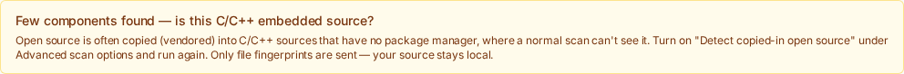
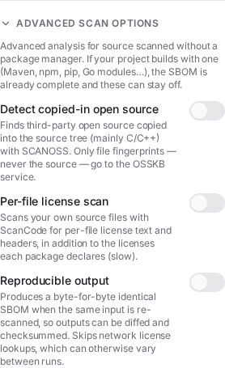
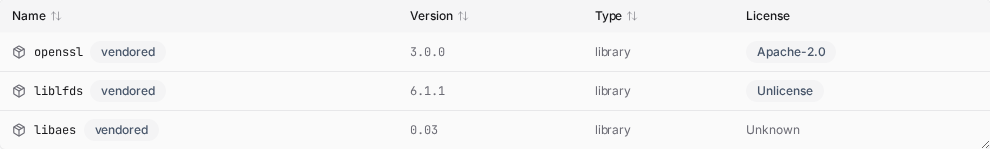

# 내장 오픈소스 식별 (C/C++)

C/C++ 임베디드 소스를 스캔했는데 BomLens가 거의 아무것도 못 찾을 때 사용합니다.

## 언제 필요한가

일반 스캔은 패키지 매니저(npm, Maven, pip, Go, Conan 등)를 읽어 프로젝트가 어떤 오픈소스를 쓰는지 파악합니다. C/C++ 임베디드 펌웨어에는 대개 패키지 매니저가 없고, 오픈소스가 소스 트리에 그대로 복사돼 있습니다. 예를 들어 `third_party/` 아래에 openssl·zlib·liblfds 사본이 들어가는 식인데, 이를 소스째 포함(vendored)이라고 합니다. cdxgen은 이런 파일의 이름을 알 수 없어, SBOM이 거의 비고 각 파일이 식별 안 된 `pkg:generic` 항목으로만 나옵니다.

이 상황이 되면 BomLens가 이 옵션을 권하는 한 줄 안내를 출력하고, 웹 UI도 스캔 후 같은 안내를 보여줍니다. 사용자가 직접 상황을 알아챌 필요는 없습니다.



`--identify-vendored`는 소스 파일의 지문을 공개 OSSKB 지식 베이스와 대조해, 일치한 항목을 이름·버전·PURL을 갖춘 컴포넌트로 기록합니다. 그러면 복사돼 들어간 오픈소스가 SBOM에 드러나고, 알려진 CVE가 있는 라이브러리는 보안 보고서에도 나타납니다.

## 무엇이 전송되나

OSSKB 서비스로는 파일 **지문(해시)**만 전송됩니다. 소스 코드는 기기를 떠나지 않습니다. 공급사는 계약 전에 자기 환경에서 그대로 실행할 수 있습니다.

## 패키지 매니저가 있는 프로젝트에서는

이 옵션은 패키지 매니저가 없는 소스를 위한 것입니다. npm, Maven, pip, Go 등을 쓰는 프로젝트라면 일반 스캔이 이미 의존성을 해석하므로 필요하지 않습니다. 그래도 켜면 BomLens가 결과를 정리해 중복을 없앱니다. 의존성·빌드 디렉터리(`node_modules`, `vendor`, `dist` 등)는 건너뛰고, 패키지 매니저 컴포넌트에 이미 있는 이름과 겹치는 매칭 결과는 더 정확한 패키지 매니저 쪽 식별을 우선해 제거합니다. 그래서 관리 프로젝트에서 켜도 알려진 의존성이 중복되거나 취약점 수가 부풀지 않으며, 기껏해야 패키지 매니저가 못 본 진짜 복사된 소스만 추가됩니다.

각 매칭 결과는 출처와 신뢰도를 붙여 읽기 전용으로 기록합니다. BomLens는 승인/반려 같은 감사 절차를 제공하지 않습니다. 매칭 결과를 확정하거나 분류해야 하면 SBOM을 취약점 관리 시스템(Dependency-Track, TRUSCA 등)에 올려 거기서 처리하세요.

## 준비

발행된 `bomlens` 이미지(v1.4.0 이상)에는 SCANOSS 클라이언트가 이미 포함돼 있어 별도 설정이 필요 없습니다. 이미지를 최소 구성으로 직접 빌드하는 경우에만 build arg를 추가합니다.

```bash
docker build --build-arg SBOM_SCANOSS=true -t bomlens ./docker
```

## 실행

```bash
scan-sbom.sh --project trelay --version 26.4.0 --target ./src \
  --identify-vendored --all --generate-only
```

웹 UI·데스크톱 앱에서는 **고급**을 펼쳐 **파일 단위 식별 (SCANOSS)** 토글을 켭니다. 화면 라벨은 "파일 단위 식별 (SCANOSS)"이지만 이 문서에서 말하는 내장 오픈소스 식별과 같은 기능입니다. 이 옵션은 소스 스캔(현재 디렉터리, git URL, ZIP 업로드)이면서 이미지가 지원할 때만 보입니다.

명령어가 낯선 Windows 사용자는 [비개발자 빠른 시작](../start/no-cli.ko.md)의 데스크톱 앱 안내를 먼저 따라 하세요.



## 결과

- 복사된 오픈소스가 버전을 가진 컴포넌트로 SBOM에 나타나며, 각 항목에 `vendored` 표시(`bomlens:layer=vendored` 속성)가 붙습니다.
- 알려진 제품으로 매핑되는 컴포넌트에는 CPE가 붙어, Trivy 보안 보고서에 해당 CVE가 나열됩니다. 예를 들어 vendored된 `openssl 1.1.1w`는 관련 취약점과 함께 나타납니다.
- 취약점 데이터베이스에 기록이 없는 흔치 않은 라이브러리(예: `liblfds`, `libaes`, `djbdns`)는 이름과 버전까지 식별됩니다. 보고할 CVE가 없을 뿐이며, 이는 스캔이 아니라 공개 데이터의 한계입니다.

파일 단위 전체 일치만 컴포넌트가 됩니다. 부분(스니펫) 일치는 노이즈가 커서 제외하므로 보고서가 깔끔하게 유지됩니다.



## 엔드포인트와 제한

기본 엔드포인트는 무료 OSSKB API로, 요청 빈도 제한이 있고 식별 전용입니다. CLI에서는 대량 사용이나 에어갭 환경을 위해 SCANOSS 상용·자체 호스팅 엔드포인트를 환경변수로 지정할 수 있습니다.

```bash
SCANOSS_API_URL=https://your-scanoss-endpoint \
SCANOSS_API_KEY=your-key \
scan-sbom.sh --project trelay --version 26.4.0 --target ./src --identify-vendored --all --generate-only
```

웹 UI·데스크톱 앱에서는 토큰만 화면에서 넣을 수 있습니다. 무료 OSSKB 호출 한도에 걸리면 **파일 단위 식별 (SCANOSS)** 토글을 켤 때 아래에 나타나는 토큰칸에 scanoss.com에서 발급한 토큰을 넣고 다시 실행하세요. 토큰은 그 스캔에만 한 번 쓰이고 저장하거나 로그에 남지 않습니다.

엔드포인트 주소(`SCANOSS_API_URL`)와 보고 임계값(`SCANOSS_MIN_FILES`)은 CLI와 컨테이너 환경변수로만 설정하며, 웹 UI·데스크톱 앱에는 입력 화면이 없습니다. 특히 데스크톱 앱은 `SCANOSS_API_URL`을 컨테이너로 전달하지 않으므로, 현재 데스크톱 앱 화면에서는 상용·자체 호스팅 엔드포인트를 쓸 수 없습니다. 이 엔드포인트가 필요하면 CLI나 `sbom-ui.bat`로 실행하면서 환경변수를 지정하세요.

버전은 근사값입니다. 파일 매칭은 그 파일 내용이 처음 등장한 릴리스를 버전으로 보고하므로, 같은 라이브러리라도 파일마다 버전이 조금씩 다르게 나오거나 실제보다 한 단계 어긋난 릴리스로 보고될 수 있습니다. 버전(과 그로부터 도출된 CVE)은 최종 판정이 아니라 검토의 출발점으로 삼으세요.

귀속(어느 프로젝트인지)도 틀릴 수 있습니다. 여러 프로젝트가 흔히 복사하는 파일(예: zlib의 `deflate.c`)은 정식 upstream이 아니라 그것을 vendored한 다운스트림 프로젝트로 매칭될 수 있습니다. 이 노이즈를 줄이기 위해 BomLens는 **최소 두 개 이상의 파일이 지지하는 라이브러리만 보고**하고(`SCANOSS_MIN_FILES`로 조정, `1`이면 모두 유지) 버전과 PURL은 그 파일들의 **다수결**로 정합니다. 그래서 단발성 포크 매칭은 걸러지고, 여러 포크로 흩어진 라이브러리는 하나의 컴포넌트로 합쳐집니다. 다만 완전한 해결은 아니며, 실제 사본이 여전히 다른 이름으로 보고되고 그 CVE를 놓칠 수 있습니다. 이는 지식 베이스의 랭킹과 커버리지 한계이며 무료 OSSKB에서 더 두드러집니다. 더 정확한 귀속이 필요하면 `SCANOSS_API_URL`을 SCANOSS 상용 또는 자체 호스팅 엔드포인트로 지정하세요. 또한 공개 저장소에 이미 게시된 소스를 스캔하면 그 저장소로 매칭됩니다(자기 1st-party 파일이 자기 공개 프로젝트로 매칭됨) — 의도한 용도인 비공개 공급사 소스에서는 발생하지 않습니다.

결과는 확정이 아니라 근사 추정이므로 사람이 한 번 검토하는 편이 좋습니다. OSSKB 약관과 라이선스 설명은 [THIRD_PARTY_LICENSES.md](https://github.com/sktelecom/bomlens/blob/main/THIRD_PARTY_LICENSES.md)를 참조하세요.
