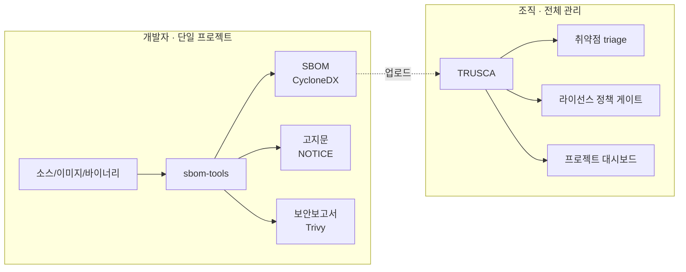

# sbom-tools 방향성 조사 보고서

> 작성일: 2026-05-30 · 대상 독자: sbom-tools 메인테이너 · 성격: 의사결정 + 실행 로드맵

## 0. 요약 (Executive Summary)

`sbom-tools`의 향후 방향을 5개 질문으로 조사했다. 결론은 **sbom-tools를 단독 프로젝트용 경량 종합 스캐너로 강화**하는 것이다. 한 프로젝트의 SBOM과 오픈소스 고지문, 보안 취약점 보고서를 로컬에서 한 번에 생성한다. 전사(全社) 프로젝트 관리와 협업, 취약점 triage, 라이선스 정책 게이트는 자매 프로젝트 [TRUSCA](https://github.com/trustedoss/trusca)(구 TrustedOSS Portal)에 위임한다.

| # | 질문 | 결론 |
|---|------|------|
| 1 | Docker 이미지의 의미 / plain cdxgen 대비 | 주류 언어(java·python·node·dotnet·php)는 cdxgen 공식 이미지로 검출이 동일하다. go·ruby·rust만 우리 이미지가 우수한데, cdxgen 공식에 cargo·bundler 등이 없기 때문이다. **통합 기능(syft·고지문·보안·UI)이 핵심 차별점**이다. `compare-cdxgen-vs-docker.sh`로 재현한다(빌드 안 된 순수 소스 기준). |
| 2 | 이미지 커버리지는 충분한가 | **불충분하다.** Go·.NET이 설치돼 있지 않고, yarn/pnpm/poetry가 누락됐으며, 도구 버전도 고정되지 않았다. 커버리지를 보강하고 Android를 추가하며 버전을 고정한다. 장기적으로는 언어별 이미지를 분리하고 on-demand pull을 도입한다. |
| 3 | SBOM + 고지문 + 보안보고서 | **`scan-sbom.sh` 플래그(`--notice`/`--security`/`--all`)로 통합한다.** 고지문은 Text와 HTML, 보안보고서는 Trivy 기반 JSON·MD·HTML로 낸다. scancode는 `--deep-license` 옵트인이다. |
| 4 | CLI 미숙 사용자용 UI | **localhost 웹 래퍼를 Docker 이미지에 내장한다.** `scan-sbom.sh --ui`로 브라우저를 띄우고, Windows는 `.bat`을 더블클릭한다. Docker Desktop은 감지해 안내한다. |
| 5 | 추가 고려 | CycloneDX 1.6, byte-stable 출력, cosign 서명, 빌드환경 자동감지, repo 위생, 테스트 계층화. |

### 역할 분담



sbom-tools는 생성(generation) 전문이고, TRUSCA는 관리(governance) 전문이다. 둘 다 cdxgen/Trivy를 공유하므로 산출물(CycloneDX)이 그대로 호환된다.

---

## 1. Docker 이미지의 의미 — cdxgen 단독 vs Docker 스캔

### 현황 진단
`docker/entrypoint.sh`(141–220줄)는 cdxgen을 실행하기 전에 언어별 의존성을 먼저 설치한다.

```sh
[ -f pom.xml ]      && mvn dependency:resolve ...      # Maven
[ -f build.gradle ] && gradle dependencies ...         # Gradle
[ -f Gemfile ]      && bundle install ...              # Ruby
[ -f composer.json ]&& composer install ...            # PHP
[ -f Cargo.toml ]   && cargo generate-lockfile ...     # Rust
[ -f requirements.txt ] && pip install ...             # Python
```

핵심 질문은 "cdxgen이 내부 install로 충분하다면 우리 이미지가 필요한가"이다. cdxgen은 lockfile이 없어도 스스로 패키지 매니저를 호출해 transitive까지 해석한다(우리 예제는 lockfile 미커밋인데도 검출됨). 다만 그 install이 작동하려면 해당 언어의 도구가 환경에 있어야 한다.

### 실측 데이터 (cdxgen 공식 이미지 vs 우리 이미지, `compare-cdxgen-vs-docker.sh`)

"우리 이미지 없이 plain cdxgen을 쓸 때"(= cdxgen 공식 이미지, 내부 install 켜짐, 자체 toolchain 포함)와 우리 이미지를 번들 예제(lockfile 미커밋)로 비교했다.

| 프로젝트 | cdxgen 공식 | 우리 이미지 | 차이 |
|----------|-------:|-------:|-----:|
| dotnet · java-maven · java-gradle · php · python | (동일) | (동일) | — |
| nodejs | 471 | 493 | +5% |
| **go** | 3 | 19 | **+533%** |
| **ruby** | 0 | 9 | **cdxgen 공식 미검출** |
| **rust** | 5 | 180 | **+3500%** |

주류 5개 언어(java·python·node·dotnet·php)는 cdxgen 공식 이미지로 충분하다(검출 동일). **go·ruby·rust에서만 우리 이미지가 결정적으로 우수하다.** cdxgen 공식 이미지에 cargo·bundler와 완전한 go 도구가 없기 때문이다(ruby는 0, rust는 36배).

> 정정 이력: 초기엔 ① bd-scan "+6271%" 인용(빌드도구 부재로 detector 실패하는 다른 맥락 — 부적용) ② cdxgen 공식 이미지 baseline이 0(이미지 실행 문제/디스크) ③ `SKIP_BUILD` 대조(cdxgen 내부 install을 못 막아 무효)를 거쳐, 디스크 확보 후 cdxgen 공식 이미지가 정상 작동(java-maven 91=91 확인)함을 검증하고 위 수치를 확정했다.

### 권고 + 다음 단계
- 순수 SBOM 검출만 보면 주류 언어는 cdxgen 공식 이미지로 충분하다. 우리 이미지의 차별적 가치는 세 가지다. 첫째, go·ruby·rust처럼 cdxgen 공식이 약한 언어를 한 이미지로 모두 커버한다. 둘째, cdxgen이 하지 않는 일 — syft 이미지/바이너리/RootFS 스캔, 고지문, Trivy 보안보고서, 웹 UI 통합 — 을 한다. 셋째, 도구 버전을 고정해 결정론적 출력을 낸다.
- 시사점: 만약 대상이 주류 언어 위주라면, 무거운 통합 이미지 대신 cdxgen 공식 이미지에 후처리(고지문/보안)만 더해도 상당 부분 커버할 수 있다. §5 "언어별 이미지 분리" 로드맵과 연계해 이미지 경량화를 재검토할 여지가 있다.

---

## 2. Docker 이미지 커버리지

### 현황 진단 (`docker/Dockerfile` 직접 확인)

`node:20-slim` 단일 이미지다. README의 지원 주장과 실제 설치 사이에는 명백한 갭이 있다.

| 언어 | 패키지매니저 | README 주장 | Dockerfile 실제(개선 전) | 비고 |
|------|-------------|:-----------:|:-----------------------:|------|
| Java | Maven, Gradle | ✅ | ✅ (JDK17 단일) | 멀티버전 없음 |
| Python | pip, Poetry | ✅ | ⚠️ pip만 | **poetry/pipenv 누락** |
| Node.js | npm, Yarn, pnpm | ✅ | ⚠️ npm만 | **yarn/pnpm 누락** |
| Ruby | Bundler | ✅ | ✅ | |
| PHP | Composer | ✅ | ✅ | |
| Rust | Cargo | ✅ | ✅ | |
| **Go** | Go modules | ✅ | ❌ **미설치** | README 거짓 주장 |
| **.NET** | NuGet | ✅ | ❌ **미설치** | README 거짓 주장 |
| Android | Gradle+SDK | — | ❌ | 신규 요구 |
| 이미지/바이너리 | — (syft) | ✅ | ✅ | |

또 하나의 문제는 도구 버전이 고정돼 있지 않다는 점이다. `cdxgen@latest`를 쓰고 syft는 `install.sh ... main`으로 설치한다. 재현성이 깨지고 공급망 공격(커밋 `1d2ed74`의 Trivy 사건과 동질)에 노출된다.

### 권고 + 다음 단계
1. Go·.NET 런타임을 설치해 README 주장과 일치시키고 fixtures의 `go`·`dotnet`을 스캔할 수 있게 한다. (구현 완료)
2. yarn/pnpm와 poetry/pipenv를 추가한다. (구현 완료)
3. Android를 지원한다. Gradle과 Android command-line tools/SDK가 필요하다. (구현 완료, `SBOM_ANDROID_SDK` 옵트인 빌드 인자)
4. cdxgen·syft·Trivy·scancode의 버전을 명시적 버전(ARG)으로 핀 고정한다. (구현 완료)
5. 언어별 이미지를 분리하고 on-demand로 pull한다. `scan-sbom.sh`가 프로젝트 타입을 감지해 필요한 cdxgen 공식 언어 이미지만 받아 거대 단일 이미지의 pull 비용을 줄인다. (구현 완료. `detect_lang()`/`img_for_lang()`를 쓰고 후처리는 별도 경량 이미지로 분리했다. §5 Phase 5 참조)

---

## 3. SBOM + 오픈소스 고지문 + 보안 보고서

### 설계 원칙
단독 프로젝트의 결과물 3종 생성은 sbom-tools 범위에 정확히 부합한다. 다만 TRUSCA의 관리 기능, 곧 triage 워크플로우와 정책 게이트, DB는 가져오지 않는다.

### 고지문(NOTICE) — Text + HTML
- 라이선스 소스(기본): 이미 생성된 CycloneDX의 `components[].licenses` 필드. 추가 도구·온라인 조회 불필요(경량).
- `--deep-license` 옵트인: scancode-toolkit로 1st-party 소스코드의 라이선스 헤더까지 탐지(무겁고 느려 기본 비활성).
- 구현: `docker/lib/generate-notice.sh`가 SBOM JSON을 라이선스별로 그룹핑해 `NOTICE.txt`와 `NOTICE.html`을 낸다. HTML은 모든 필드를 escape해 XSS를 막는다. 렌더 구조는 TRUSCA `services/obligation_service.py`에서 차용했다.

### 보안 보고서 — Trivy 기반 JSON + Markdown + HTML
- 엔진: 버전을 고정한 Trivy로 `trivy sbom --format json --input <bom.json>`을 실행한다. NVD+OSV+GHSA DB를 쓴다.
- 구현: `docker/lib/scan-security.sh`가 Trivy JSON의 severity를 정규화·집계해 `_security.json`과 `_security.md`, `_security.html`을 낸다. TRUSCA `integrations/trivy.py`와 `services/report_service.py` 패턴을 차용했다.
- 공급망 안전: Trivy를 CLI 바이너리로 버전 고정해 설치한다(문제됐던 `trivy-action@master`와 다르다). `.github/workflows/docker-publish.yml`의 비활성화 스텝도 핀 고정으로 재활성화했다.

### 호출 방식 — `scan-sbom.sh` 플래그 확장
```bash
scan-sbom.sh --project App --version 1.0 --generate-only           # SBOM만 (기존 호환)
scan-sbom.sh --project App --version 1.0 --notice --generate-only  # + 고지문
scan-sbom.sh --project App --version 1.0 --security --generate-only# + 보안보고서
scan-sbom.sh --project App --version 1.0 --all --generate-only     # 3종 모두
scan-sbom.sh ... --all --deep-license                              # + scancode 정밀 라이선스
```
산출물: `{project}_{version}_bom.json`, `{project}_{version}_NOTICE.{txt,html}`, `{project}_{version}_security.{json,md,html}`.

---

## 4. CLI 미숙 사용자용 경량 UI

### 방식 — localhost 웹 래퍼 + Docker 이미지 내장
데스크톱 앱(Tauri/Wails)은 OS별 크로스 빌드와 코드 서명(Windows SmartScreen, macOS notarization) 부담이 크다. 반면 localhost 웹 UI를 기존 Docker 이미지에 내장하면 추가 런타임이 0이고 크로스플랫폼이다.

- 구현: `docker/web/server.py`(Python 표준 라이브러리 `http.server`만 쓰고 추가 의존성이 없다)와 `docker/web/index.html`.
- 실행: `scan-sbom.sh --ui`가 `docker run -p 8080:8080`을 띄우고 브라우저를 자동으로 연다.
- 기능 범위는 실행과 결과 뷰어다. 폼(프로젝트·버전·타겟·옵션 체크박스)을 입력해 스캔을 실행하면 로그가 스트리밍되고, SBOM과 고지문, 보안보고서를 화면에서 보고 내려받는다.
- Windows: `scripts/sbom-ui.bat`을 더블클릭하면 Docker를 확인하고 컨테이너를 기동한 뒤 기본 브라우저를 연다.

### Docker 의존성 (진짜 병목)
UI가 쉬워도 진짜 진입 장벽은 Docker Desktop 설치다. 따라서 런처가 Docker 설치와 구동 여부를 감지하고, 없으면 공식 설치 링크와 가이드를 안내한다(자동 설치는 권한·라이선스 문제로 제외한다).

---

## 5. 추가 고려사항 + 단계별 실행 로드맵

### 추가 과제
- CycloneDX 1.4에서 1.6으로 업그레이드: cdxgen `--spec-version 1.6`, syft `cyclonedx-json@1.6`. 라이선스 표현과 lifecycle 등 최신 스키마를 쓴다. (Phase 3에서 적용)
- 결정론적 byte-stable 출력: `metadata.timestamp`를 고정하거나 제거하고 `components`를 purl로 정렬하면 동일 입력이 동일 바이트가 된다. CI diff와 재현성에 쓴다. (`docker/lib/normalize-sbom.sh`)
- cosign으로 SBOM 서명·검증: `--sign` 옵트인 시 `cosign sign-blob`로 detached 서명한다. (Phase 5)
- 빌드환경 자동감지 고도화: bd-scan `detect_build_env()`와 prune 정책(node_modules·build·dist 제외). 언어별 이미지 분리(Phase 5)의 토대다.
- repo 위생: 루트의 `sbom-tools-20260312.zip`과 `.DS_Store`는 git 미추적이지만 작업트리에 남아 있어 정리를 권고한다. `.gitignore`는 이미 커버한다.
- 테스트 계층화: bd-scan 3단계(Level 1 격리 / Level 2 Docker / Level 3 실스캔). 항목1·2 검증을 CI로 자동화한다.

### 실행 로드맵

각 Phase의 **구체 구현 방법**:

#### Phase 1 — 커버리지 보강 + 버전 고정 (기반)
- `docker/Dockerfile`:
  - Go(`golang` apt 또는 tarball, `ARG GO_VERSION`)와 .NET SDK(`dotnet-sdk-8.0`, `ARG DOTNET_VERSION`)를 설치한다.
  - corepack로 yarn/pnpm를 활성화하고, `pipx`/`pip`로 poetry·pipenv를 설치한다.
  - cdxgen·syft·Trivy·scancode를 `ARG ...VERSION`으로 핀 고정한다.
  - Android는 `ARG SBOM_ANDROID_SDK=false`로 두고, true일 때만 cmdline-tools와 SDK를 설치해 이미지 비대화를 막는다.
- 검증: `docker build` 성공과 `shellcheck`.

#### Phase 2 — 실증 비교 (질문 1 데이터)
- `tests/compare-cdxgen-vs-docker.sh`: fixtures를 돌며 A(cdxgen 단독)와 B(Docker)로 스캔하고, 컴포넌트와 취약점, 시간을 측정해 CSV로 낸다.
- README에 "Why Docker?" 표를 추가한다.

#### Phase 3 — 고지문 + 보안보고서 (질문 3)
- `docker/lib/generate-notice.sh`, `docker/lib/scan-security.sh`, `docker/lib/normalize-sbom.sh`를 새로 추가한다.
- `docker/entrypoint.sh`: Go/.NET/poetry 빌드 분기를 추가하고, SBOM 생성 후 `GENERATE_NOTICE`/`GENERATE_SECURITY`/`DEEP_LICENSE` 환경변수에 따라 헬퍼를 호출하며, CycloneDX 1.6으로 출력하고 normalize를 적용한다.
- `scripts/scan-sbom.sh`·`scan-sbom.bat`: `--notice`/`--security`/`--all`/`--deep-license` 플래그와 환경변수를 전달한다.

#### Phase 4 — 웹 UI (질문 4)
- `docker/web/server.py` + `index.html`, `entrypoint.sh`에 `UI` 모드, `scan-sbom.sh --ui`, `scripts/sbom-ui.bat`.

#### Phase 5 — 고도화 (로드맵)
- 언어별 이미지 분리와 on-demand pull(구현 완료. `scan-sbom.sh`의 `detect_lang()`/`img_for_lang()`가 언어를 감지해 cdxgen 공식 언어 이미지를 on-demand로 pull·실행한다. 아키텍처 상세는 [architecture.md](architecture.md) 참조), cosign 서명(구현 완료), 빌드환경 자동감지 함수화.
- 번들 도구 라이선스 컴플라이언스: 조합 도구들의 라이선스 인벤토리와 배포 의무는 [THIRD_PARTY_LICENSES.md](../../THIRD_PARTY_LICENSES.md)를 참조한다. (문서화 완료: [THIRD_PARTY_LICENSES.md](../../THIRD_PARTY_LICENSES.md), [NOTICE](../../NOTICE))

#### Phase 6 — 펌웨어 분석 (구현 완료, Phase 1+2)
공급사 제공 네트워크 장비 펌웨어의 SBOM/취약점/라이선스 점검. 상세는 [firmware-analysis.md](firmware-analysis.md).

- 상태: Phase 1+2 구현·머지 완료. (함수 핑거프린팅 SCANOSS/LibDB 등은 Phase 3 선택지로 보류.)
- 구현: unblob으로 언팩하고(폴백은 unsquashfs) syft와 cve-bin-tool로 스캔한 뒤 SBOM을 병합해 기존 후처리를 재사용한다. GPL 도구는 별도 opt-in 이미지 `sbom-scanner-firmware`로 격리한다(기본 이미지는 GPL-free). `--firmware`로 진입하거나 펌웨어 확장자로 자동 감지한다. 관련: `docker/lib/scan-firmware.sh`, `entrypoint.sh` FIRMWARE case, `Dockerfile` `SBOM_FIRMWARE` 블록.

#### Phase 7 — 공급사 제출 SBOM 검증·분석 (구현 완료)
SKT 공급망 가이드([for-suppliers](https://sktelecom.github.io/guide/supply-chain/for-suppliers/), [requirements](https://sktelecom.github.io/guide/supply-chain/for-suppliers/requirements/))에 따라 공급사가 제출한 SBOM을 검증하고 라이선스·취약점을 분석한 뒤 위험 보고서로 처리한다. sbom-tools를 "생성기"에서 "검증·분석 도구"로 확장한다. 상세는 [supplier-sbom-analysis.md](supplier-sbom-analysis.md).

- 상태: 검증, 분석, 보고서, 웹 UI 업로드를 모두 구현·머지 완료.
- 구현: `--analyze <sbom>`(CycloneDX/SPDX)로 받아 `validate-sbom.sh`로 요구사항 충족을 검증하고, `convert-to-cdx.sh`로 SPDX를 CDX로 바꾼 뒤, 기존 normalize/notice/security를 재사용하고 `generate-risk-report.sh`(Critical 7일/High 30일)로 마무리한다. 웹 UI는 "SBOM 업로드"로 동일하게 처리한다. 관련: `docker/lib/{validate-sbom,convert-to-cdx,generate-risk-report}.sh`, `entrypoint.sh` ANALYZE case, `server.py` 업로드.
- 참고: 위 위험분석보고서(`generate-risk-report.sh`)는 ANALYZE 전용이 아니라 모든 모드에서 기본 생성되도록 일반화됐다(`--no-report`로 opt-out).
- 역할 경계: sbom-tools는 로컬 단일 SBOM의 검증·분석·보고서를 맡고, 전사 등록과 triage, 대응 추적은 TOSCA/TRUSCA 범위다.

---

## 부록: 참고 프로젝트 매핑

| sbom-tools 기능 | 차용 출처 |
|----------------|----------|
| 실증 비교 방법론 | `bd-scan/tests/level3/e2e_compare_legacy_vs_current.sh` |
| 빌드환경/컴포넌트 감지 | `bd-scan/local-scan/scan.sh` (`detect_build_env`, `detect_components`) |
| 고지문 렌더 | `trusca/apps/backend/services/obligation_service.py` |
| Trivy 통합 | `trusca/apps/backend/integrations/trivy.py` |
| 취약점 보고서 | `trusca/apps/backend/services/report_service.py` |
| byte-stable SBOM | TRUSCA SBOM export (BUG-006) |
