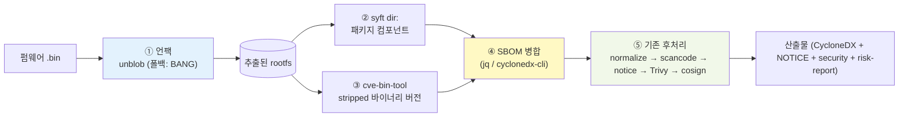

# 펌웨어 분석 (Firmware Analysis)

> **관련 문서**: [아키텍처](../concepts/architecture.ko.md) | [방향성 조사 보고서](direction-study.md) | [고지문·보안 보고서 가이드](../guides/reports.ko.md) | [번들 도구 라이선스](../../THIRD_PARTY_LICENSES.md)
>
> 성격: 메인테이너용 설계·의사결정 문서입니다. Phase 1+2는 구현·머지를 마쳤으며(§5), §1의 "현재"는 펌웨어 도구가 없는 기본 이미지를 기준으로 한 한계를 뜻합니다. opt-in `sbom-scanner-firmware` 이미지(`--firmware`)가 이를 해소합니다. Phase 3(함수 핑거프린팅)만 선택적 향후 과제로 남습니다.

## 요약 (Executive Summary)

공급사가 제공한 네트워크 장비 펌웨어 바이너리(`.bin`/`.img`/squashfs 등)를 대상으로 SBOM과 보안취약점, 라이선스를 점검하는 시나리오를 다룹니다.

- 현재: 펌웨어 파일을 그대로 넣으면 거의 검출하지 못해 빈 SBOM이 나옵니다. 이미지에 언팩 도구조차 없습니다.
- 방향: 먼저 언팩(unblob, 폴백 BANG)으로 가방을 연 뒤, syft로 패키지를, cve-bin-tool로 stripped 바이너리를 식별하고, 두 SBOM을 병합해 기존 후처리(라이선스·CVE·서명)를 재사용합니다. 별도 opt-in 이미지 `sbom-scanner-firmware`로 제공합니다.
- 기대치: 오픈소스 스택으로 검출률 약 60~85%입니다. 상용 도구(Insignary Clarity 등)의 함수 수준 바이너리 핑거프린팅은 알고리즘 자체는 재현 가능하지만, 멀티아키·멀티버전 시그니처 코퍼스가 없어 동등한 정확도에는 미치지 못합니다. 이는 고비용 고도화 트랙(Phase 3)으로 분류합니다.

핵심 원칙은 역할 분리입니다. "가방 열기(언팩)"는 전용 도구에 맡기고, "내용물 식별·라이선스·CVE"는 우리가 이미 가진 도구로 처리합니다.

---

## 목차
- [1. 현재 능력과 한계](#1-현재-능력과-한계)
- [2. 오픈소스 스택과 워크플로우](#2-오픈소스-스택과-워크플로우)
- [3. 바이너리 OSS 식별 도구 카탈로그](#3-바이너리-oss-식별-도구-카탈로그)
- [4. BANG 검토 결론](#4-bang-검토-결론)
- [5. 구현 설계 — FIRMWARE 모드](#5-구현-설계--firmware-모드)
- [6. 단계별 로드맵 (Phase)](#6-단계별-로드맵-phase)
- [7. 정직한 한계](#7-정직한-한계)
- [8. 라이선스 주의](#8-라이선스-주의)

---

## 1. 현재 능력과 한계

> 이 절은 펌웨어 도구가 없는 기본 이미지를 기준으로 한 baseline입니다. `--firmware`로 진입하는 opt-in `sbom-scanner-firmware` 이미지는 §5처럼 언팩과 바이너리 식별을 수행합니다(구현 완료).

펌웨어는 운영체제와 라이브러리 수십 개가 통째로 압축·밀봉된 이삿짐 가방과 같습니다. 기본 이미지의 파이프라인만으로는 이 가방을 열지 못합니다.

| 입력 | 현재 동작 | 결과 |
|------|-----------|------|
| 펌웨어 `.bin` (압축/squashfs) | `BINARY` 모드 → `syft file:` → 거의 항상 실패 → 빈 SBOM 폴백 (`docker/entrypoint.sh:67-83`) | ❌ 컴포넌트 0개 |
| 압축 해제된 rootfs 디렉터리 | `ROOTFS` 모드 → `syft dir:` | ⚠️ 패키지 DB(opkg/dpkg/apk/rpm)만 검출, stripped 정적 바이너리는 놓침 |

또한 `docker/Dockerfile`에는 펌웨어 언팩 도구(binwalk/unblob/unsquashfs 등)가 아예 들어 있지 않습니다. 그래서 사용자가 외부에서 직접 언팩한 rootfs를 `ROOTFS` 모드로 넘기지 않는 한, 펌웨어는 사실상 점검할 수 없습니다.

검출/미검출 요약

| 항목 | 검출 | 미검출 |
|------|------|--------|
| 패키지 매니저로 설치된 컴포넌트(opkg/dpkg/apk/rpm) | ✅ (언팩 후) | — |
| stripped 정적 링크 바이너리(busybox, openssl, dropbear 등) | — | ❌ syft만으로는 놓침 |
| 펌웨어 직접 입력(언팩 전) | — | ❌ 빈 SBOM |

---

## 2. 오픈소스 스택과 워크플로우



| 단계 | 도구 | 라이선스 | 역할 |
|------|------|----------|------|
| ① 언팩 | **unblob** (폴백 **BANG**) | MIT (BANG: GPL-3.0) | 펌웨어 압축·파일시스템 해제 → rootfs 추출 |
| ② 패키지 식별 | **syft** | Apache-2.0 | rootfs의 패키지 매니저 DB 기반 컴포넌트 |
| ③ 바이너리 식별 | **cve-bin-tool** | GPL-3.0 | stripped 정적 바이너리의 버전 문자열 + CVE (CycloneDX 입출력) |
| ④ 병합 | jq / cyclonedx-cli | MIT/Apache-2.0 | ②③ SBOM을 하나로 합쳐 후처리 입력 단일화 |
| ⑤ 후처리 | scancode / Trivy / cosign | Apache-2.0 | **기존 파이프라인 그대로 재사용** (라이선스·CVE·서명) |

식별 방식은 크게 셋입니다(비유하면 라벨 읽기와 지문 대조).
- 라벨 읽기는 `syft`입니다. 부품에 붙은 패키지 라벨(opkg 등)을 읽습니다. 쉽고 정확하지만 라벨이 없으면 읽지 못합니다.
- 버전 글자 지문은 `cve-bin-tool`입니다. 바이너리 안에 적힌 버전 문자열을 뒤집니다. 글자가 strip되면 실패합니다.
- 모양(함수) 지문은 상용 도구의 핵심입니다. 오픈소스로는 정확도에 한계가 있습니다(§3, §6 Phase 3 참조).

---

## 3. 바이너리 OSS 식별 도구 카탈로그

함수 수준 핑거프린팅 알고리즘은 오픈소스로 재현할 수 있고, 공개 시그니처 DB를 가진 도구도 일부 있습니다. 다만 진짜 해자는 라벨링된 멀티아키·멀티버전 시그니처 코퍼스입니다(상용 Insignary는 ≈ 40,000개 OSS 프로젝트). 정확도 격차도 큽니다. 상용은 컴포넌트 95%+/버전 90%+인 반면 오픈소스는 최고가 컴포넌트 70~80%/버전 50~60%이고, stripped MIPS에서는 더 나빠집니다.

### A. 사전구축 DB 보유 (즉시 식별 가능)
| 도구 | 방식 | 사전구축 DB | 라이선스 | 성숙도 |
|------|------|-------------|----------|--------|
| **SCANOSS** | winnowing (파일/스니펫) | ✅ 100M+ OSSKB 공개 | GPL-2.0 / MIT | **프로덕션급**, CycloneDX 네이티브 |
| **LibDB** | 함수 임베딩 + 신경망 | ✅ Fedora 25k 버전 DB + 모델 | 학술 | 프로토타입 |
| **LibAM** | 함수 영역(area) 매칭 | ✅ 사전추출 특성 + Docker | 학술 | 프로토타입, 부분 임포트 강함 |
| **BinaryAI** | 트랜스포머 binary↔source | ✅ 모델 공개 | 학술 | ICSE 2024, 정밀도 ~86% |

### B. 펌웨어 통합 프레임워크
| 도구 | 라이선스 | 비고 |
|------|----------|------|
| **EMBA** | GPL-3.0 | 펌웨어 분석 끝판왕, CycloneDX+VEX, Dependency-Track 연계 |
| **FACT** | GPL-3.0 | Fraunhofer, 모듈식 펌웨어 분석 |
| **BANG** | GPL-3.0 | Armijn Hemel, 언팩 강력 (§4) |

### C. 유사도 엔진 (모델만 제공, OSS 라벨 DB는 직접 구축 필요)
| 도구 | 라이선스 | 한계 |
|------|----------|------|
| **Ghidra BSim / FID** | Apache-2.0 | ARM·MIPS 지원하나 공개 시그니처 DB 부족 |
| **jTrans · SAFE · Trex · PalmTree · Kam1n0** | MIT 등 | "유사도"만 풀고 OSS 라벨 매핑은 별도 |
| **Diaphora** | AGPL-3.0 | binary diffing |
| **Karta** | MIT | **IDA Pro(상용) 필수** |

판정하자면, "함수 수준 핑거프린팅 + 즉시 쓸 DB"를 둘 다 갖춘 건 LibDB/LibAM/BinaryAI뿐인데 모두 학술 프로토타입이라 견고성과 유지보수가 약합니다. 프로덕션 안정성과 거대 공개 KB를 함께 갖춘 것은 파일/스니펫 레벨인 SCANOSS가 독보적입니다. 결국 함수 핑거프린팅은 "불가능"이 아니라, 학술 도구를 통합하거나 자체 DB를 구축해야 하는 Phase 3 선택지입니다.

---

## 4. BANG 검토 결론

Armijn Hemel(GPL 위반 적발로 유명한 라이선스 컴플라이언스 전문가)의 BANG(Binary Analysis Next Generation)이며, GPL-3.0이고 활발히 유지보수됩니다.

| 영역 | 평가 |
|------|------|
| **언팩** | ⭐⭐⭐⭐⭐ 221+ 포맷, 재귀, squashfs/ubifs/exotic 펌웨어 — binwalk/unblob 우위 |
| 컴포넌트 식별 | 해시·문자열 기반. **대조용 knowledge base는 자체 구축 필요**(공개 DB 없음, 고비용) |
| 라이선스 식별 | ⚠️ 미완성 (옛 BAT의 코드클론 탐지가 BANG엔 미포함) |
| CVE 식별 | ⚠️ 프로토타입 ("DO NOT USE" 표기) |
| SBOM(CycloneDX) 출력 | ❌ 없음 |

결론적으로 "라이선스 거장이 만든 도구"라는 기대와 달리 라이선스/CVE 식별 기능은 미완성입니다. 그래서 BANG은 "언팩 폴백"으로만 채택합니다. 라이선스/CVE/SBOM은 우리가 이미 가진 scancode/Trivy/syft가 더 성숙하므로, 그 영역에는 BANG을 쓰지 않습니다.

---

## 5. 구현 설계 — FIRMWARE 모드

> 구현을 마쳤습니다(Phase 1+2). 기존 IMAGE/BINARY/ROOTFS 모드와 동일하게 후처리 이미지 패밀리의 한 모드로 추가하되, 무거운 언팩·바이너리 분석 도구는 별도 opt-in 이미지 `sbom-scanner-firmware`에만 설치합니다. 언팩 폴백은 unblob을 먼저 시도하고, 설치돼 있으면 BANG, 표준 squashfs는 unsquashfs, 정상 설치된 경우 binwalk 순으로 넘어갑니다. 각 단계는 종료코드가 아니라 실제 추출 파일이 나왔는지로 판정합니다.

### 5.1 `scripts/scan-sbom.sh`
- `FIRMWARE_IMAGE="${SBOM_FIRMWARE_IMAGE:-ghcr.io/sktelecom/sbom-scanner-firmware:latest}"` 변수 추가.
- `is_firmware()` 헬퍼: 확장자(`.bin .img .squashfs .ubi .ubifs .trx .chk .fw .rom` 등) + (호스트에 `file`이 있으면) magic 검사.
- 타깃 감지(`scan-sbom.sh:128-133`)에 FIRMWARE 분기, `--firmware` 강제 플래그 추가.
- `case "$MODE"`(`scan-sbom.sh:219-223`)의 `FIRMWARE)` 분기에서 `RUN_IMAGE="$FIRMWARE_IMAGE"`로 디스패치합니다. `pp_env()`는 그대로 재사용합니다.

### 5.2 `docker/entrypoint.sh`
- BINARY case 뒤에 `FIRMWARE)` case를 추가해 `bash "$LIBDIR/scan-firmware.sh" "$TARGET_FILE" "$OUTPUT_FILE" "$PROJECT_VERSION"`를 호출합니다.
- `LIBDIR` 정의를 case 블록 위로 이동.
- 그 아래 공통 파이프라인(`normalize → scancode → notice → Trivy → cosign → upload`)은 수정 없이 그대로 재사용합니다.

### 5.3 `docker/lib/scan-firmware.sh` (신규)
```
scan-firmware.sh <firmware_file> <output_sbom.json> <version>
```
1. `WORK=$(mktemp -d)` (trap으로 cleanup), 언팩: unblob을 우선 시도하고 실패하거나 설치돼 있지 않으면 BANG으로 폴백.
2. rootfs 후보 디렉터리 탐색(없으면 추출 루트 전체).
3. `syft dir:$ROOTFS -o cyclonedx-json`로 패키지 SBOM을 만듭니다.
4. (Phase 2) `cve-bin-tool ... --sbom-output ... cyclonedx`로 바이너리 SBOM을 만들고, 같은 패스에서 CVE 보고서(`--format json -o`)도 받습니다. CVE 매칭 경로는 아래 5.6에서 다룹니다.
5. 병합(cyclonedx-cli 또는 jq, purl 기준 dedupe) 결과를 `$OUTPUT_FILE`에 씁니다.
6. `metadata.component`를 펌웨어 파일명/버전/`file` 출력으로 채움.

기존 `docker/lib/*.sh` 스타일(인자 위치, `[prefix]` 로깅, jq, best-effort)을 따릅니다.

### 5.4 `docker/Dockerfile`
- `ARG SBOM_FIRMWARE=false` + `CVE_BIN_TOOL_VERSION`/`UNBLOB_VERSION` 핀.
- scancode opt-in 블록(`Dockerfile:60-67`) 패턴 그대로, `COPY` 이전에 firmware opt-in RUN 블록 추가(unblob + cve-bin-tool, 폴백 BANG).
- `SBOM_FIRMWARE=true`일 때 같은 opt-in 블록에서 cve-bin-tool CVE 데이터베이스를 미리 받아 이미지에 번들합니다(아래 5.6). 이렇게 해야 스캔 시점에 오프라인으로 매칭할 수 있고, 에어갭에서도 동작합니다.
- 배포는 별도 태그 `sbom-scanner-firmware:latest`로 분리해 경량 기본 이미지를 보호합니다. CVE 데이터베이스(약 0.5~1.5 GB)도 펌웨어 이미지에만 들어갑니다.

### 5.5 테스트
- `tests/test-scan.sh`/`tests/test-e2e.sh`에 소형 squashfs fixture로 FIRMWARE e2e 케이스 추가.
- 기본 이미지 회귀(firmware 도구 미설치) 확인.

### 5.6 CVE 데이터베이스 (cve-bin-tool)

정적 바이너리의 CVE 매칭은 cve-bin-tool과 그 전용 취약점 데이터베이스로 합니다. 데이터베이스는 하이브리드 방식입니다. opt-in 펌웨어 이미지에 데이터베이스를 번들해 오프라인/에어갭에서 즉시 매칭하고, 네트워크가 있고 번들 데이터베이스가 없으면 실행 중에 NVD에서 받습니다.

**데이터베이스 경로.** cve-bin-tool 3.x는 캐시 경로를 `$HOME/.cache/cve-bin-tool/cve.db`로 하드코딩하고 `CVE_DATA_DIR`을 무시합니다. 그래서 위치는 `HOME`으로 제어합니다. 이미지는 `CVE_BIN_TOOL_HOME=/opt/cve-bin-tool-home` 기준으로 번들하므로, 실제 데이터베이스는 `/opt/cve-bin-tool-home/.cache/cve-bin-tool/cve.db`입니다. `scan-firmware.sh`는 같은 위치에서 읽습니다(`BUNDLED_DB`). 오프라인 스캔은 이 읽기 전용 데이터베이스를 per-run `HOME`에 심볼릭 링크로 걸고, 온라인 갱신은 복사본을 써서 갱신이 번들 데이터베이스를 변형/삭제하지 않게 합니다.

**모드.** `CVE_BIN_TOOL_MODE`(기본 `auto`)로 동작을 고릅니다. `auto`는 번들 데이터베이스가 있으면 `--update=never`로 그걸 쓰고, 없고 NVD에 닿으면 `--update=latest`로 받고, 둘 다 없으면 구성요소만(`run_cve=0`) 내보내며 사유를 로그로 남깁니다. `offline`/`online`/`components-only`는 각각 그 분기를 강제합니다.

**데이터 출처.** 데이터베이스는 NVD뿐 아니라 여러 출처(NVD, PURL2CPE 등)를 합친 집계 데이터입니다. cve-bin-tool은 "This product uses the NVD API but is not endorsed or certified by the NVD." 고지를 출력하므로, 사용자 문서에 NVD 비보증·출처 표기를 한 줄 둡니다.

**GAD 비활성.** `CVE_BIN_TOOL_DISABLE_SOURCES`(기본 `GAD`)로 비활성화할 출처를 정합니다. GAD(GitLab Advisory)는 번들된 cve-bin-tool에서 fetch 시 `UnicodeDecodeError`로 크래시하므로 기본 비활성화합니다. Dockerfile 빌드 인자 `SBOM_FIRMWARE_DISABLE_SOURCES`도 같은 기본값입니다.

**빌드(BuildKit secret).** 빌드 시 NVD API 키는 build-arg가 아니라 BuildKit secret으로 주입해 이미지 히스토리에 남지 않게 합니다.

```
docker build --secret id=nvd_api_key,env=NVD_API_KEY --build-arg SBOM_FIRMWARE=true ...
```

키가 없으면 NVD fetch가 rate-limit이 걸립니다. CI는 `docker-publish.yml`에서 `nvd_api_key=${{ secrets.NVD_API_KEY }}`로 같은 secret을 전달합니다.

**빈-DB 빌드 게이트.** 빌드는 데이터베이스가 비면(`cve_severity` 행이 0이면) `exit 1`로 실패합니다. 키 누락이나 fetch 실패로 0-CVE 이미지가 조용히 배포되는 것을 막습니다.

**진행률 계약.** 온라인으로 데이터베이스를 받을 때 cve-bin-tool의 rich 진행 표시를 파싱 가능한 한 줄 마커로 바꿔 stdout에 내보냅니다. 형식은 `[firmware-cvedb-progress] NN%`이고, `\r`로 덮어쓰는 줄과 ANSI escape를 걷어낸 뒤 퍼센트가 오를 때만(단조 증가, 중복 제거) 찍습니다. `docker/web/server.py`는 이 마커를 SSE `progress` 이벤트(`{"phase": "cvedb", "percent": NN}`)로 바꿔 웹 UI 다운로드 진행률 바에 연결합니다. 그 밖의 표 출력은 여기서 버려 노이즈가 새지 않게 합니다.

---

## 6. 단계별 로드맵 (Phase)

| Phase | 범위 | 검출 | 미검출 |
|-------|------|------|--------|
| **1 (MVP)** | 언팩(unblob+BANG 폴백) + syft dir | opkg/dpkg/apk/rpm 패키지 | stripped 바이너리 |
| **2 (목표 범위)** | + cve-bin-tool + SBOM 병합 | busybox/openssl/zlib/dropbear 등 stripped 정적 바이너리의 버전·CVE | 버전 strip된 바이너리, 사명 변경 라이브러리 |
| **3 (선택·고도화)** | 정확도 향상 트랙 | — | — |

현실적인 Phase 3 우선순위는 다음과 같습니다.
1. SCANOSS winnowing 통합. 공개 OSSKB를 쓰고 CycloneDX로 병합하며, 통합 난이도가 낮습니다.
2. EMBA 결과 수집기 연계. 펌웨어 전용이고 CycloneDX+VEX를 지원합니다.
3. 함수 핑거프린팅이 필요하면 학술 공개 모델/DB인 LibDB/BinaryAI를 실험하거나, Ghidra BSim 커스텀 DB를 직접 구축합니다(3~6개월 고비용).
4. 그 외 중첩 추출, 커널/모듈, rootfs deep-license(scancode). 웹 UI "펌웨어 업로드"는 구현을 마쳤습니다.

> Phase 1+2는 구현·머지를 마쳤습니다. Phase 3(정확도 고도화)만 선택 과제로 남습니다.

---

## 7. 정직한 한계

- 오픈소스 스택 검출률은 약 60~85%이며, 펌웨어 종류와 strip 정도, 언팩 성공 여부에 크게 좌우됩니다.
- 함수 수준 바이너리 핑거프린팅이 없어서, 상용(Insignary Clarity/Cybellum/Finite State)과 달리 strip·인라인·버전 제거된 컴포넌트는 놓칩니다.
- 암호화·서명된 펌웨어, 벤더 커스텀·사명 변경 라이브러리는 검출하지 못하거나 부정확합니다.
- 결과 SBOM은 best-effort 추정이므로, 법적 라이선스 컴플라이언스의 단일 근거로 사용하지 마십시오.

---

## 8. 라이선스 주의

- 펌웨어 이미지에는 GPL 도구가 들어갑니다. cve-bin-tool(GPL-3.0), BANG(GPL-3.0), unblob이 의존하는 extractor 중 sasquatch(GPL-2.0)와 ubi_reader(GPL-3.0)가 그렇습니다. unblob 본체와 binwalk는 MIT입니다.
- 우리 셸 스크립트는 이들을 별도 프로세스로 호출만 하고 수정하지 않으므로, copyleft가 우리 Apache-2.0 코드로 전파되지 않습니다(mere aggregation).
- 다만 GPL 바이너리를 이미지로 재배포하므로 라이선스 텍스트 동봉과 소스 오퍼 의무가 있습니다.
- AGPL 도구는 사용하지 않으므로(unblob=MIT 확인), 웹 UI(`--ui`)의 네트워크 조항을 걱정할 일이 없습니다.
- GPL은 별도 `sbom-scanner-firmware` 이미지에만 들어가고, 기본 이미지는 permissive-only로 유지합니다.
- 상세 인벤토리·의무는 [../../THIRD_PARTY_LICENSES.md](../../THIRD_PARTY_LICENSES.md) 참조.
