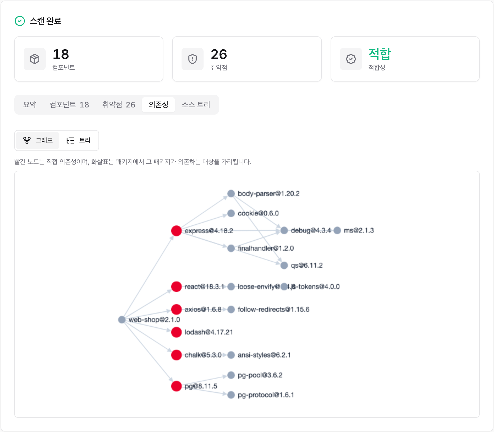
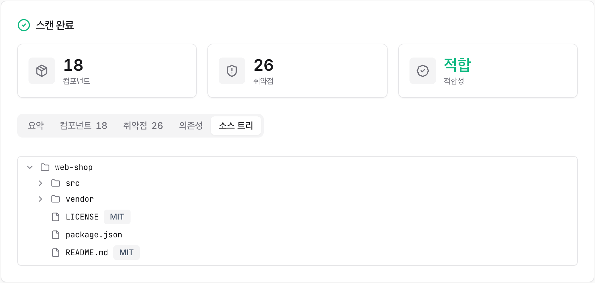

# 웹 UI와 데스크톱 앱

CLI 없이 브라우저에서 스캔합니다. UI 서버는 스캐너 이미지에 내장되어 있어 추가 설치가 필요 없습니다.


**macOS / Linux:**
```bash
cd ~/sbom-output      # 산출물 저장 폴더 (어디든 무방)
/path/to/sbom-tools/scripts/scan-sbom.sh --ui
# → http://localhost:8080 자동 열림
```

**Windows — 더블클릭 (CLI 불필요):** 압축을 푼 폴더에서 `scripts\sbom-ui.bat`를 더블클릭하면 잠시 뒤 브라우저에 `http://localhost:8080`이 열립니다. Docker가 실행 중이면 되고, `sbom-ui.bat`은 Rancher Desktop이나 Docker Desktop에서 동작합니다(WSL2라면 WSL 안에서 `scan-sbom.sh --ui`를 실행).

> 실행 위치는 산출물 저장 폴더이며, 스캔 대상으로 "현재 폴더"를 고를 때만 그 폴더의 소스를 스캔합니다. GitHub URL이나 업로드, Docker 이미지를 쓸 거라면 실행 위치는 무관합니다.

화면 구성:
1. **스캔 설정** — 프로젝트 이름과 버전(필수, 인라인 검증), 스캔 대상 선택, 생성 옵션(고지문, 보안, 정밀 라이선스).
2. **스캔 대상** — 6가지 중 선택하고 형태에 맞게 입력하거나 업로드합니다:

   | 스캔 대상 | 입력 방법 | 백엔드 모드 |
   |-----------|-----------|-------------|
   | 현재 폴더 | UI 실행 폴더의 소스 스캔 | SOURCE |
   | GitHub URL | 저장소 URL 입력 | SOURCE(클론) |
   | ZIP 업로드 | `.zip`/tar 파일 업로드 | SOURCE(해제) |
   | SBOM 업로드 | 기존 SBOM(JSON) 업로드 | ANALYZE |
   | 펌웨어 업로드 | `.bin` 등 업로드 | FIRMWARE |
   | Docker 이미지 | 이미지명 입력 | IMAGE |

3. **스캔 실행** — 진행 중 실시간 로그가 스트리밍됩니다. 오류(클론 실패, 소켓 없음, 미지원 파일 등)는 로그에 명확히 표시됩니다.
4. **요약** — 완료되면 컴포넌트 수, 취약점 심각도 배지, 그리고 [공급사 SBOM](../guides/supplier-sbom.ko.md)의 경우 적합성(적합/부적합) 카드가 표시됩니다.
5. **결과물** — SBOM, 고지문, 오픈소스위험분석보고서, 보안보고서, 적합성을 표에서 바로 열거나 내려받습니다. 위험분석보고서는 강조 표시됩니다.

우측 상단의 한국어 / EN 토글로 표시 언어를 바꿀 수 있습니다.

## 결과 화면

스캔이 끝나면 결과 카드에 요약과 결과물이 함께 나타납니다. 결과물은 종류별로 묶여 제목과 설명이 붙고, 포맷(HTML/Markdown/JSON)별 칩으로 내려받거나 전체를 ZIP 하나로 받을 수 있습니다. 위험분석 보고서는 맨 위에 강조됩니다.


컴포넌트 탭에서는 검출된 구성요소를 이름, 버전, 타입, 라이선스로 살펴보고 검색할 수 있습니다.


취약점 탭에서는 심각도 분포와 CVE 상세(설치 버전과 수정 버전 포함)를 확인합니다.


의존성 탭에서는 SBOM에 기록된 의존성 관계를 그래프나 트리로 살펴봅니다. 그래프 보기는 직접 의존성을 빨간 노드로 강조하고, 화살표로 각 패키지가 의존하는 대상을 보여줍니다. 트리 보기로 바꾸면 직접 의존성과 간접 의존성을 계층으로 펼쳐 라이선스와 함께 확인할 수 있습니다.



소스 트리 탭은 정밀 라이선스 옵션(`--deep-license`)으로 스캔했을 때만 나타납니다. 소스 파일과 디렉터리 구조를 트리로 탐색하고, 파일마다 탐지된 라이선스를 배지로 표시합니다.



> SBOM 업로드(ANALYZE)를 선택하면 위험분석을 위해 고지문과 보안이 자동 활성화됩니다.
> 펌웨어 업로드 탭은 펌웨어 도구가 포함된 이미지에서 UI를 실행할 때만 활성화됩니다:
> `SBOM_SCANNER_IMAGE=ghcr.io/sktelecom/bomlens-firmware:latest ./scripts/scan-sbom.sh --ui`
>
> **참고:** UI의 소스 스캔(현재 폴더/ZIP/GitHub)은 컨테이너 내부에서 syft로 디렉터리를 분석합니다. 잠금 파일(`package-lock.json`, `go.sum` 등)이나 설치된 의존성이 있어야 구성요소가 잡힙니다. 매니페스트만 있다면 더 깊은 해석이 필요할 때 CLI 소스 모드(cdxgen)를 사용하세요.

**포트 변경 / 충돌 시:** 기본 포트(8080)가 다른 서비스에 점유돼 있으면 다른 포트를 지정하세요:
```bash
UI_PORT=9090 ./scripts/scan-sbom.sh --ui      # http://localhost:9090
```

> **참고:** UI가 쉬워도 Docker 엔진 설치와 실행이 전제입니다(무료: WSL2 + docker-ce 또는 Rancher Desktop). 런처는 Docker 미설치/미실행을 감지해 설치 링크를 안내합니다.
