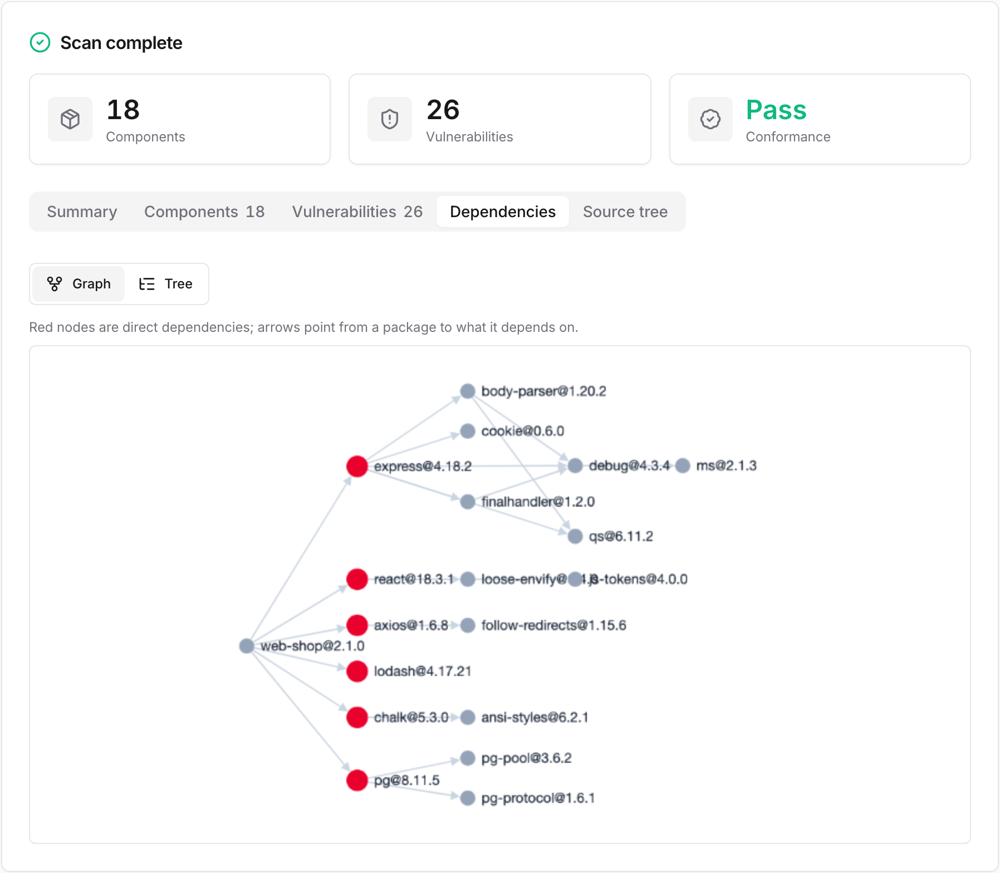
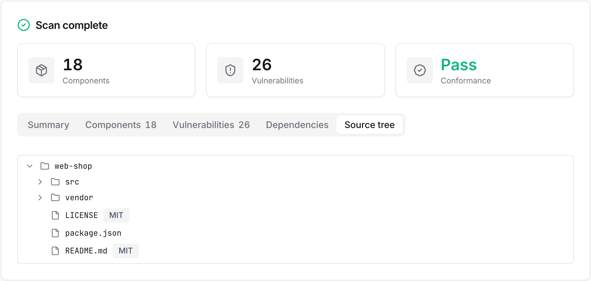

# Web UI & desktop app

Scan from a browser without the CLI. The UI server is built into the scanner image, so no extra install is needed.


**macOS / Linux:**
```bash
cd ~/sbom-output      # output folder (anywhere is fine)
/path/to/sbom-tools/scripts/scan-sbom.sh --ui
# → opens http://localhost:8080 automatically
```

**Windows — double-click (no command line):** in the unzipped folder, double-click `scripts\sbom-ui.bat` and a browser opens `http://localhost:8080` shortly after. Docker just needs to be running, and `sbom-ui.bat` works on Rancher Desktop or Docker Desktop (on WSL2, run `scan-sbom.sh --ui` inside WSL).

> The run location is the output folder, and it scans that folder's source only when you choose "current folder" as the scan target. If you use a GitHub URL, an upload, or a Docker image, the run location does not matter.

Screen layout:
1. **Scan settings** — project name and version (required, inline validation), scan target selection, generation options (notice, security, deep license).
2. **Scan target** — choose one of six and enter or upload accordingly:

   | Scan target | Input method | Backend mode |
   |-------------|--------------|--------------|
   | Current folder | scans the source in the UI's run folder | SOURCE |
   | GitHub URL | enter the repository URL | SOURCE (clone) |
   | ZIP upload | upload a `.zip`/tar file | SOURCE (extract) |
   | SBOM upload | upload an existing SBOM (JSON) | ANALYZE |
   | Firmware upload | upload a `.bin`, etc. | FIRMWARE |
   | Docker image | enter the image name | IMAGE |

3. **Run the scan** — a real-time log streams during the run. Errors (clone failure, no socket, unsupported file, and so on) are shown clearly in the log.
4. **Summary** — when done, it shows the component count, vulnerability severity badges, and, for a [supplier SBOM](../guides/supplier-sbom.md), a conformance (pass/fail) card.
5. **Outputs** — open or download the SBOM, notice, open-source risk report, security report, and conformance directly from a table. The risk report is highlighted.

Use the 한국어 / EN toggle at the top right to change the display language.

## Results screen

When the scan finishes, the results card shows the summary and the outputs together. Outputs are grouped by kind with a title and description, downloadable as per-format chips (HTML/Markdown/JSON) or as a single ZIP. The risk report is highlighted at the top.


The Components tab lets you browse and search the detected components by name, version, type, and license.


The Vulnerabilities tab shows the severity distribution and CVE details (including installed and fixed versions).


The Dependencies tab shows the dependency relationships recorded in the SBOM as a graph or a tree. The graph view highlights direct dependencies as red nodes, with arrows pointing from each package to what it depends on. Switch to the tree view to expand direct and transitive dependencies as a hierarchy, with their licenses.



The Source tree tab appears only when you scan with the deep license option (`--deep-license`). It lets you browse the source files and directory structure as a tree, with the detected license shown per file.



> Choosing SBOM upload (ANALYZE) automatically enables notice and security for the risk analysis.
> The firmware upload tab is enabled only when the UI runs from an image that includes the firmware tools:
> `SBOM_SCANNER_IMAGE=ghcr.io/sktelecom/sbom-scanner-firmware:latest ./scripts/scan-sbom.sh --ui`
>
> **Note:** the UI's source scan (current folder/ZIP/GitHub) analyzes the directory with syft inside the container. Components are captured only when there is a lock file (`package-lock.json`, `go.sum`, and so on) or installed dependencies. If you only have a manifest and need deeper resolution, use the CLI source mode (cdxgen).

**Changing the port / on a conflict:** if the default port (8080) is taken by another service, specify a different port:
```bash
UI_PORT=9090 ./scripts/scan-sbom.sh --ui      # http://localhost:9090
```

> **Note:** even though the UI is easy, a Docker engine must be installed and running (free: WSL2 + docker-ce, or Rancher Desktop). The launcher detects a missing or stopped Docker and shows the install link.
