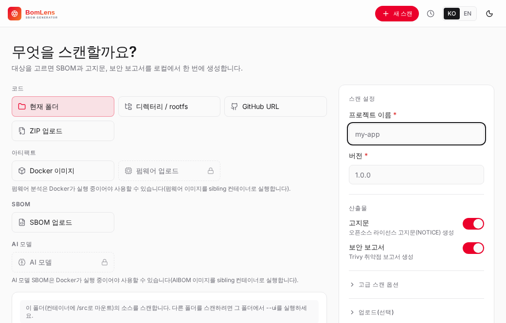
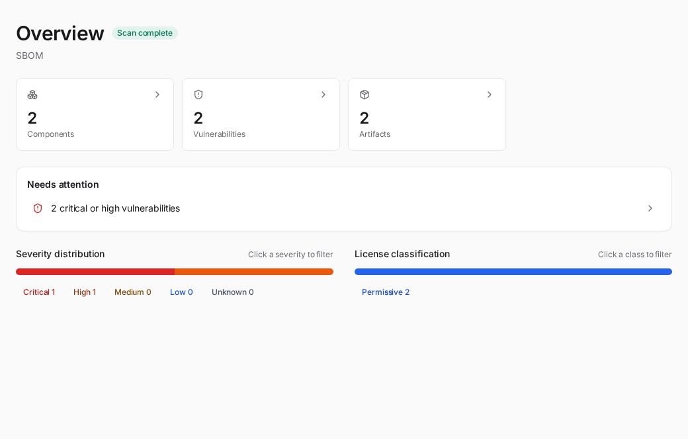
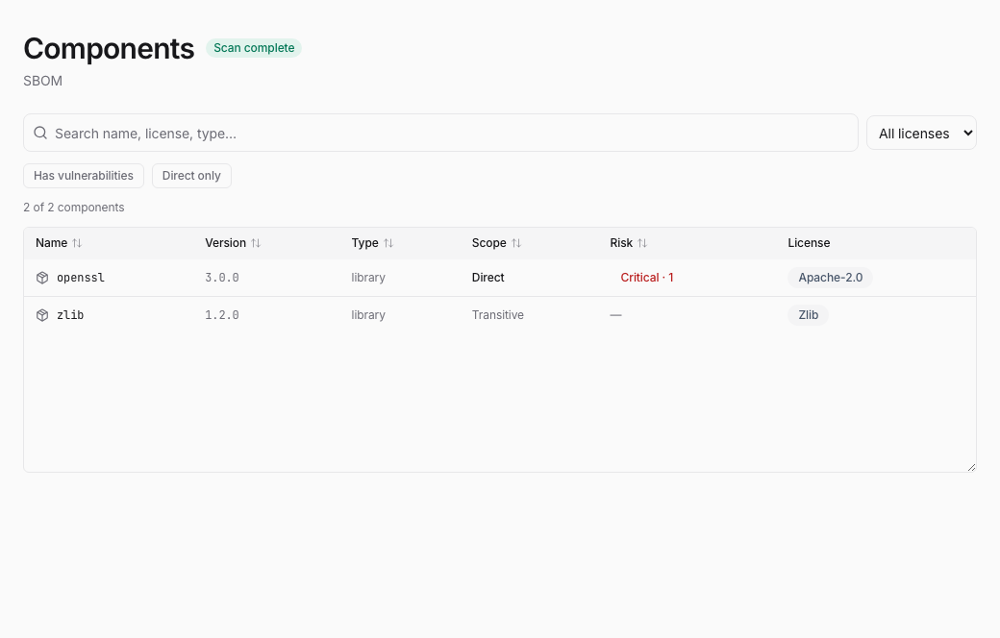
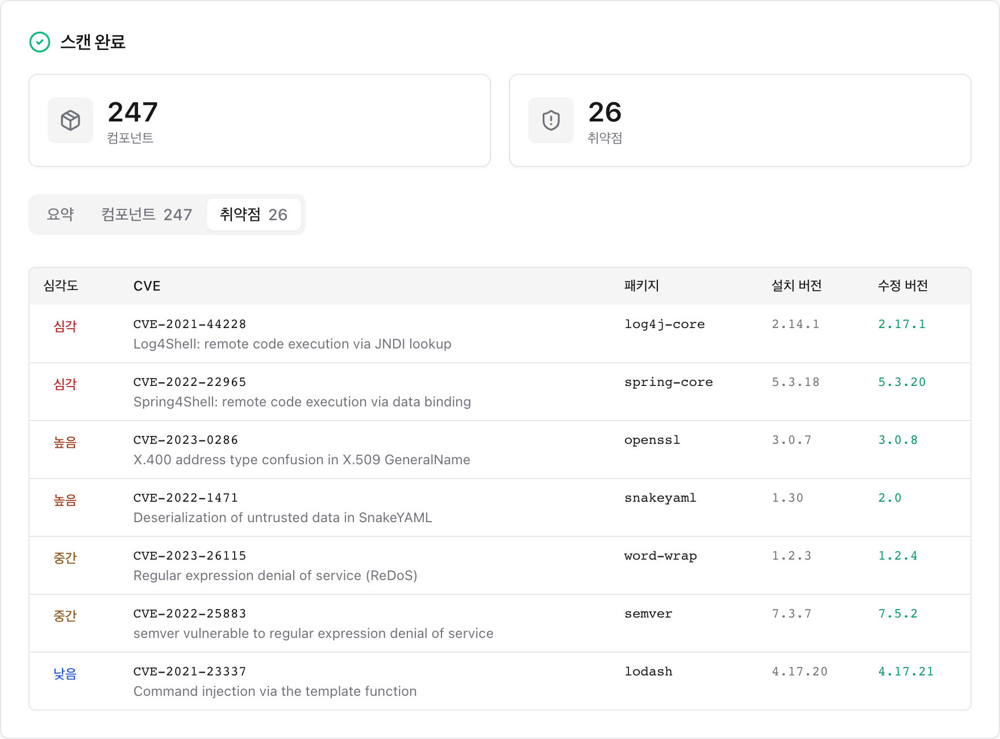
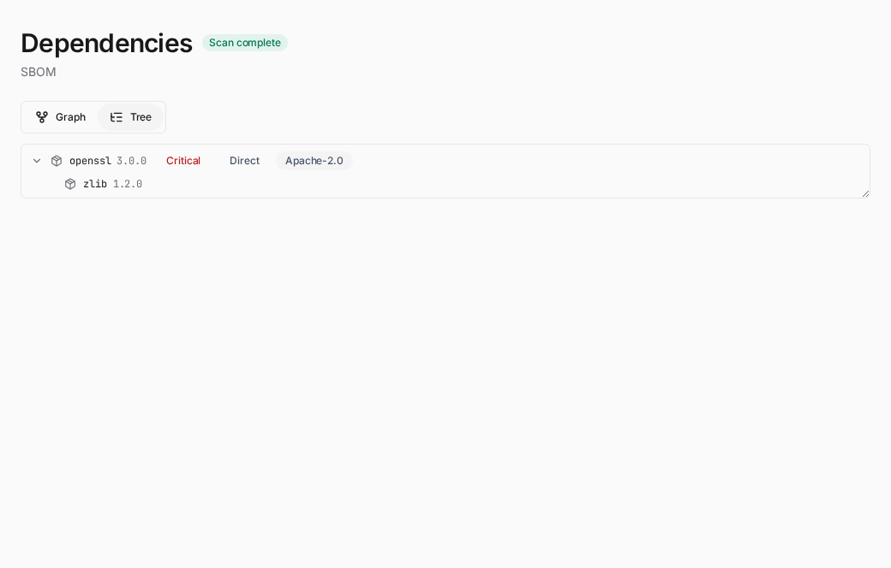
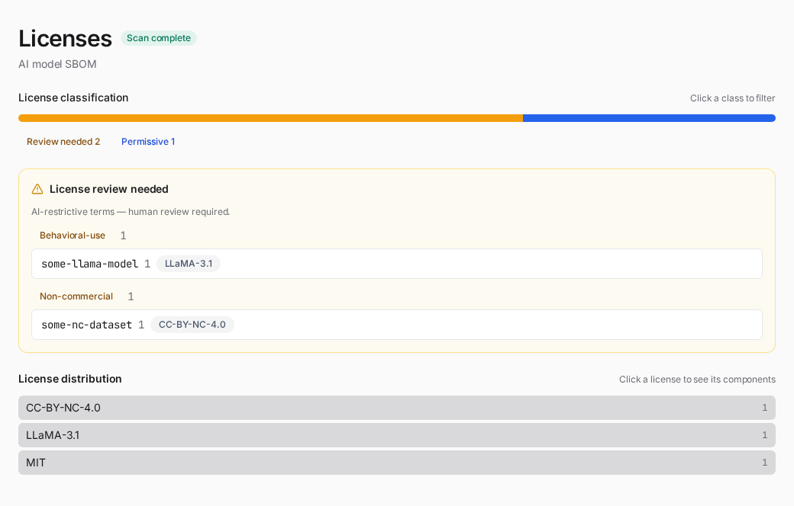
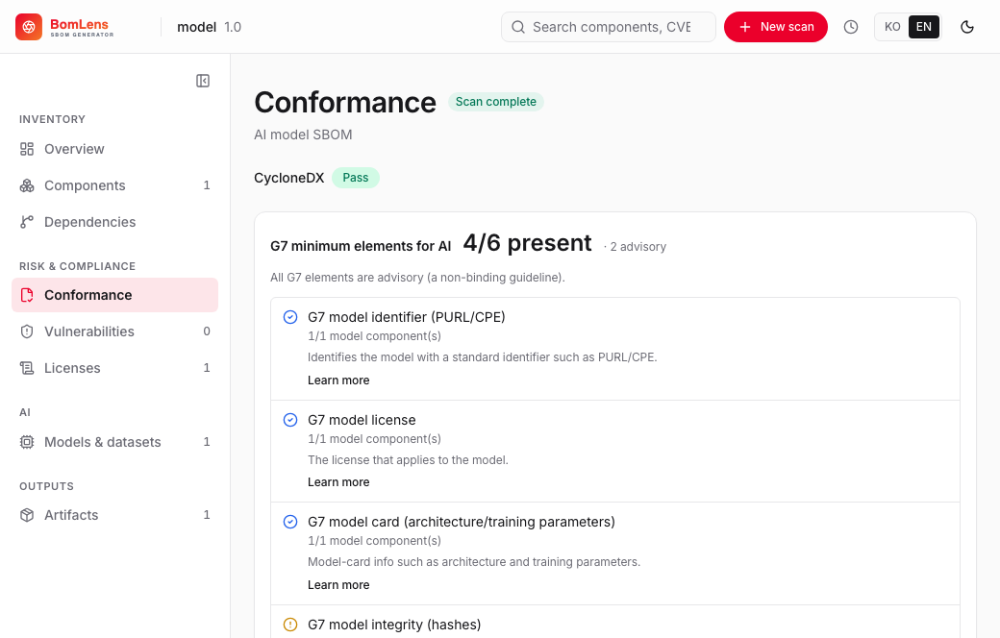
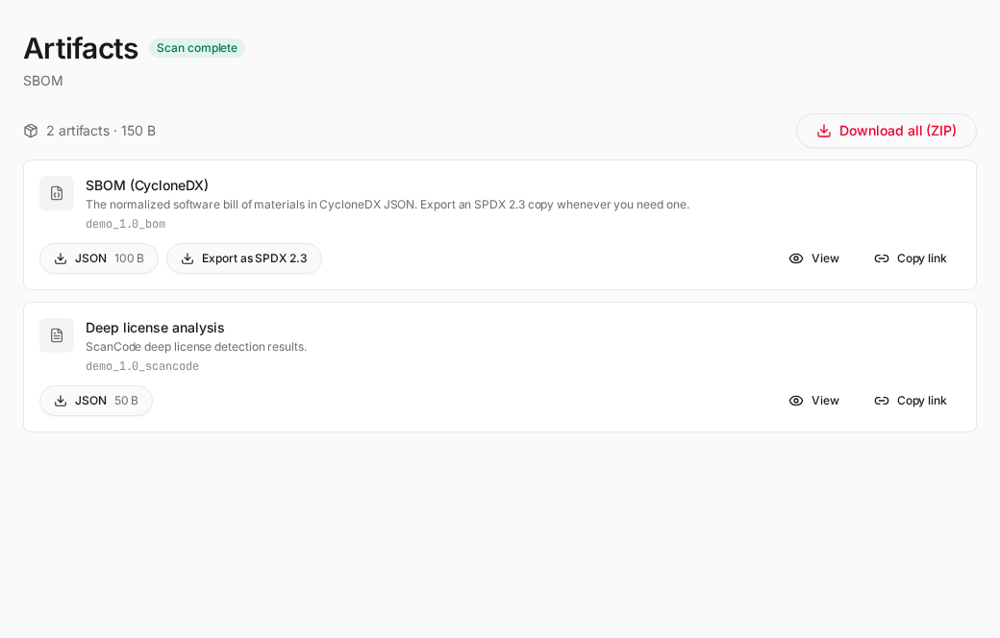
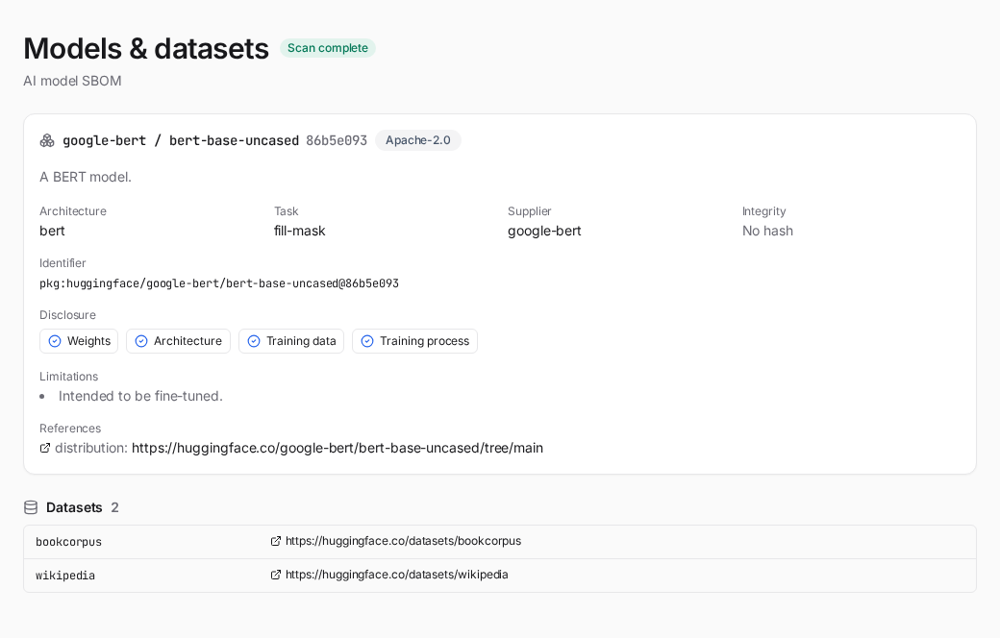

# Web UI & desktop app

Scan from a browser without the CLI. The UI server is built into the scanner image, so no extra install is needed.



**macOS / Linux:**
```bash
cd ~/sbom-output      # output folder (anywhere is fine)
/path/to/bomlens/scripts/scan-sbom.sh --ui
# → opens http://localhost:8080 automatically
```

**Windows — double-click (no command line):** in the unzipped folder, double-click `scripts\sbom-ui.bat` and a browser opens `http://localhost:8080` shortly after. Docker just needs to be running, and `sbom-ui.bat` works on Rancher Desktop or Docker Desktop (on WSL2, run `scan-sbom.sh --ui` inside WSL).

> The run location is the output base, and it scans that folder's source only when you choose "Current folder" as the scan target. If you use a GitHub URL, an upload, or a Docker image, the run location does not matter. Each scan is saved to its own `{Project}_{Version}/` subfolder; the base defaults and how to change them are in [Where outputs go](cli.md#where-outputs-go).

## The shell

The interface has a top bar across the width, a left rail for the current scan's sections, and a content area:

- **Top bar** — the product mark (links home), the current project, a Re-scan button (shown on a scan that still carries its settings, so you can re-run the same target with the toggles prefilled), global search across components and CVEs, the Scan management menu (the clock icon opens a list of past scans with a delete control and a link to the full list), the New scan button, and the language (한국어 / EN) and light/dark toggles.
- **Left rail** — the current scan's sections, grouped under Inventory, Risk & compliance, AI and Outputs. The rail adapts to the scan: AI sections appear only for AI/ML SBOMs, and a section appears only when its data exists. It collapses to icons on narrow windows. With no scan open — the home screen — there is no rail.
- **Content** — the home (Scan management) screen, the New scan form, the running view, or the active result section.

The global actions (New scan, Scan management) live in the top bar so the rail stays purely the current scan's sections. Every navigation element — the logo, New scan, the rail sections, the jump cards and the past-scan links — is a real link backed by a URL hash (`#/scan/<id>/<section>`), so Cmd/Ctrl or middle click opens it in a new tab.

## New scan

The New scan screen is two panes. On the left, pick a source — grouped into Code (current folder, a directory path, a GitHub URL, a ZIP upload), Artifact (a Docker image, a firmware image), SBOM (analyze an existing SBOM) and AI model (generate an ML-BOM from a HuggingFace model) — and fill in the source-specific input below the tiles. On the right, enter the project name and version, choose the outputs to generate, and start the scan.

| Scan target | Input method | Backend mode |
|-------------|--------------|--------------|
| Current folder | scans the source in the UI's run folder | SOURCE |
| Directory path | a subfolder under the run folder (e.g. an OS rootfs), a folder mounted with `--ui --mount <dir>`, or — in the desktop app — a folder added with the Add folder button | ROOTFS |
| GitHub URL | enter the repository URL | SOURCE (clone) |
| ZIP upload | upload a `.zip`/tar file | SOURCE (extract) |
| SBOM upload | upload an existing SBOM (JSON) | ANALYZE |
| Firmware upload | upload a `.bin`, etc. | FIRMWARE |
| Docker image | enter the image name | IMAGE |
| AI model | enter a HuggingFace model id (`org/model`) | AIBOM |

Generation options are the open-source notice and the security (vulnerability) report. A scan always writes the SBOM in CycloneDX; an SPDX copy is exported afterwards from the results screen, so there is nothing to decide here. Separately, an **Advanced scan options** section gathers the toggles that change how the source is analyzed rather than which files are produced. License scan (ScanCode) scans the project's own source files for per-file license text (1st-party; it does not download the declared dependencies) and applies to source-code scans (current folder, GitHub URL, ZIP upload). File-level identification (SCANOSS) finds third-party open source copied into the tree (mainly C/C++), also for source-code scans. For firmware, the advanced option is OSV advisories. SCANOSS uses the free OSSKB service, which is rate-limited and may return nothing under frequent use, so add a token from scanoss.com for regular runs. Docker images, SBOM uploads and AI models have no advanced options. Choosing SBOM upload (ANALYZE) forces the notice and security reports on for the risk analysis, and an AI-model scan produces the notice only (it has no package CVEs, so the security report is skipped).

A **Reproducible output** toggle produces byte-identical SBOMs across runs (the UI equivalent of `--byte-stable`); it is available for source, image and firmware scans, not for SBOM analysis or AI models.

Below the outputs, an optional **Upload** step can send the finished SBOM to a server. Turn it on to pick the destination — Dependency-Track or TRUSCA — and enter the server URL and an access token; TRUSCA also asks for the target project id. The URL and token are used for that one run and are never saved. It is the UI equivalent of the CLI upload options; see [Upload to Dependency-Track / TRUSCA](../guides/upload.md).

## Scan running

During a run the screen shows the pipeline stages — generate, normalize, notices, security, report — advancing as the live log streams, so you can see where the scan is and read any error (clone failure, no Docker socket, an unsupported file) as it happens.

## Result sections

When the scan finishes, the left rail fills with the sections for that scan.

**Overview** opens with the at-a-glance counts as cards that jump to each detail section, then what needs attention — a failed format conformance (for an analyzed supplier SBOM), critical or high vulnerabilities, and components flagged for license review. When the scan flags components past their upstream end-of-life, an "End of life" count tile joins the cards, with the ones that are also vulnerable shown in the risk colour (see [Component end-of-life](../concepts/reports-explained.md#component-end-of-life-eol)). A separate tile counts the components that have fallen behind their latest version (see [Version currency](../concepts/reports-explained.md#version-currency)). Below that, two risk axes sit side by side: the security severity distribution and the license classification. Click a band in either and you land in that section (Vulnerabilities or Licenses) with the filter already applied.

If a scan finished with reduced analysis — for example cdxgen ran out of Docker disk space and the SBOM fell back to direct dependencies only — a banner here gives the reason and what to do. If a scan is still running, its live log appears here on the Overview, not under every section.



**Components** lists everything detected, with search and filters (has vulnerabilities, direct only, needs review, end of life, outdated) and columns for Scope (direct vs transitive) and Risk (the worst vulnerability severity and count). A component past its upstream end-of-life carries an "End of life" badge, with the EOL date where known. A component that is not on its latest version is marked as outdated; with deps.dev enrichment on (`STALENESS_ENRICH=true`) its detail shows how many releases it is behind and its last-release date (see [Version currency](../concepts/reports-explained.md#version-currency)). Large SBOMs render in pages. Click a row to expand its detail in place — the PURL, source/download location, copyright, licenses and any vulnerabilities.



**Vulnerabilities** sorts by severity then CVSS, with a CVSS column and the fixed version, and each row expands in place to show the CVSS vector, description and references. Click a band in the severity bar to filter to that severity, or search by CVE or package.



**Dependencies** shows the relationships recorded in the SBOM as a graph or a tree. Direct dependencies are highlighted and packages with known vulnerabilities are marked with their severity. Switch to the tree to expand direct and transitive dependencies as a hierarchy.



**Licenses** opens with a license classification axis that groups components by copyleft strength — network copyleft (AGPL), strong copyleft (GPL), weak copyleft (LGPL, MPL, EPL, …), permissive, review needed, and uncategorized. An unrecognised license is never assumed permissive; it falls to uncategorized so a person looks at it. Click a class to filter the rest of the section to it. Below the classification come the components whose terms need human review — AI behavioral-use (RAIL/Llama/Gemma) and non-commercial licenses — and then the full license distribution; click a license to list the components that use it.



**Conformance** appears when you analyze an existing SBOM (the SBOM upload / ANALYZE mode), under Risk & compliance. It shows the format verdict — pass or fail — and the base CycloneDX checks (timestamp, tools, top-level component, name and version coverage, PURL coverage, transitive dependencies), with the missing items listed for each failed check. When the analyzed SBOM carries a machine-learning-model component, the G7 AI minimum-element checks (all advisory) appear here as a sub-block, grouped by the seven G7 clusters and tagged by data source — auto (read directly), inferred, declared, or review-needed when no automated source exists. The [AI model SBOM guide](../guides/ai-model.md#reading-the-conformance-report) explains the headline numbers and badges.



**Artifacts** lists the generated files (SBOM, notice, risk report, security report, conformance) grouped by kind, downloadable per format or as a single ZIP. The Source tree section appears when ScanCode results are available — that is, from a source scan run with **License scan (ScanCode)** on — showing the source files with the license detected per file.



The SBOM card in that section carries an **Export as SPDX 2.3** button. It converts the finished CycloneDX BOM into `{Project}_{Version}_bom.spdx.json` and starts the download at once, without rescanning. The converted file then joins the card as an ordinary download chip and is included in the ZIP, and the button is no longer offered for a scan that already has an SPDX file. CycloneDX stays the primary format, and CycloneDX-only data (vulnerabilities, `bomlens:*` properties) is not carried over. Signing is available only in the CLI (`--spdx --sign`), so a file exported here is unsigned like every other artifact the UI produces.

Conversion needs syft. The scanner image ships it, so the usual deployment converts on the spot. Where it is missing, such as the desktop app's base UI image, BomLens runs the scanner image as a separate container to do the conversion, which downloads that image once on first use. Where neither is possible, the button is not shown.

### AI surfaces

For an AI/ML SBOM (a CycloneDX SBOM with a machine-learning-model component), the rail adds:

**Models & datasets** — each model card's identifier, architecture, task, license, supplier and integrity, a four-axis disclosure panel (weights / architecture / training data / training process, as documented in the BOM), and the datasets the model references.



The G7 AI minimum-element checks appear inside the **Conformance** section above — they are added only when the SBOM has a model component.

That section also shows an AI compliance profile card: a one-glance rollup of the G7 result, the number of license-flagged components, and regulatory framework coverage (EU AI Act, Korea AI Basic Act). It is advisory, not a certification, and the same data is written to the `_ai-profile` files (see [Artifacts](artifacts.md)).

## Scan management

The home screen — opened from the logo or the top bar's Scan management (clock) menu — lists every past scan saved on this machine. Each scan's `{Project}_{Version}/` subfolder under the output base is one entry. A search box and scan-type filter chips (only the types that exist — Source, Container, RootFS, Firmware, AI model, SBOM) narrow the list; three summary cards show the total scans, how many are at risk (click that card to filter to them), and the project count. The table sorts by scan, generated time, components or top severity. Click a row to re-open its results, or delete one to remove its subfolder. This is local files only — no account, no database.

## Notes

> The firmware upload tile is enabled only when the UI runs from an image that includes the firmware tools:
> `SBOM_SCANNER_IMAGE=ghcr.io/sktelecom/bomlens-firmware:latest ./scripts/scan-sbom.sh --ui`
>
> **Note:** the UI's source scan (current folder / ZIP / GitHub) analyzes the directory with syft inside the container. Components are captured only when there is a lock file (`package-lock.json`, `go.sum`, and so on) or installed dependencies. If you only have a manifest and need deeper resolution, use the CLI source mode (cdxgen).

**Changing the port / on a conflict:** if the default port (8080) is taken by another service, specify a different port:
```bash
UI_PORT=9090 ./scripts/scan-sbom.sh --ui      # http://localhost:9090
```

> **Note:** even though the UI is easy, a Docker engine must be installed and running (free: WSL2 + docker-ce, or Rancher Desktop). The launcher detects a missing or stopped Docker and shows the install link.
