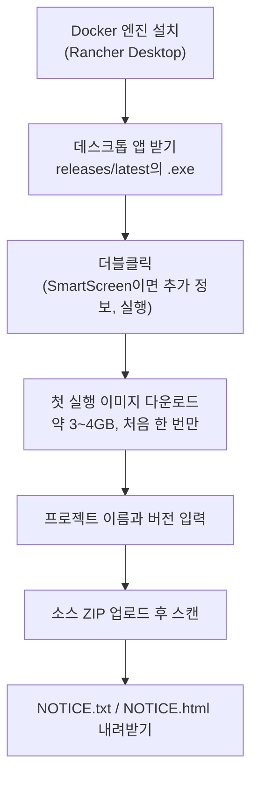

# 비개발자 빠른 시작 (CLI 불필요)

명령어를 한 번도 써본 적 없어도 됩니다. 이 문서는 오픈소스 라이선스 담당자가 개발팀에게
받은 소스 코드로 오픈소스 고지문을 만드는 가장 짧은 길만 담았습니다. 브라우저 화면에서
클릭만으로 끝납니다.

## 오픈소스 고지문이란

제품에 포함된 오픈소스 구성요소와 그 라이선스를 정리해 배포 시 함께 제공하는 문서입니다.
많은 오픈소스 라이선스(MIT, Apache-2.0, BSD 등)가 저작권 표시와 라이선스 전문을 제품에
동봉하도록 요구하기 때문에, 이를 모아 둔 고지문이 필요합니다.

이 도구는 소스 코드를 분석해 구성요소 목록([SBOM](../concepts/what-is-sbom.ko.md))을 만들고, 거기서 라이선스별로 구성요소를
묶어 고지문 두 가지를 생성합니다.

- `..._NOTICE.txt` — 배포물에 그대로 동봉하는 텍스트 형식
- `..._NOTICE.html` — 브라우저로 보기 좋은 형식

이름 앞부분(`...`)에는 입력한 프로젝트 이름과 버전이 붙습니다. 예를 들어 프로젝트가
`MyApp`, 버전이 `1.0.0`이면 `MyApp_1.0.0_NOTICE.txt`가 됩니다.

## 준비물과 걸리는 시간

필요한 것은 Docker 엔진 하나뿐입니다. Windows에서 처음 설치한다면 무료이면서 더블클릭 흐름과
잘 맞는 **Rancher Desktop**을 권장합니다. 이미 Docker를 쓰고 있다면 그대로 두고 넘어가세요.
(다른 선택지의 자세한 비교는 [시작하기](../start/first-scan.ko.md) 문서에 있습니다.)

처음 한 번은 설치와 다운로드에 시간이 걸립니다. 대략 다음과 같습니다.

- Rancher Desktop 설치와 첫 기동: 약 5~10분
- 스캐너 이미지 첫 다운로드(약 3~4GB): 약 5~15분(네트워크에 따라 다름, 처음 한 번만)

한 번 준비해 두면 다음부터는 앱을 열고 스캔하는 데 1~2분이면 됩니다.

## 따라 하기

방법은 두 가지입니다. 데스크톱 앱이 가장 간단하니 이쪽을 권장합니다. 전체 흐름은 다음과 같습니다.



### 방법 A — 데스크톱 앱 (권장)

1. **Docker 엔진 설치**. [rancherdesktop.io](https://rancherdesktop.io/)에서 Windows용 설치
   파일을 받아 설치하고 실행합니다. 설치 중 Kubernetes 사용 여부를 물으면 꺼도 됩니다. 작업
   표시줄 아이콘이 안정되면(보통 1~2분) 준비가 끝난 것입니다.
2. **앱 받아 실행**. [Windows용 BomLens 내려받기 (.exe)](https://github.com/sktelecom/sbom-tools/releases/latest/download/BomLens-Setup.exe)를
   눌러 받은 파일을 더블클릭합니다. 아직 미서명이라 Windows에서 "Windows가 PC를
   보호했습니다" 경고가 뜨면 "추가 정보"를 누르고 "실행"을 고릅니다. 콘솔 창 없이 앱이 열립니다.
3. **첫 실행 이미지 다운로드**. 처음 한 번만 스캐너 이미지를 받습니다. 앱이 아래처럼 진행 상황을
   보여주니 창을 닫지 말고 기다리세요.


Docker가 설치되지 않았거나 꺼져 있으면, 앱이 스캔을 시작하는 대신 무엇을 해야 하는지 안내합니다.


이제 아래 [스캔하고 고지문 받기](#스캔하고-고지문-받기)로 갑니다.

### 방법 B — ZIP과 더블클릭 배치 파일 (대안)

데스크톱 앱 대신 스크립트로 쓰고 싶다면 이 길도 있습니다.

1. **Docker 엔진 설치**. 방법 A의 1번과 같습니다.
2. **도구 내려받기**. GitHub 저장소 페이지에서 초록색 Code 버튼을 누르고 Download ZIP을 고른 뒤
   압축을 풉니다. 압축을 푼 폴더 안에 `scripts` 폴더가 보이면 됩니다.
3. **웹 UI 실행**. `scripts` 폴더의 `sbom-ui.bat`을 더블클릭합니다. 처음에는 검은 창에 "스캐너
   이미지를 내려받습니다(약 3~4GB)"라는 안내가 나오고, 다 받으면 브라우저에
   `http://localhost:8080`이 열립니다. 스캔 결과는 `C:\Users\사용자이름\sbom-output` 아래 `{Project}_{Version}\` 하위 폴더에 저장됩니다.

준비가 잘 됐는지 확인하려면 압축을 푼 폴더에서 `scripts\check-setup.bat`을 더블클릭하세요.
Docker 설치와 실행, 스캐너 이미지, 포트 상태를 한국어로 점검해 줍니다.


## macOS에서 '손상됨' 경고가 날 때

macOS에서 "'BomLens'은(는) 손상되었기 때문에 열 수 없습니다"라는 경고가 뜨고 "휴지통으로 이동"만
보일 수 있습니다. 앱이 실제로 손상된 것은 아닙니다. 현재 macOS 빌드가 아직 Apple Developer ID로
코드 서명·공증(notarization)되지 않아, macOS가 내려받은 앱을 격리(quarantine)하고 Gatekeeper가
막는 것입니다. Windows의 SmartScreen 경고와 같은 성격의 차단입니다.

이 메시지는 흔한 "확인되지 않은 개발자" 경고와 다르게 동작합니다. 최근 macOS에서는 앱을 우클릭해
열기를 고르거나 시스템 설정의 "확인 없이 열기" 버튼을 눌러도 잘 풀리지 않습니다. 믿을 수 있는
방법은 터미널에서 격리 속성을 지우는 것입니다.

1. `.dmg`를 열어 `BomLens.app`을 응용 프로그램(Applications) 폴더로 끌어다 놓습니다.
2. 터미널을 열어 아래 명령을 실행한 뒤, 평소처럼 응용 프로그램에서 BomLens를 엽니다.

   ```bash
   xattr -dr com.apple.quarantine /Applications/BomLens.app
   ```

Apple Silicon Mac에서 그래도 열리지 않으면 아래를 한 번 실행하고 다시 시도하세요.

```bash
codesign --force --deep -s - /Applications/BomLens.app
```

이 단계는 현재 macOS 빌드가 아직 서명·공증 전이라 필요한 것이며, 서명되면 사라집니다.

## 스캔하고 고지문 받기

여기서부터는 데스크톱 앱과 웹 UI가 같습니다.

1. 프로젝트 이름과 버전을 입력합니다.
2. 스캔 대상에서 "ZIP 업로드"를 고르고, 개발팀에게 받은 소스 코드 ZIP 파일을 올립니다.
3. 스캔 실행을 누릅니다. 진행 로그가 실시간으로 표시되고, 끝나면 결과 개요가 나타납니다.


스캔이 끝나면 결과 화면에서 고지문을 포맷별 칩(`HTML`, `TXT`)으로 내려받습니다. 함께 만들어진
SBOM(`..._bom.json`)과 위험분석 보고서(`..._risk-report.html`)도 같은 화면에서 받을 수 있고,
전체를 ZIP 하나로 한 번에 받을 수도 있습니다. 내려받은 파일은 결과 폴더에도 저장됩니다.


## 막혔을 때

- **무엇이 문제인지 모르겠어요**: `scripts\check-setup.bat`을 더블클릭하면 Docker와 이미지,
  포트 상태를 한 번에 점검해 한국어로 다음에 할 일을 알려줍니다.
- **"Windows가 PC를 보호했습니다" 경고가 떠요**: 데스크톱 앱이 아직 미서명이라 그렇습니다.
  "추가 정보"를 누르고 "실행"을 고르면 됩니다.
- **macOS에서 "손상됨" 경고가 떠요**: 실제 손상이 아니라 같은 미서명 차단입니다.
  [macOS에서 '손상됨' 경고가 날 때](#macos에서-손상됨-경고가-날-때)에서 터미널로 푸는 방법을 확인하세요.
- **"Docker가 설치되어 있지 않습니다"가 떠요**: Rancher Desktop을 설치하고 실행했는지 확인하세요.
- **"Docker 엔진이 실행 중이 아닙니다"가 떠요**: Rancher Desktop을 켜고 아이콘이 안정될 때까지
  기다린 뒤 다시 실행하세요.
- **스캔은 끝났는데 결과 폴더에 파일이 없어요**: 결과 폴더가 Docker의 파일 공유 범위 밖이면
  생길 수 있습니다. 이 도구는 홈 디렉터리(`C:\Users\...`) 아래 `sbom-output`에 저장하므로 보통
  안전합니다. 그래도 보이지 않으면 브라우저 화면의 다운로드 버튼으로 직접 받으세요.
- **브라우저가 자동으로 안 열려요**: 주소창에 `http://localhost:8080`을 직접 입력하세요.

더 자세한 설명과 CLI 사용법은 [시작하기](../start/first-scan.ko.md)와
[고지문·보안 보고서 가이드](../guides/reports.ko.md) 문서를 참고하세요.

---

> **관련 문서**: [시작하기](../start/first-scan.ko.md) | [고지문·보안 보고서 가이드](../guides/reports.ko.md)
