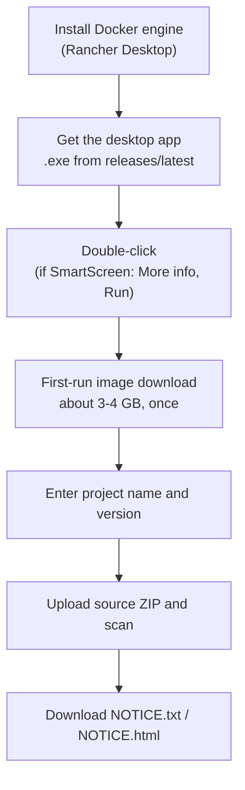
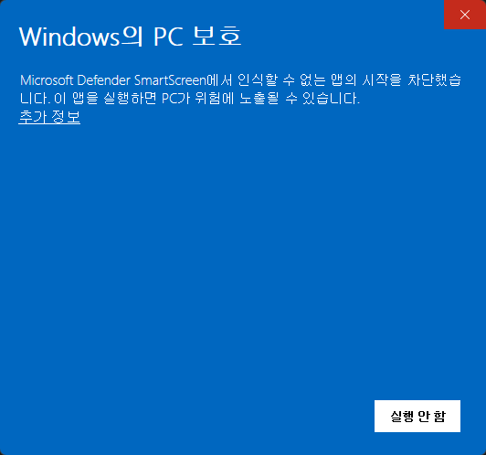
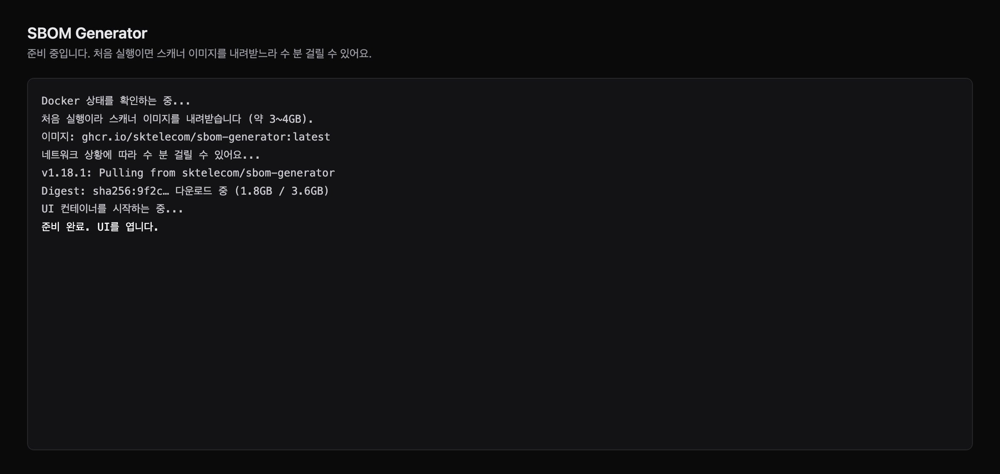
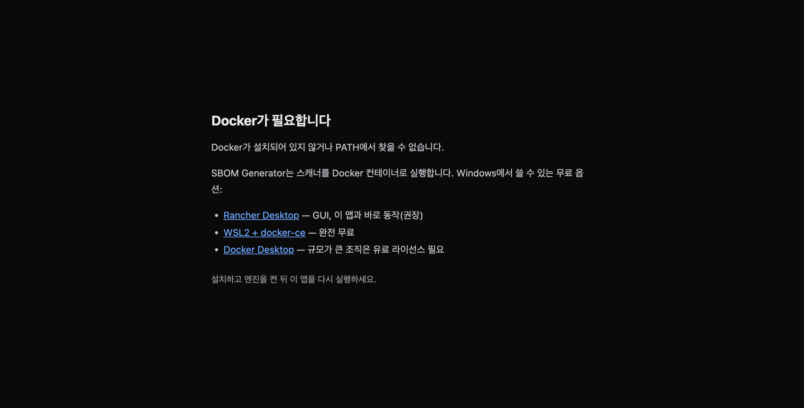
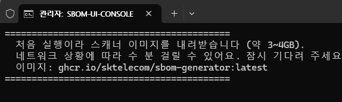
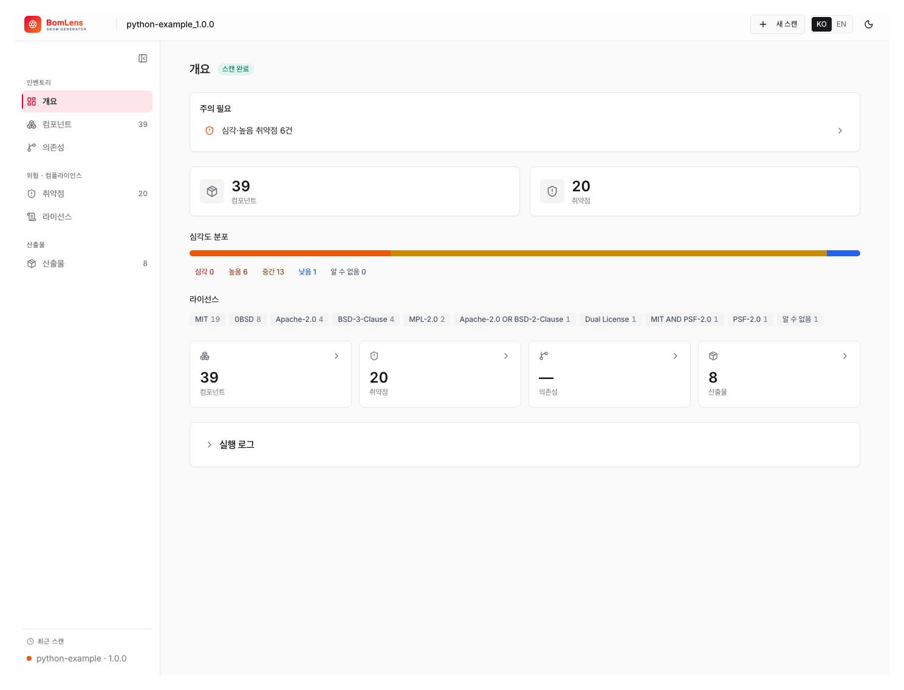

# No-CLI quick start (no command line)

You do not need to have ever typed a command. This page covers the shortest path for an open-source license manager to turn source code received from a dev team into an open-source notice. It is all clicks in a browser.

## What is an open-source notice

A document that lists the open-source components in a product and their licenses, provided alongside the product when it ships. Many open-source licenses (MIT, Apache-2.0, BSD, and others) require the copyright notice and the full license text to be included with the product, so a notice that gathers them is needed.

This tool analyzes source code to build a component list (an [SBOM](../concepts/what-is-sbom.md)), then groups components by license to generate two notice files.

- `..._NOTICE.txt` — a text format to ship as-is with the distribution
- `..._NOTICE.html` — a format that reads well in a browser

The prefix (`...`) is the project name and version you entered. For example, if the project is `MyApp` and the version is `1.0.0`, the file is `MyApp_1.0.0_NOTICE.txt`.

## What you need and how long it takes

All you need is a Docker engine. On Windows, for a first install, **Rancher Desktop** is recommended — it is free and fits the double-click flow well. If you already use Docker, leave it as is and move on. (A detailed comparison of the other options is in [Getting started](../start/first-scan.md).)

The first time, install and download take a while. Roughly:

- Installing and first launch of Rancher Desktop: about 5–10 minutes
- First download of the scanner image (about 3–4 GB): about 5–15 minutes (varies by network, only the first time)

Once set up, opening the app and scanning afterward takes 1–2 minutes.

## Walkthrough

There are two paths. The desktop app is the simplest, so it is recommended. The overall flow:



### Path A — desktop app (recommended)

1. **Install a Docker engine**. Download the Windows installer from [rancherdesktop.io](https://rancherdesktop.io/), install it, and run it. If it asks whether to use Kubernetes during install, you can turn it off. When the taskbar icon settles (usually 1–2 minutes), it is ready.
2. **Get and run the app**. Click [Download BomLens for Windows (.exe)](https://github.com/sktelecom/bomlens/releases/latest/download/BomLens-Setup.exe) and double-click the file. It is unsigned for now, so if Windows shows a "Windows protected your PC" warning, click "More info" and choose "Run anyway". The app opens with no console window.
3. **First-run image download**. The scanner image is pulled just once. The app shows progress as below, so leave the window open and wait.





If Docker is not installed or is stopped, the app tells you what to do instead of starting a scan.



Now go to [Scan and get the notice](#scan-and-get-the-notice) below.

### Path B — ZIP and double-click batch file (alternative)

If you prefer a script over the desktop app, this path works too.

1. **Install a Docker engine**. Same as step 1 of Path A.
2. **Download the tool**. On the GitHub repository page, click the green Code button, choose Download ZIP, and unzip it. You should see a `scripts` folder inside the unzipped folder.
3. **Run the web UI**. Double-click `sbom-ui.bat` in the `scripts` folder. At first a black window shows "downloading the scanner image (about 3–4 GB)", and once done a browser opens `http://localhost:8080`. Each scan's results are saved to a `{Project}_{Version}\` subfolder under `C:\Users\<your-name>\sbom-output`.

To check that everything is ready, double-click `scripts\check-setup.bat` in the unzipped folder. It checks Docker installation and status, the scanner image, and port status, in Korean.




## If macOS says the app is damaged

On macOS you may see a warning that "BomLens" is damaged and can't be opened, offering only "Move to Trash". The app is not actually damaged. The current macOS build is not yet signed and notarized with an Apple Developer ID, so macOS quarantines the downloaded app and Gatekeeper blocks it. It is the same kind of block as the SmartScreen warning on Windows.

This message behaves differently from the ordinary "unidentified developer" warning. On recent macOS, right-clicking the app and choosing Open, or the "Open anyway" button in System Settings, usually does not clear it. The reliable way is to remove the quarantine attribute from a terminal.

1. Open the `.dmg` and drag `BomLens.app` into your Applications folder.
2. Open Terminal and run the command below, then open BomLens from Applications as usual.

   ```bash
   xattr -dr com.apple.quarantine /Applications/BomLens.app
   ```

If it still won't open on an Apple Silicon Mac, run this once and try again:

```bash
codesign --force --deep -s - /Applications/BomLens.app
```

This step is only needed because the current macOS build is not yet signed and notarized, and it goes away once the app is signed.

## Scan and get the notice

From here the desktop app and the web UI are the same.

1. Enter the project name and version.
2. For the scan target, choose "ZIP upload" and upload the source code ZIP received from the dev team.
3. Click run. The progress log streams in real time, and the result overview appears when it finishes.



When the scan finishes, download the notice from the results screen as per-format chips (`HTML`, `TXT`). The SBOM (`..._bom.json`) and the risk report (`..._risk-report.html`) generated alongside are available on the same screen, and you can also download everything as a single ZIP. Downloaded files are saved to the results folder as well.


## When you get stuck

- **I don't know what's wrong**: double-click `scripts\check-setup.bat` to check Docker, the image, and port status at once, and it tells you what to do next. It follows your Windows display language: Korean on a Korean system, English everywhere else. To force one, put `SBOM_LANG=en` (or `ko`) in the settings file described below.
- **A "Windows protected your PC" warning appears**: this is because the desktop app is still unsigned. Click "More info" and choose "Run anyway".
- **macOS says the app is "damaged"**: this is the same unsigned-app block, not real damage. See [If macOS says the app is damaged](#if-macos-says-the-app-is-damaged) to clear it from a terminal.
- **It says "Docker is not installed"**: make sure Rancher Desktop is installed and running.
- **It says "the Docker engine is not running"**: start Rancher Desktop, wait for the icon to settle, then run it again.
- **The scan finished but there are no files in the results folder**: this can happen if the results folder is outside Docker's file-sharing scope. This tool saves to `sbom-output` under your home directory (`C:\Users\...`), which is usually safe. If you still don't see them, download them directly with the download buttons in the browser.
- **The browser doesn't open automatically**: type `http://localhost:8080` into the address bar yourself. If port 8080 was busy the launcher moves to the next free port and prints the address it chose, so use that one.
- **"Image download failed" on a company network**: this is almost always a proxy. The image is downloaded by the **Docker daemon**, not by the launcher, so proxy settings in your command prompt have no effect — set them in Docker Desktop (Settings → Resources → Proxies) or Rancher Desktop (Preferences → WSL → Proxy). If the proxy also intercepts `localhost`, add `localhost` to its bypass list, otherwise the browser shows an error even when the scan is running fine.
- **No usable network at all**: the launcher can install from a file instead of downloading. Ask for `bomlens-image.tar`, put it next to the `.bat` files, and it is used automatically — no network, no command line. See "Settings file" below.

## Settings file (no command line needed)

Environment variables you type in a command prompt do not apply when you double-click a `.bat`, so the launchers also read a plain text file. Copy `scripts\bomlens.settings.example.txt` to `bomlens.settings.txt` in the same folder and uncomment what you need:

```
SBOM_LANG=en
UI_PORT=9090
SBOM_PULL=never
SBOM_IMAGE_TAR=D:\bomlens-image.tar
```

The file is commented in both English and Korean. A real environment variable, if you set one, still wins over the file.

For more detail and command-line usage, see [Getting started](../start/first-scan.md) and the [Notice and security guide](../guides/reports.md).

---

> **Related**: [Getting started](../start/first-scan.md) | [Notice and security guide](../guides/reports.md)
