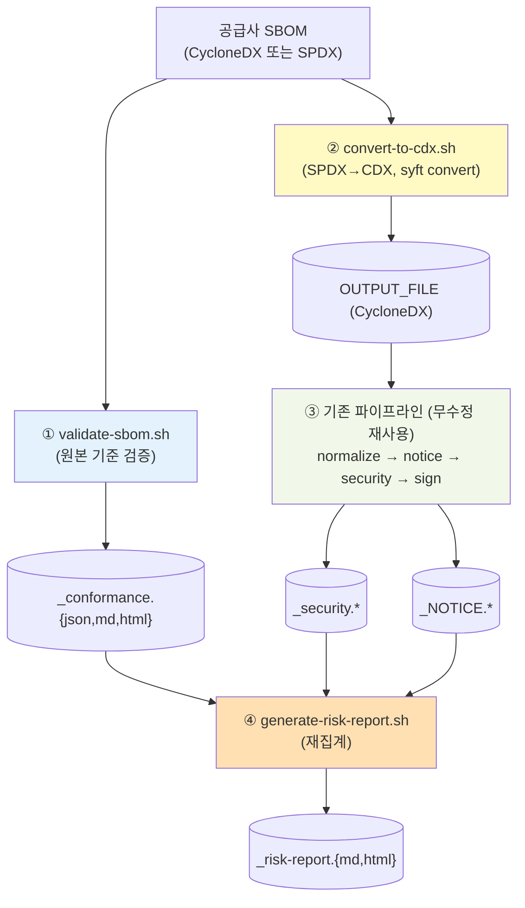

# 공급사 제출 SBOM 검증·분석 (Supplier SBOM Analysis)

> **관련 문서**: [아키텍처](architecture.md) · [방향성 조사 보고서](direction-study.md) · [고지문·보안·UI 가이드](notice-security-ui-guide.md) · [펌웨어 분석](firmware-analysis.md)
>
> 성격: 설계·의사결정 문서 (메인테이너용). **Phase 1~4 모두 구현 완료**되었습니다(`docker/lib/validate-sbom.sh`·`convert-to-cdx.sh`·`generate-risk-report.sh`, `--analyze`/ANALYZE 모드, 웹 UI **SBOM 업로드**). 또한 위험분석보고서(`_risk-report`)는 ANALYZE 전용이 아니라 **모든 분석 모드에서 기본 생성**되도록 일반화되었습니다(자체 생성 SBOM에는 포맷 검증 절을 생략하고 제목을 "오픈소스위험분석보고서"로 표기). 입력 형태별 처리는 [시나리오별 가이드](scenarios-guide.md) 참고.

## 요약 (Executive Summary)

SK텔레콤은 [공급망 보안 가이드](https://sktelecom.github.io/guide/supply-chain/for-suppliers/)를 통해 공급사에 SBOM 제출을 요구하고, [제출 요구사항](https://sktelecom.github.io/guide/supply-chain/for-suppliers/requirements/)을 정의합니다. SKT는 제출된 SBOM을 **검증 → 라이선스/취약점 분석 → 위험 보고서 생성 → 공급사 대응 요구**의 흐름으로 처리합니다.

이 문서는 sbom-tools를 "SBOM **생성기**"에서 "공급사가 제출한 SBOM을 **받아 검증·분석·보고**하는 도구"로 확장하는 설계를 다룹니다.

- **현재**: 후처리 파이프라인(`POSTPROCESS` 모드)이 절반을 담당하나, ① 임의 SBOM 파일 입력 경로가 없고 ② **요구사항 충족 검증(conformance) 기능이 전무**하며 ③ SPDX 입력 시 라이선스 분석이 안 됩니다.
- **방향**: `--analyze` 진입점 + **검증기(`validate-sbom.sh`)** + **SPDX→CycloneDX 변환(`convert-to-cdx.sh`)** + **위험 보고서(`generate-risk-report.sh`)**. 기존 normalize/notice/security 파이프라인을 **단일 경로로 무수정 재사용**.

**역할 경계**: sbom-tools = **로컬에서 단일 SBOM을 검증·분석·보고**. 전사 등록·triage·대응 추적·이력 관리는 SKT 내부 시스템(TOSCA)·자매 프로젝트(trustedoss-portal) 범위입니다.

---

## 목차
- [1. SKT 요구사항](#1-skt-요구사항)
- [2. 현재 능력과 갭](#2-현재-능력과-갭)
- [3. 설계 — ANALYZE 모드](#3-설계--analyze-모드)
- [4. 검증기 (validate-sbom.sh)](#4-검증기-validate-sbomsh)
- [5. SPDX 입력 처리 (convert-to-cdx.sh)](#5-spdx-입력-처리-convert-to-cdxsh)
- [6. 위험 보고서 (generate-risk-report.sh)](#6-위험-보고서-generate-risk-reportsh)
- [7. 단계별 로드맵 (Phase)](#7-단계별-로드맵-phase)
- [8. 정직한 한계](#8-정직한-한계)

---

## 1. SKT 요구사항

[for-suppliers/requirements](https://sktelecom.github.io/guide/supply-chain/for-suppliers/requirements/) 기준.

| 구분 | 요구사항 |
|------|----------|
| **포맷** | CycloneDX v1.3~1.5 (JSON 권장) **또는** SPDX v2.2~2.3 (JSON/Tag-Value) |
| **필수 메타데이터** | timestamp(ISO8601), tool info(vendor/name/version), top-level component name+version |
| **필수 컴포넌트 필드** | name, version, **PURL** (ecosystem 타입 명시, `pkg:generic/`·커스텀 금지) |
| **완전성** | 직접 + **추이적(transitive) 의존성 모두 포함** (직접만 있으면 반려) |
| **권장** | supplier, license(SPDX ID), hash |

**SKT 검증 프로세스 3단계**:
1. **포맷 검증** — 필수 필드 누락 확인 (제출 후 3일 내)
2. **보안 분석** — 자동 취약점 스캔, 임계치 초과 탐지
3. **개선 요청** — **Critical 7일 / High 30일** 내 대응 계획 또는 위험 정당화 제출 요청

결과는 SKT 내부 시스템 **TOSCA**에 등록되어 관리됩니다.

---

## 2. 현재 능력과 갭

| 시나리오 단계 | 현재 sbom-tools | 갭 |
|---------------|------------------|-----|
| 임의 SBOM 파일 입력 | `POSTPROCESS` 모드(`entrypoint.sh:93-101`)는 `${PROJECT}_${VERSION}_bom.json` **고정 파일명**만 처리 | ❌ 임의 경로/이름 입력 경로 없음 |
| ① 포맷/요구사항 검증 | 파일 존재·크기만 확인 | ❌ **conformance 검증 기능 전무** |
| ② 취약점 분석 | `scan-security.sh`의 `trivy sbom` — CycloneDX·SPDX 모두 입력 가능 | ✅ 가능 |
| 라이선스 분석 | `generate-notice.sh` — CycloneDX `.components[]` 전용 | ⚠️ SPDX(`.packages`)는 빈 보고서 |
| 정규화 | `normalize-sbom.sh` — CycloneDX `.components` 정렬 가정 | ⚠️ SPDX는 정렬 skip |
| ③ 위험 보고서(공급사 대응용) | security.md/html + NOTICE 개별 산출 | ⚠️ SKT 기준(7일/30일) 묶음 보고서 없음 |

→ **핵심 갭 = 임의 입력 경로 + 요구사항 검증(conformance) + SPDX 라이선스 + 대응용 위험 보고서.**

---

## 3. 설계 — ANALYZE 모드

기존 IMAGE/BINARY/ROOTFS/POSTPROCESS와 형제인 **`ANALYZE` 모드**를 신설합니다. 핵심은 **검증은 원본 기준, 분석은 CycloneDX 단일 경로**로 처리해 기존 파이프라인을 그대로 재사용하는 것입니다.

### 진입점 (`scripts/scan-sbom.sh`)
- `--analyze <sbom>` (별칭 `--sbom`) 플래그 + `ANALYZE_SBOM` 변수. `--help`에 노출.
- `MODE=ANALYZE` (지정 시 `--target`과 상호배타). 입력 파일 디렉터리를 `/input:ro`로 마운트하고 파일명을 env로 전달(BINARY 모드의 `FD`/`FN` 패턴 재사용).
- `--analyze` 지정 시 `GENERATE_NOTICE`/`GENERATE_SECURITY` 자동 on(위험 보고서가 둘 다 필요).

### 후처리 (`docker/entrypoint.sh`)
- `ANALYZE)` case 신설:
  1. `validate-sbom.sh`를 **원본 입력**에 실행 → `_conformance.*` (검증은 변환 전 기준이어야 정확)
  2. `convert-to-cdx.sh`로 `$OUTPUT_FILE`(표준 CycloneDX) 생성
- case 이후 **공통 파이프라인(normalize → notice → security → sign → upload) 무수정 재사용**.
- 파이프라인 끝에 `generate-risk-report.sh` 호출. 산출물은 `ARTIFACTS`에 누적.

---

## 4. 검증기 (validate-sbom.sh)

> **신규.** SKT "①포맷 검증" 단계에 직접 대응. pass/fail + 누락 목록을 `_conformance.{json,md,html}`로 산출. 파이프라인을 중단시키지 않음.

`validate-sbom.sh <sbom_file> <out_prefix> <project_name>` (기존 lib 인자 규약 준수).

**포맷 판별**: CycloneDX(`.bomFormat=="CycloneDX"` + `.specVersion`) / SPDX JSON(`.spdxVersion`) / SPDX Tag-Value(grep `SPDXVersion:`).

**검사 항목** (CycloneDX / SPDX 양쪽 jq 경로):

| 항목 | CycloneDX | SPDX | 판정 |
|------|-----------|------|------|
| timestamp | `.metadata.timestamp` | `.creationInfo.created` | 필수 |
| tool info | `.metadata.tools[\|.components]` | `.creationInfo.creators[] (Tool:)` | 필수 |
| top component | `.metadata.component.name/.version` | document name + describes root | 필수 |
| name/version 커버리지 | `.components[]` | `.packages[]` (name+versionInfo) | 필수(100%) |
| PURL 커버리지 | `.components[].purl` | `.packages[].externalRefs(purl)` | 필수(임계치) |
| `pkg:generic` 금지 | purl startswith 검사 | referenceLocator 검사 | 필수(0건) |
| transitive 포함 | `.dependencies[].dependsOn` edge 존재 | `.relationships[] DEPENDS_ON` | 필수(추정) |
| license 커버리지 | `.components[].licenses` | `.packages[].licenseConcluded/Declared` | 권장(warn) |
| hash 커버리지 | `.components[].hashes` | `.packages[].checksums` | 권장(warn) |

임계치(`PURL_MIN_PCT` 등)는 스크립트 상단 변수로 노출. 필수 항목 미달 = `fail`, 권장 미달 = `warn`. HTML은 `scan-security.sh`의 카드/테이블·CSP·이스케이프 패턴 차용.

---

## 5. SPDX 입력 처리 (convert-to-cdx.sh)

> **신규.** 입력을 CycloneDX로 정규화해 이후 분석을 **단일 경로**로 처리 → `normalize-sbom.sh`·`generate-notice.sh` **변경 불필요**.

`convert-to-cdx.sh <input> <output_cdx>`:
- 입력이 CycloneDX면 `cp`.
- SPDX면 **`syft convert <input> -o cyclonedx-json=<output>`** — syft가 이미 이미지에 있어 추가 의존성 0.
- syft 변환 실패 시 jq fallback(`.packages[]` → `.components[]`, name/versionInfo/purl/licenseConcluded 보존)으로 라이선스만이라도 보존.

**방안 비교**: generate-notice·normalize에 SPDX 분기를 각각 추가하는 방식(중복·유지보수 부담)보다, **입력 변환 단일화**가 유지보수 표면을 한 파일로 집중시켜 유리. 단 **검증(§4)은 변환 전 원본 기준**(변환이 timestamp/tool/transitive 메타데이터를 정규화·손실시킬 수 있음).

---

## 6. 위험 보고서 (generate-risk-report.sh)

> **신규.** 새 스캔 없이 **기존 산출물을 재집계**하여 공급사 전달용 보고서를 만듦.

`generate-risk-report.sh <out_prefix> <project_name>` — `_conformance.json`·`_security.json`·`_NOTICE.*`를 읽어 `_risk-report.{md,html}` 생성.

구성:
1. **요구사항 충족** — conformance 결과 표. fail이면 SKT "①포맷 검증 반려 사유" 명시.
2. **취약점 집계 + 대응 기한** — severity 집계 + **Critical → 7일, High → 30일 대응계획 제출 필요** 문구. CVE·패키지·고정버전·요구 기한 표.
3. **라이선스 요약** — NOTICE/커버리지.
4. **다음 단계** — "대응계획을 SKT 검증 프로세스 ③에 따라 제출. 결과는 TOSCA 등록(포털 범위)."

스타일은 `scan-security.sh` HTML 패턴 차용. 입력 부재 섹션은 graceful skip.

---

## 7. 단계별 로드맵 (Phase)

| Phase | 범위 | 비고 |
|-------|------|------|
| **1** | `validate-sbom.sh` (검증기) | 독립적, host jq로 테스트 가능 → 가치 높고 의존성 적어 우선 |
| **2** | `--analyze`/ANALYZE 입력 경로 + `convert-to-cdx.sh` | 기존 normalize/notice/security 재사용 연결 |
| **3** | `generate-risk-report.sh` | 기존 산출물 재집계 |
| **4** | 웹 UI 업로드 (`server.py` `do_POST` + "SBOM 업로드" 스캔 대상) | 구현 완료 |
| **5** | 문서·역할 경계 명시 | |

> Phase 1~4 **모두 구현·머지 완료**. 또한 위험 보고서(Phase 3)는 ANALYZE 전용이 아니라 **모든 분석 모드에서 기본 생성**되도록 일반화됨(`--no-report`로 opt-out).

**검증(e2e)**: `tests/test-e2e.sh`의 host-side(Docker 불필요) 패턴으로 — ① 정상 CycloneDX → pass ② 정상 SPDX → pass + 변환 후 components>0 + 라이선스 추출 ③ 결함 SBOM(각 1개 위반: pkg:generic / PURL 누락 / tools 없음 / dependencies 없음) → 각각 fail + 누락 목록 단언 ④ 위험 보고서에 "7일"/"30일" 문구·Critical/High 표 포함 단언 ⑤ `--help`에 `--analyze` 노출.

---

## 8. 정직한 한계

- 검증은 **"필수 필드 존재/커버리지"** 기준입니다. PURL이 실제 패키지를 정확히 가리키는지, 버전이 진짜인지 등 **의미적 정확성**까지는 보장하지 못합니다.
- **transitive 의존성 포함 여부**는 dependency graph의 edge 유무로 **추정**합니다(완전한 그래프 완전성 증명은 아님).
- SPDX → CycloneDX 변환 시 일부 SPDX 고유 메타데이터가 정규화·손실될 수 있어, **검증은 원본 기준**으로 수행합니다.
- 취약점/라이선스 분석의 정확도는 입력 SBOM의 품질(특히 PURL·version 정확성)에 직접 좌우됩니다.
- 이 도구는 **로컬 단일 SBOM 분석**용이며, 전사 등록·대응 추적·정책 게이트는 TOSCA/trustedoss-portal 범위입니다.
