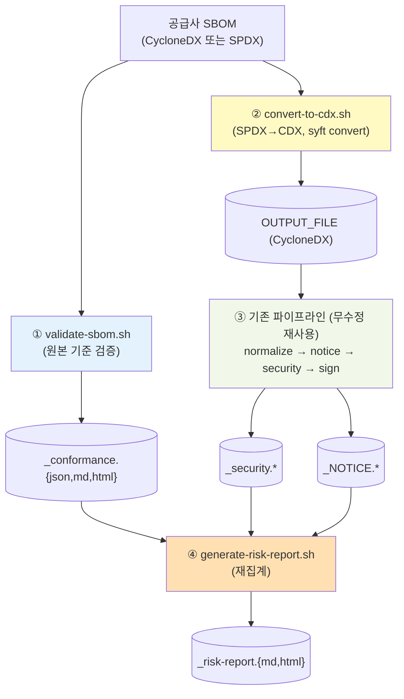

# 공급사 제출 SBOM 검증·분석 (Supplier SBOM Analysis)

> **관련 문서**: [아키텍처](architecture.md) · [방향성 조사 보고서](direction-study.md) · [고지문·보안·UI 가이드](notice-security-ui-guide.md) · [펌웨어 분석](firmware-analysis.md)
>
> 성격: 설계·의사결정 문서 (메인테이너용). Phase 1~4가 모두 구현 완료되었습니다(`docker/lib/validate-sbom.sh`·`convert-to-cdx.sh`·`generate-risk-report.sh`, `--analyze`/ANALYZE 모드, 웹 UI의 SBOM 업로드). 위험분석보고서(`_risk-report`)도 ANALYZE 전용이 아니라 모든 분석 모드에서 기본 생성되도록 일반화되었습니다. 자체 생성 SBOM에는 포맷 검증 절을 생략하고 제목을 "오픈소스위험분석보고서"로 표기합니다. 입력 형태별 처리는 [시나리오별 가이드](scenarios-guide.md)를 참고하세요.

## 요약 (Executive Summary)

SK텔레콤은 [공급망 보안 가이드](https://sktelecom.github.io/guide/supply-chain/for-suppliers/)로 공급사에 SBOM 제출을 요구하고, [제출 요구사항](https://sktelecom.github.io/guide/supply-chain/for-suppliers/requirements/)을 정의합니다. SKT는 제출된 SBOM을 검증하고, 라이선스와 취약점을 분석한 뒤 위험 보고서를 만들어 공급사에 대응을 요구하는 흐름으로 처리합니다.

이 문서는 sbom-tools를 SBOM 생성기에서 한 걸음 더 나아가, 공급사가 제출한 SBOM을 받아 검증·분석·보고하는 도구로 확장하는 설계를 다룹니다.

- 현재: 후처리 파이프라인(`POSTPROCESS` 모드)이 절반을 담당하지만, 임의 SBOM 파일을 입력하는 경로가 없고 요구사항 충족 검증(conformance) 기능이 전무하며 SPDX를 입력하면 라이선스 분석이 안 됩니다.
- 방향: `--analyze` 진입점에 검증기(`validate-sbom.sh`), SPDX를 CycloneDX로 바꾸는 변환기(`convert-to-cdx.sh`), 위험 보고서(`generate-risk-report.sh`)를 더합니다. 기존 normalize/notice/security 파이프라인은 단일 경로로 손대지 않고 재사용합니다.

역할 경계: sbom-tools는 로컬에서 단일 SBOM을 검증·분석·보고하는 데까지입니다. 전사 등록, triage, 대응 추적, 이력 관리는 SKT 내부 시스템(TOSCA)과 자매 프로젝트(trustedoss-portal)의 몫입니다.

---

## 목차
- [1. SKT 요구사항](#1-skt-요구사항)
- [2. 현재 능력과 갭](#2-현재-능력과-갭)
- [3. 설계 — ANALYZE 모드](#3-설계--analyze-모드)
- [4. 검증기 (validate-sbom.sh)](#4-검증기-validate-sbomsh)
- [5. SPDX 입력 처리 (convert-to-cdx.sh)](#5-spdx-입력-처리-convert-to-cdxsh)
- [6. 위험 보고서 (generate-risk-report.sh)](#6-위험-보고서-generate-risk-reportsh)
- [7. 단계별 로드맵 (Phase)](#7-단계별-로드맵-phase)
- [8. 정직한 한계](#8-정직한-한계)

---

## 1. SKT 요구사항

[for-suppliers/requirements](https://sktelecom.github.io/guide/supply-chain/for-suppliers/requirements/) 기준.

| 구분 | 요구사항 |
|------|----------|
| **포맷** | CycloneDX v1.3~1.5 (JSON 권장) **또는** SPDX v2.2~2.3 (JSON/Tag-Value) |
| **필수 메타데이터** | timestamp(ISO8601), tool info(vendor/name/version), top-level component name+version |
| **필수 컴포넌트 필드** | name, version, **PURL** (ecosystem 타입 명시, `pkg:generic/`·커스텀 금지) |
| **완전성** | 직접 + **추이적(transitive) 의존성 모두 포함** (직접만 있으면 반려) |
| **권장** | supplier, license(SPDX ID), hash |

SKT 검증 프로세스는 세 단계로 나뉩니다.
1. 포맷 검증 — 필수 필드 누락 확인 (제출 후 3일 내)
2. 보안 분석 — 자동 취약점 스캔, 임계치 초과 탐지
3. 개선 요청 — Critical 7일, High 30일 내에 대응 계획이나 위험 정당화 제출 요청

결과는 SKT 내부 시스템 TOSCA에 등록되어 관리됩니다.

---

## 2. 현재 능력과 갭

| 시나리오 단계 | 현재 sbom-tools | 갭 |
|---------------|------------------|-----|
| 임의 SBOM 파일 입력 | `POSTPROCESS` 모드(`entrypoint.sh:93-101`)는 `${PROJECT}_${VERSION}_bom.json` **고정 파일명**만 처리 | ❌ 임의 경로/이름 입력 경로 없음 |
| ① 포맷/요구사항 검증 | 파일 존재·크기만 확인 | ❌ **conformance 검증 기능 전무** |
| ② 취약점 분석 | `scan-security.sh`의 `trivy sbom` — CycloneDX·SPDX 모두 입력 가능 | ✅ 가능 |
| 라이선스 분석 | `generate-notice.sh` — CycloneDX `.components[]` 전용 | ⚠️ SPDX(`.packages`)는 빈 보고서 |
| 정규화 | `normalize-sbom.sh` — CycloneDX `.components` 정렬 가정 | ⚠️ SPDX는 정렬 skip |
| ③ 위험 보고서(공급사 대응용) | security.md/html + NOTICE 개별 산출 | ⚠️ SKT 기준(7일/30일) 묶음 보고서 없음 |

핵심 갭은 임의 입력 경로, 요구사항 검증(conformance), SPDX 라이선스, 대응용 위험 보고서 네 가지입니다.

---

## 3. 설계 — ANALYZE 모드

기존 IMAGE/BINARY/ROOTFS/POSTPROCESS와 형제인 `ANALYZE` 모드를 신설합니다. 검증은 원본을 기준으로 하고 분석은 CycloneDX 단일 경로로 처리해, 기존 파이프라인을 그대로 재사용하는 것이 핵심입니다.

### 진입점 (`scripts/scan-sbom.sh`)
- `--analyze <sbom>` (별칭 `--sbom`) 플래그와 `ANALYZE_SBOM` 변수를 두고 `--help`에 노출합니다.
- `MODE=ANALYZE`로 동작하며, 지정하면 `--target`과 상호배타입니다. 입력 파일 디렉터리를 `/input:ro`로 마운트하고 파일명을 env로 전달하는데, 이는 BINARY 모드의 `FD`/`FN` 패턴을 재사용한 것입니다.
- `--analyze`를 지정하면 위험 보고서가 둘 다 필요하므로 `GENERATE_NOTICE`와 `GENERATE_SECURITY`를 자동으로 켭니다.

### 후처리 (`docker/entrypoint.sh`)
- `ANALYZE)` case를 신설합니다. 먼저 `validate-sbom.sh`를 원본 입력에 실행해 `_conformance.*`를 만들고(검증은 변환 전 기준이어야 정확합니다), 이어서 `convert-to-cdx.sh`로 `$OUTPUT_FILE`(표준 CycloneDX)을 생성합니다.
- case 이후에는 공통 파이프라인(normalize, notice, security, sign, upload)을 손대지 않고 그대로 재사용합니다.
- 파이프라인 끝에서 `generate-risk-report.sh`를 호출하며, 산출물은 `ARTIFACTS`에 누적합니다.

---

## 4. 검증기 (validate-sbom.sh)

> 신규. SKT의 "①포맷 검증" 단계에 직접 대응합니다. pass/fail과 누락 목록을 `_conformance.{json,md,html}`로 산출하며, 파이프라인을 중단시키지 않습니다.

`validate-sbom.sh <sbom_file> <out_prefix> <project_name>` (기존 lib 인자 규약을 따릅니다).

포맷 판별은 세 갈래입니다. CycloneDX는 `.bomFormat=="CycloneDX"`와 `.specVersion`으로, SPDX JSON은 `.spdxVersion`으로, SPDX Tag-Value는 `SPDXVersion:`을 grep해 가립니다.

검사 항목은 CycloneDX와 SPDX 양쪽 jq 경로로 다음과 같습니다.

| 항목 | CycloneDX | SPDX | 판정 |
|------|-----------|------|------|
| timestamp | `.metadata.timestamp` | `.creationInfo.created` | 필수 |
| tool info | `.metadata.tools[\|.components]` | `.creationInfo.creators[] (Tool:)` | 필수 |
| top component | `.metadata.component.name/.version` | document name + describes root | 필수 |
| name/version 커버리지 | `.components[]` | `.packages[]` (name+versionInfo) | 필수(100%) |
| PURL 커버리지 | `.components[].purl` | `.packages[].externalRefs(purl)` | 필수(임계치) |
| `pkg:generic` 금지 | purl startswith 검사 | referenceLocator 검사 | 필수(0건) |
| transitive 포함 | `.dependencies[].dependsOn` edge 존재 | `.relationships[] DEPENDS_ON` | 필수(추정) |
| license 커버리지 | `.components[].licenses` | `.packages[].licenseConcluded/Declared` | 권장(warn) |
| hash 커버리지 | `.components[].hashes` | `.packages[].checksums` | 권장(warn) |

임계치(`PURL_MIN_PCT` 등)는 스크립트 상단 변수로 노출합니다. 필수 항목이 미달이면 `fail`, 권장 항목이 미달이면 `warn`으로 판정합니다. HTML은 `scan-security.sh`의 카드와 테이블, CSP, 이스케이프 패턴을 차용했습니다.

---

## 5. SPDX 입력 처리 (convert-to-cdx.sh)

> 신규. 입력을 CycloneDX로 정규화하면 이후 분석을 단일 경로로 처리할 수 있어 `normalize-sbom.sh`와 `generate-notice.sh`를 고칠 필요가 없습니다.

`convert-to-cdx.sh <input> <output_cdx>`는 입력 형식에 따라 다르게 동작합니다.
- 입력이 CycloneDX면 `cp`만 합니다.
- SPDX면 `syft convert <input> -o cyclonedx-json=<output>`을 씁니다. syft가 이미 이미지에 들어 있어 추가 의존성이 없습니다.
- syft 변환이 실패하면 jq fallback(`.packages[]`를 `.components[]`로 옮기며 name/versionInfo/purl/licenseConcluded 보존)으로 라이선스만이라도 살립니다.

방안을 비교하면, generate-notice와 normalize에 SPDX 분기를 각각 더하는 방식은 중복과 유지보수 부담이 큽니다. 반면 입력 변환을 한곳에 모으면 유지보수 표면이 한 파일로 집중돼 유리합니다. 다만 검증(§4)은 변환 전 원본을 기준으로 합니다. 변환 과정에서 timestamp나 tool, transitive 메타데이터가 정규화되거나 사라질 수 있기 때문입니다.

---

## 6. 위험 보고서 (generate-risk-report.sh)

> 신규. 새로 스캔하지 않고 기존 산출물을 재집계해 공급사 전달용 보고서를 만듭니다.

`generate-risk-report.sh <out_prefix> <project_name>`는 `_conformance.json`, `_security.json`, `_NOTICE.*`를 읽어 `_risk-report.{md,html}`를 생성합니다.

보고서는 네 부분으로 구성됩니다.
1. 요구사항 충족 — conformance 결과 표. fail이면 SKT "①포맷 검증 반려 사유"를 명시합니다.
2. 취약점 집계와 대응 기한 — severity 집계와 함께 Critical은 7일, High는 30일 안에 대응계획을 제출해야 한다는 문구를 넣고, CVE와 패키지, 고정버전, 요구 기한을 표로 정리합니다.
3. 라이선스 요약 — NOTICE와 커버리지.
4. 다음 단계 — "대응계획을 SKT 검증 프로세스 ③에 따라 제출. 결과는 TOSCA 등록(포털 범위)."

스타일은 `scan-security.sh`의 HTML 패턴을 차용했습니다. 입력이 없는 섹션은 graceful skip 합니다.

---

## 7. 단계별 로드맵 (Phase)

| Phase | 범위 | 비고 |
|-------|------|------|
| **1** | `validate-sbom.sh` (검증기) | 독립적, host jq로 테스트 가능 → 가치 높고 의존성 적어 우선 |
| **2** | `--analyze`/ANALYZE 입력 경로 + `convert-to-cdx.sh` | 기존 normalize/notice/security 재사용 연결 |
| **3** | `generate-risk-report.sh` | 기존 산출물 재집계 |
| **4** | 웹 UI 업로드 (`server.py` `do_POST` + "SBOM 업로드" 스캔 대상) | 구현 완료 |
| **5** | 문서·역할 경계 명시 | |

> Phase 1~4가 모두 구현·머지 완료되었습니다. 위험 보고서(Phase 3)도 ANALYZE 전용이 아니라 모든 분석 모드에서 기본 생성되도록 일반화되었습니다(`--no-report`로 opt-out).

검증(e2e)은 `tests/test-e2e.sh`의 host-side 패턴(Docker가 필요 없습니다)으로 다섯 가지를 확인합니다. ① 정상 CycloneDX는 pass, ② 정상 SPDX는 pass에 더해 변환 후 components>0과 라이선스 추출을 확인, ③ 결함 SBOM(pkg:generic, PURL 누락, tools 없음, dependencies 없음을 각각 한 건씩 위반)은 각각 fail과 누락 목록을 단언, ④ 위험 보고서에 "7일"·"30일" 문구와 Critical/High 표가 들어 있는지 단언, ⑤ `--help`에 `--analyze`가 노출되는지 확인합니다.

---

## 8. 정직한 한계

- 검증은 필수 필드의 존재와 커버리지를 기준으로 합니다. PURL이 실제 패키지를 정확히 가리키는지, 버전이 진짜인지 같은 의미적 정확성까지는 보장하지 못합니다.
- transitive 의존성을 포함했는지는 dependency graph의 edge 유무로 추정합니다. 그래프가 완전하다는 증명은 아닙니다.
- SPDX를 CycloneDX로 변환할 때 일부 SPDX 고유 메타데이터가 정규화되거나 사라질 수 있어, 검증은 원본을 기준으로 수행합니다.
- 취약점·라이선스 분석의 정확도는 입력 SBOM의 품질, 특히 PURL과 version 정확성에 직접 좌우됩니다.
- 이 도구는 로컬에서 단일 SBOM을 분석하는 용도이며, 전사 등록과 대응 추적, 정책 게이트는 TOSCA와 trustedoss-portal의 범위입니다.
