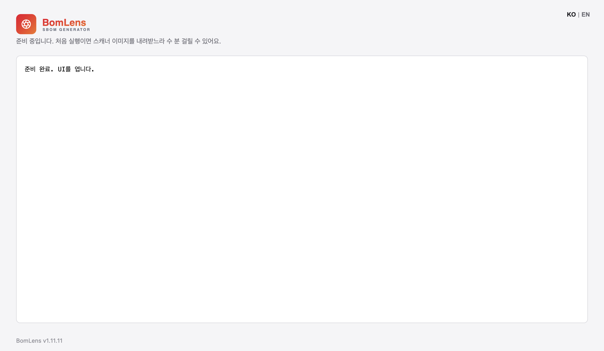
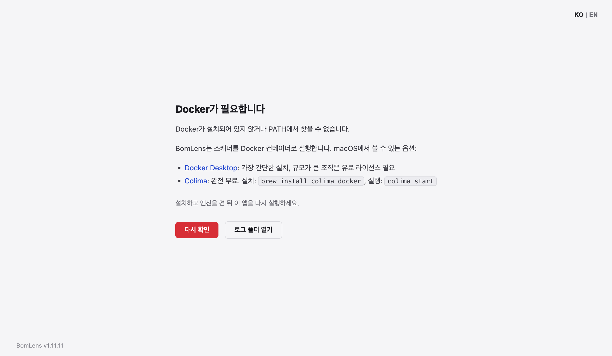

# BomLens desktop app (Electron)

> **한국어**: [electron/README.ko.md](README.ko.md)

A desktop app that opens the BomLens web UI with a double-click, no console
required. The scanner itself still runs as a Docker container; this app takes
care of checking Docker, pulling the image, and starting and cleaning up the
container.

> Most users don't need to build anything. Download `BomLens-Setup.exe` (or
> `.dmg`) from the [latest release](https://github.com/sktelecom/bomlens/releases/latest)
> and install it. It isn't code-signed yet, so if Windows SmartScreen warns
> you, click "More info" and then "Run anyway". The rest of this document is
> for developers building from source.

## How it works

1. It checks whether Docker is installed and running. If not, it shows a
   guidance screen (available in both Korean and English).
2. On first run it pulls the scanner image and shows progress. The tag
   matches the app's own version (`ghcr.io/sktelecom/bomlens:<version from package.json>`).
   `:latest` points at the newest build on `main`, not a release, so pulling
   it would run a scanner that doesn't match the version the user installed.
   The app falls back to `:latest` only in development runs where it can't
   read a version. You can override the image with `SBOM_SCANNER_IMAGE`.
   Layer-by-layer progress summaries and guidance for specific failure
   causes (proxy, DNS, auth, disk, missing tag) come from
   `lib/pullprogress.mjs`.
3. It starts a `MODE=UI` container. The mount configuration matches
   `scripts/sbom-ui.bat` (the engine socket and an `sbom-output` output
   folder under the home directory). The engine mount uses the Unix socket
   `/var/run/docker.sock` rather than a Windows named pipe, because Rancher
   Desktop rejects named pipes with `invalid volume name` (see
   `engineMount()` in `lib/container.mjs`).
4. Once the container's `/capabilities` endpoint returns 200, it loads that
   localhost address into the window.
5. When you close the app, it cleans up the container.

The core logic lives in `lib/container.mjs` (plain Node), so it can be
verified without Electron.

This is the screen you see on startup. It shows progress as a log and
switches to the UI once everything is ready.



If Docker is missing or not running, the app shows a guidance screen instead
of scanning.



## Development

```bash
cd electron
npm install
npm start
```

The Docker engine must be running. Pulling the image ahead of time makes the
first startup faster. The app only allows a single instance, so running the
smoke test (`npm run test:smoke`) while the app is open fails on the lock.
Close the app first.

```bash
docker pull ghcr.io/sktelecom/bomlens:<version>   # same tag as electron/package.json's version
```

The startup screen's language follows the system locale (Korean if the
system is Korean, English otherwise). You can force it with `SBOM_LANG=en`
or `SBOM_LANG=ko`. The web UI's own language is switched with the KO/EN
toggle in the top-right corner of the screen.

```bash
SBOM_LANG=en npm start
```

On startup, the app checks GitHub for the latest release and, if a newer
version exists, shows a dialog with a download link (`lib/update.mjs`).
Failures are silently ignored and don't affect startup. This check is off
in development runs (`npm start`); turn it on with
`SBOM_FORCE_UPDATE_CHECK=1` to test it.

Startup progress is logged to the status screen and also written to a
`startup.log` file (overwritten on each run). Electron's `app.getName()`
follows `package.json`'s `name` field rather than `productName`, so both the
packaged app and `npm start` development runs write to the same location:
`%APPDATA%\sbom-generator-desktop\startup.log` on Windows,
`~/Library/Application Support/sbom-generator-desktop/startup.log` on macOS.

## Building (installer)

```bash
npm install
npm run dist          # default target for the current OS
npm run dist:win      # Windows NSIS
```

Artifacts are written to `dist-electron/`. Multi-platform builds run in CI
(`.github/workflows/desktop.yml`) on `windows-latest` and `macos-latest`.
The initial build is unsigned.

## Code signing

Unsigned installers trigger Windows SmartScreen and macOS Gatekeeper
warnings. The CI workflow is wired to sign and notarize automatically once
the repository secrets below are set. Without them, it builds unsigned as it
does now. No separate configuration file changes are needed.

Keep the Windows and macOS certificates in separate secrets. The generic
`CSC_LINK` is also read by the macOS build, so putting a Windows `.pfx`
there makes the macOS runner try to import it as an Apple certificate and
fail the build.

| Secret | Purpose |
|--------|------|
| `WIN_CSC_LINK` | Windows Authenticode certificate (base64-encoded `.pfx`) |
| `WIN_CSC_KEY_PASSWORD` | Windows certificate password |
| `CSC_LINK` | macOS Developer ID Application certificate (base64-encoded `.p12`) |
| `CSC_KEY_PASSWORD` | macOS certificate password |
| `APPLE_ID` | Apple ID used for macOS notarization |
| `APPLE_APP_SPECIFIC_PASSWORD` | App-specific password for that Apple ID (issued at appleid.apple.com) |
| `APPLE_TEAM_ID` | Apple Developer team ID (from the membership page) |

Set all three `APPLE_*` secrets or none of them. Setting only some causes
electron-builder to fail the build with a configuration error. If all three
are missing, notarization is skipped but signing still proceeds (notarization
is only attempted on a build that signed successfully). Add secrets under
the repository's Settings, Secrets and variables.

### Getting certificates (a human has to do this)

Start with macOS. It requires an Apple Developer Program membership ($99 a
year).

1. Decide who enrolls. Enrolling as an organization (SK Telecom) requires a
   D-U-N-S number and legal entity verification, which takes days to weeks,
   but Gatekeeper then shows the company name. Enrolling as an individual is
   faster, but shows a personal name, which doesn't fit organizational
   distribution. An organization enrollment is recommended.
2. With Account Holder privileges, issue a Developer ID Application
   certificate, export it as a `.p12` from Keychain, base64-encode it into
   `CSC_LINK`, and put its password in `CSC_KEY_PASSWORD`.
3. Issue an app-specific password at appleid.apple.com (requires
   two-factor authentication) for `APPLE_ID` and
   `APPLE_APP_SPECIFIC_PASSWORD`, and put the team ID from the membership
   page into `APPLE_TEAM_ID`.

For Windows, choose one of two paths.

- Azure Trusted Signing (recommended): around $10 a month, and no file
  certificate is needed. It requires an Azure subscription and at least
  three years of verified organizational history. electron-builder 26
  supports it out of the box, but `azureSignOptions` can't live permanently
  in the config file (having it there forces the Azure path
  unconditionally), so adopting this needs a follow-up change that injects
  it conditionally from the workflow.
- OV Authenticode: $200 to $500 a year. Since June 2023, private keys must
  be kept in an HSM, which has effectively ended issuance of a `.pfx` file,
  so using it in CI needs a cloud HSM product such as DigiCert KeyLocker.
  Once issued, put it in `WIN_CSC_LINK`/`WIN_CSC_KEY_PASSWORD`.

Either way, SmartScreen reputation only clears once downloads accumulate
after signing (only an EV certificate clears it immediately).

### Verifying signatures (after the first signed release)

```bash
# macOS
codesign -dv --verbose BomLens.app
spctl -a -t open --context context:primary-signature BomLens-Setup.dmg
xcrun stapler validate BomLens-Setup.dmg
```

```powershell
# Windows
Get-AuthenticodeSignature BomLens-Setup.exe
```

Once signing is in place, revisit these follow-up items: trim the Gatekeeper
bypass instructions in the user docs (`docs/start/no-cli.md`), and add fully
automatic updates through electron-updater (macOS auto-update only works on
a signed app, so signing is a prerequisite).
